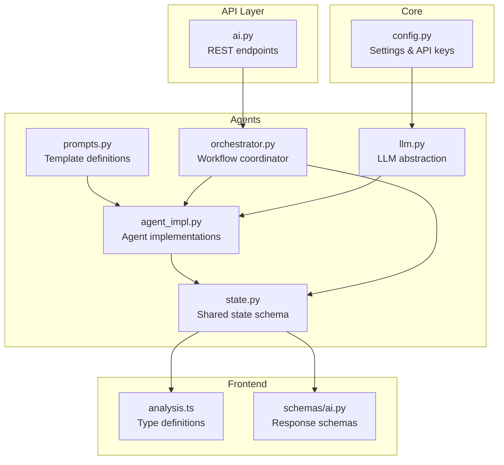
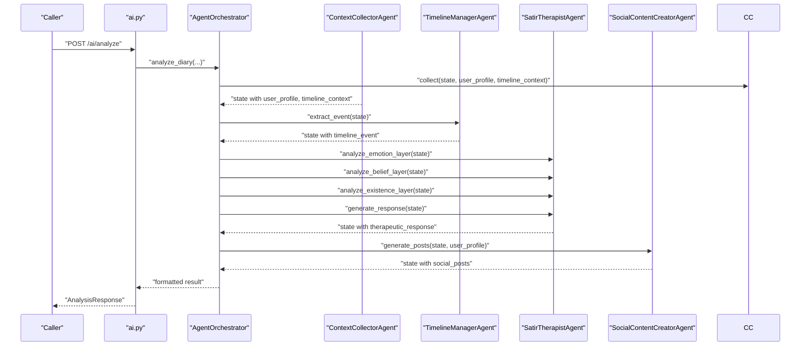
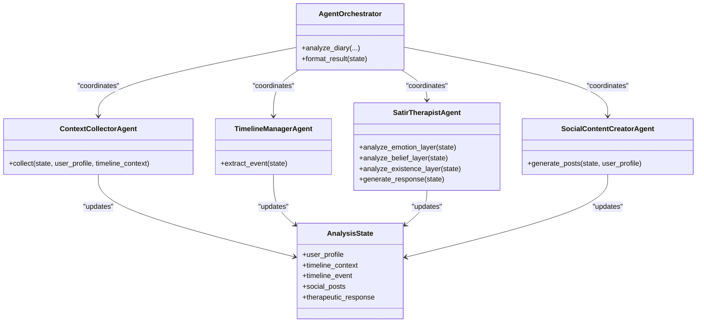
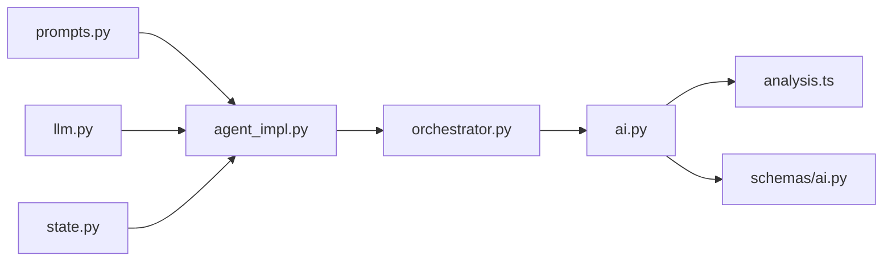

# Agent Prompt Engineering

<cite>
**Referenced Files in This Document**
- [prompts.py](file://backend/app/agents/prompts.py)
- [agent_impl.py](file://backend/app/agents/agent_impl.py)
- [state.py](file://backend/app/agents/state.py)
- [orchestrator.py](file://backend/app/agents/orchestrator.py)
- [llm.py](file://backend/app/agents/llm.py)
- [config.py](file://backend/app/core/config.py)
- [ai.py](file://backend/app/api/v1/ai.py)
- [test_ai_agents.py](file://backend/test_ai_agents.py)
- [analysis.ts](file://frontend/src/types/analysis.ts)
- [schemas/ai.py](file://backend/app/schemas/ai.py)
</cite>

## Update Summary
**Changes Made**
- Enhanced SocialContentCreatorAgent with sophisticated writing styles and expanded content generation strategies
- Improved authenticity requirements and writing guidelines for social content generation
- Added comprehensive fallback mechanisms and JSON parsing strategies
- Expanded prompt variations for different user profiles and analysis contexts
- Enhanced system-level guidance for content authenticity and boundary setting

## Table of Contents
1. [Introduction](#introduction)
2. [Project Structure](#project-structure)
3. [Core Components](#core-components)
4. [Architecture Overview](#architecture-overview)
5. [Detailed Component Analysis](#detailed-component-analysis)
6. [Dependency Analysis](#dependency-analysis)
7. [Performance Considerations](#performance-considerations)
8. [Troubleshooting Guide](#troubleshooting-guide)
9. [Conclusion](#conclusion)
10. [Appendices](#appendices)

## Introduction
This document explains the comprehensive prompt engineering system used across the multi-agent architecture. It details the prompt templates for each agent type, the prompt structure and context injection mechanisms, parameterization strategies, and how prompts adapt to different analysis scenarios. It also covers prompt versioning, customization options, and optimization techniques that maintain consistency while enabling contextual adaptation.

**Updated** Enhanced with sophisticated content generation strategies for the SocialContentCreatorAgent, including multiple writing styles, authenticity requirements, and improved fallback mechanisms.

## Project Structure
The prompt engineering system is implemented in the backend agents module and integrated with orchestration, state management, and LLM abstraction. The frontend types define the expected outputs for consistent rendering and validation.

**Diagram sources**
- [prompts.py:1-440](file://backend/app/agents/prompts.py#L1-L440)
- [agent_impl.py:1-491](file://backend/app/agents/agent_impl.py#L1-L491)
- [state.py:1-45](file://backend/app/agents/state.py#L1-L45)
- [orchestrator.py:1-342](file://backend/app/agents/orchestrator.py#L1-L342)
- [llm.py:1-220](file://backend/app/agents/llm.py#L1-L220)
- [config.py:1-105](file://backend/app/core/config.py#L1-L105)
- [ai.py:800-918](file://backend/app/api/v1/ai.py#L800-L918)
- [analysis.ts:1-237](file://frontend/src/types/analysis.ts#L1-L237)
- [schemas/ai.py:140-174](file://backend/app/schemas/ai.py#L140-L174)

**Section sources**
- [prompts.py:1-440](file://backend/app/agents/prompts.py#L1-L440)
- [agent_impl.py:1-491](file://backend/app/agents/agent_impl.py#L1-L491)
- [state.py:1-45](file://backend/app/agents/state.py#L1-L45)
- [orchestrator.py:1-342](file://backend/app/agents/orchestrator.py#L1-L342)
- [llm.py:1-220](file://backend/app/agents/llm.py#L1-L220)
- [config.py:1-105](file://backend/app/core/config.py#L1-L105)
- [ai.py:800-918](file://backend/app/api/v1/ai.py#L800-L918)
- [analysis.ts:1-237](file://frontend/src/types/analysis.ts#L1-L237)
- [schemas/ai.py:140-174](file://backend/app/schemas/ai.py#L140-L174)

## Core Components
- Prompt templates define structured instructions, roles, context slots, and output formats for each agent.
- Agents inject runtime context into templates via parameterized formatting.
- LLM abstraction provides temperature-tuned models per agent purpose.
- Orchestrator coordinates agent steps and manages shared state.
- Frontend types enforce consistent output schemas for UI rendering.

Key prompt categories:
- ContextCollectorAgent: Aggregates user profile, timeline context, and diary content into structured JSON.
- TimelineManagerAgent: Extracts events from diary content with emotion, importance, and entity tagging.
- SatirTherapistAgent: Five-layer analysis (emotion, cognition, beliefs, core self) with a dedicated responder.
- SocialContentCreatorAgent: Generates multiple variants of social posts based on user profile and emotion tags with sophisticated writing styles.

**Updated** Enhanced SocialContentCreatorAgent now includes three distinct writing styles: "简洁叙事版" (simple narrative), "共鸣表达版" (empathetic expression), and "生活行动版" (lifestyle action), each with specific authenticity requirements and fallback mechanisms.

**Section sources**
- [prompts.py:7-33](file://backend/app/agents/prompts.py#L7-L33)
- [prompts.py:36-62](file://backend/app/agents/prompts.py#L36-L62)
- [prompts.py:65-168](file://backend/app/agents/prompts.py#L65-L168)
- [prompts.py:171-215](file://backend/app/agents/prompts.py#L171-L215)
- [agent_impl.py:92-149](file://backend/app/agents/agent_impl.py#L92-L149)
- [agent_impl.py:151-209](file://backend/app/agents/agent_impl.py#L151-L209)
- [agent_impl.py:212-400](file://backend/app/agents/agent_impl.py#L212-L400)
- [agent_impl.py:403-491](file://backend/app/agents/agent_impl.py#L403-L491)

## Architecture Overview
The multi-agent pipeline follows a deterministic workflow with explicit context propagation and robust error handling.

**Diagram sources**
- [orchestrator.py:27-131](file://backend/app/agents/orchestrator.py#L27-L131)
- [agent_impl.py:92-149](file://backend/app/agents/agent_impl.py#L92-L149)
- [agent_impl.py:151-209](file://backend/app/agents/agent_impl.py#L151-L209)
- [agent_impl.py:212-400](file://backend/app/agents/agent_impl.py#L212-L400)
- [agent_impl.py:403-491](file://backend/app/agents/agent_impl.py#L403-L491)
- [ai.py:800-918](file://backend/app/api/v1/ai.py#L800-L918)

## Detailed Component Analysis

### Prompt Templates and Parameterization
- ContextCollectorAgent: Injects user profile, timeline context, and diary content into a JSON-structured prompt. The agent calls the LLM with a JSON response format to ensure structured output.
- TimelineManagerAgent: Receives only the diary content and produces a JSON object containing event summary, emotion tag, importance score, and entities.
- SatirTherapistAgent: Uses three specialized prompts (emotion, belief/cognition, existence) and a responder prompt. Each prompt receives relevant prior outputs to build layered insights.
- SocialContentCreatorAgent: Accepts username, social style, catchphrases, diary content, and emotion tags to produce multiple post variants with sophisticated writing styles and authenticity requirements.

**Updated** The SocialContentCreatorAgent now includes three distinct writing styles with specific requirements:
- Simple Narrative Style: Focuses on factual storytelling with authentic details
- Empathetic Expression Style: Emphasizes emotional resonance and human connection  
- Lifestyle Action Style: Centers on actionable insights and practical takeaways

Parameterization strategy:
- Each agent constructs a formatted prompt string by injecting runtime context from shared state and user profile.
- JSON response format is requested for agents that require structured outputs.
- Enhanced fallback mechanisms handle various LLM output formats and edge cases.

**Section sources**
- [prompts.py:7-33](file://backend/app/agents/prompts.py#L7-L33)
- [prompts.py:36-62](file://backend/app/agents/prompts.py#L36-L62)
- [prompts.py:65-168](file://backend/app/agents/prompts.py#L65-L168)
- [prompts.py:171-215](file://backend/app/agents/prompts.py#L171-L215)
- [agent_impl.py:119-141](file://backend/app/agents/agent_impl.py#L119-L141)
- [agent_impl.py:171-196](file://backend/app/agents/agent_impl.py#L171-L196)
- [agent_impl.py:233-259](file://backend/app/agents/agent_impl.py#L233-L259)
- [agent_impl.py:274-298](file://backend/app/agents/agent_impl.py#L274-L298)
- [agent_impl.py:327-342](file://backend/app/agents/agent_impl.py#L327-L342)
- [agent_impl.py:377-393](file://backend/app/agents/agent_impl.py#L377-L393)
- [agent_impl.py:423-430](file://backend/app/agents/agent_impl.py#L423-L430)
- [agent_impl.py:436-468](file://backend/app/agents/agent_impl.py#L436-L468)

### Context Injection Mechanisms
- Shared state carries user profile, timeline context, and intermediate results across agents.
- Agents selectively inject context into downstream prompts:
  - Emotion layer prompt receives user profile.
  - Belief layer prompt receives emotion layer result.
  - Existence layer prompt receives the aggregated analysis so far.
  - Responder prompt receives the full five-layer synthesis plus user profile.
  - Social creator prompt receives user profile and emotion tags derived from the timeline event.

**Updated** Enhanced context injection for SocialContentCreatorAgent includes emotion tags extracted from timeline events, enabling more nuanced content generation that aligns with the user's current emotional state.

This incremental injection ensures each stage builds upon validated prior outputs.

**Section sources**
- [state.py:10-45](file://backend/app/agents/state.py#L10-L45)
- [agent_impl.py:233-259](file://backend/app/agents/agent_impl.py#L233-L259)
- [agent_impl.py:274-298](file://backend/app/agents/agent_impl.py#L274-L298)
- [agent_impl.py:327-342](file://backend/app/agents/agent_impl.py#L327-L342)
- [agent_impl.py:377-393](file://backend/app/agents/agent_impl.py#L377-L393)
- [agent_impl.py:423-430](file://backend/app/agents/agent_impl.py#L423-L430)

### Prompt Versioning and Customization
- The system defines distinct prompt templates per agent and per analysis layer, enabling versioned behavior by swapping or extending templates.
- Customization options include:
  - User profile fields (username, social style, catchphrases).
  - Output formats (JSON for structured tasks; plain text for the responder).
  - Temperature tuning per agent purpose (analytical vs. creative vs. balanced).
- The orchestrator's metadata includes a workflow list indicating agent stages, aiding traceability and version alignment.

**Updated** Enhanced customization capabilities for SocialContentCreatorAgent include:
- Multiple writing style configurations with specific authenticity requirements
- Dynamic emotion tag integration for contextually appropriate content
- Sophisticated fallback strategies for robust content generation
- System-level guidance for maintaining content authenticity and boundaries

Note: While the codebase does not implement externalized prompt versioning files, the modular template design supports straightforward version control and A/B testing by replacing template variables or adding new variants.

**Section sources**
- [prompts.py:65-168](file://backend/app/agents/prompts.py#L65-L168)
- [prompts.py:171-215](file://backend/app/agents/prompts.py#L171-L215)
- [llm.py:202-220](file://backend/app/agents/llm.py#L202-L220)
- [orchestrator.py:132-171](file://backend/app/agents/orchestrator.py#L132-L171)

### Prompt Variations Across Scenarios
- Different user profiles (e.g., MBTI, social style, catchphrases) alter the tone and structure of generated content.
- The standalone social post generator in the API layer demonstrates an alternate prompt formulation that incorporates historical style samples and stricter constraints for stylistic fidelity.

**Updated** Enhanced scenario adaptations include:
- Social post generation with sophisticated writing styles and authenticity requirements
- Five-layer psychological analysis tailored to user identity and current state
- Multi-modal content generation with fallback mechanisms for robustness
- Real-time emotion tag integration for contextually appropriate content

Examples of scenario adaptations:
- Social post generation with few-shot samples, strict formatting constraints, and authenticity requirements.
- Five-layer psychological analysis tailored to user identity and current state.
- Enhanced content generation strategies with multiple writing styles and fallback mechanisms.

**Section sources**
- [test_ai_agents.py:24-56](file://backend/test_ai_agents.py#L24-L56)
- [ai.py:802-888](file://backend/app/api/v1/ai.py#L802-L888)

### Prompt Optimization Techniques
- Structured outputs: Agents requesting JSON response format reduce parsing ambiguity and improve reliability.
- Robust parsing: Dedicated JSON extraction utilities handle various LLM output forms (raw JSON, fenced code blocks, leading text).
- Temperature tuning: Lower temperature for analytical tasks, higher for creative tasks.
- Fallbacks: On failure, agents populate conservative defaults or simplified outputs to preserve workflow continuity.
- System-level guidance: Separate system prompts guide agent behavior and ethical boundaries.

**Updated** Enhanced optimization techniques include:
- Multi-stage JSON parsing with fallback strategies for robust content generation
- Sophisticated emotion tag processing for contextually appropriate content
- Writing style adaptation based on user preferences and current emotional state
- Authenticity preservation mechanisms to maintain genuine content quality

**Section sources**
- [agent_impl.py:25-67](file://backend/app/agents/agent_impl.py#L25-L67)
- [agent_impl.py:403-491](file://backend/app/agents/agent_impl.py#L403-L491)
- [llm.py:202-220](file://backend/app/agents/llm.py#L202-L220)
- [prompts.py:425-440](file://backend/app/agents/prompts.py#L425-L440)

### Class Model of Agents and Prompts

**Diagram sources**
- [agent_impl.py:92-149](file://backend/app/agents/agent_impl.py#L92-L149)
- [agent_impl.py:151-209](file://backend/app/agents/agent_impl.py#L151-L209)
- [agent_impl.py:212-400](file://backend/app/agents/agent_impl.py#L212-L400)
- [agent_impl.py:403-491](file://backend/app/agents/agent_impl.py#L403-L491)
- [orchestrator.py:18-342](file://backend/app/agents/orchestrator.py#L18-L342)
- [state.py:10-45](file://backend/app/agents/state.py#L10-L45)

## Dependency Analysis
- Agents depend on:
  - Template prompts for instruction structure.
  - LLM abstraction for model invocation and response formatting.
  - Shared state for cross-step context.
- Orchestrator coordinates dependencies and ensures deterministic execution order.
- API layer depends on orchestrator for end-to-end analysis and returns typed responses aligned with frontend expectations.

**Updated** Enhanced dependency relationships include sophisticated content generation strategies and fallback mechanisms.

**Diagram sources**
- [prompts.py:1-440](file://backend/app/agents/prompts.py#L1-L440)
- [agent_impl.py:1-491](file://backend/app/agents/agent_impl.py#L1-L491)
- [state.py:1-45](file://backend/app/agents/state.py#L1-L45)
- [llm.py:1-220](file://backend/app/agents/llm.py#L1-L220)
- [orchestrator.py:1-342](file://backend/app/agents/orchestrator.py#L1-L342)
- [ai.py:800-918](file://backend/app/api/v1/ai.py#L800-L918)
- [analysis.ts:1-237](file://frontend/src/types/analysis.ts#L1-L237)
- [schemas/ai.py:140-174](file://backend/app/schemas/ai.py#L140-L174)

**Section sources**
- [prompts.py:1-440](file://backend/app/agents/prompts.py#L1-L440)
- [agent_impl.py:1-491](file://backend/app/agents/agent_impl.py#L1-L491)
- [state.py:1-45](file://backend/app/agents/state.py#L1-L45)
- [llm.py:1-220](file://backend/app/agents/llm.py#L1-L220)
- [orchestrator.py:1-342](file://backend/app/agents/orchestrator.py#L1-L342)
- [ai.py:800-918](file://backend/app/api/v1/ai.py#L800-L918)
- [analysis.ts:1-237](file://frontend/src/types/analysis.ts#L1-L237)
- [schemas/ai.py:140-174](file://backend/app/schemas/ai.py#L140-L174)

## Performance Considerations
- Temperature tuning per agent reduces hallucination risk for analytical tasks and increases creativity for content generation.
- Structured JSON requests minimize post-processing overhead and parsing errors.
- Fallback strategies prevent workflow stalls during transient failures.
- Streaming is not used in the current implementation; synchronous invocations simplify control flow and error handling.

**Updated** Enhanced performance considerations include:
- Optimized JSON parsing strategies with multiple fallback mechanisms for robust content generation
- Efficient emotion tag processing for real-time content adaptation
- Writing style optimization for different user preferences and contexts
- System-level guidance for maintaining content quality and authenticity

## Troubleshooting Guide
Common issues and mitigations:
- Unparseable JSON responses:
  - The system attempts multiple parsing strategies: direct JSON, fenced code blocks, and incremental decoding from the first brace.
- Empty or None LLM responses:
  - Validation guards raise explicit errors to capture malformed outputs early.
- Agent failures:
  - Each agent populates conservative defaults and records timing/error metadata in the shared state for diagnostics.
- API-level social post generation:
  - When JSON parsing fails, the system falls back to simple content variants with minimal constraints.
- Content authenticity issues:
  - Enhanced fallback mechanisms ensure content maintains authenticity even when primary generation fails.

**Updated** Enhanced troubleshooting includes:
- Multi-stage JSON parsing with comprehensive fallback strategies
- Writing style adaptation for different user contexts and preferences
- Emotion tag processing for contextually appropriate content generation
- System-level guidance for maintaining content authenticity and boundaries

**Section sources**
- [agent_impl.py:25-67](file://backend/app/agents/agent_impl.py#L25-L67)
- [agent_impl.py:403-491](file://backend/app/agents/agent_impl.py#L403-L491)
- [ai.py:846-888](file://backend/app/api/v1/ai.py#L846-L888)

## Conclusion
The prompt engineering system integrates structured templates, precise context injection, and purpose-specific LLM tuning to deliver consistent yet adaptable analysis across agents. The modular design supports easy customization and future enhancements such as externalized prompt versioning and advanced evaluation frameworks.

**Updated** The enhanced SocialContentCreatorAgent now provides sophisticated content generation strategies with multiple writing styles, authenticity requirements, and robust fallback mechanisms, significantly improving the quality and context-appropriate nature of generated social media content.

## Appendices

### Prompt Template Reference
- ContextCollectorAgent: Aggregates user profile, timeline context, and diary content into structured JSON.
- TimelineManagerAgent: Extracts event summary, emotion tag, importance score, and entities.
- SatirTherapistAgent:
  - Emotion layer: Surface and underlying emotions with intensity and analysis.
  - Belief layer: Irrational beliefs, automatic thoughts, core beliefs, and life rules.
  - Existence layer: Deeper yearnings, life energy, and insight.
  - Responder: Warm, non-judgmental therapeutic reply.
- SocialContentCreatorAgent: Three variants of social posts with concise, emotional, and humorous styles, each with specific authenticity requirements.

**Updated** Enhanced SocialContentCreatorAgent now includes three sophisticated writing styles:
- Simple Narrative Style: Focuses on factual storytelling with authentic details
- Empathetic Expression Style: Emphasizes emotional resonance and human connection  
- Lifestyle Action Style: Centers on actionable insights and practical takeaways

**Section sources**
- [prompts.py:7-33](file://backend/app/agents/prompts.py#L7-L33)
- [prompts.py:36-62](file://backend/app/agents/prompts.py#L36-L62)
- [prompts.py:65-168](file://backend/app/agents/prompts.py#L65-L168)
- [prompts.py:171-215](file://backend/app/agents/prompts.py#L171-L215)

### Example Prompt Variations
- Social post generation with few-shot samples, strict formatting constraints, and authenticity requirements.
- Five-layer psychological analysis tailored to user identity and current state.
- Enhanced content generation strategies with multiple writing styles and fallback mechanisms.

**Updated** Enhanced examples include:
- Multi-style social post generation with authenticity preservation
- Context-aware content generation based on emotion tags and user preferences
- Robust fallback mechanisms for maintaining content quality under various conditions

**Section sources**
- [ai.py:802-888](file://backend/app/api/v1/ai.py#L802-L888)
- [test_ai_agents.py:24-56](file://backend/test_ai_agents.py#L24-L56)