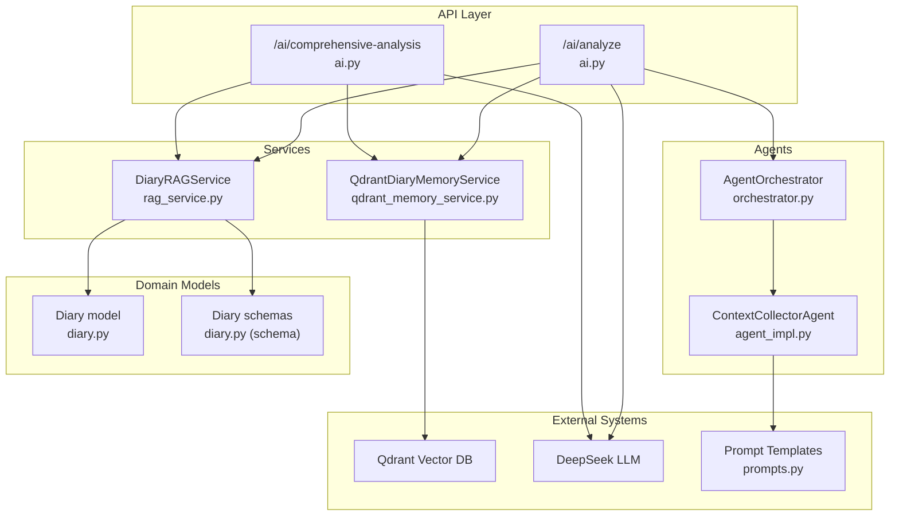
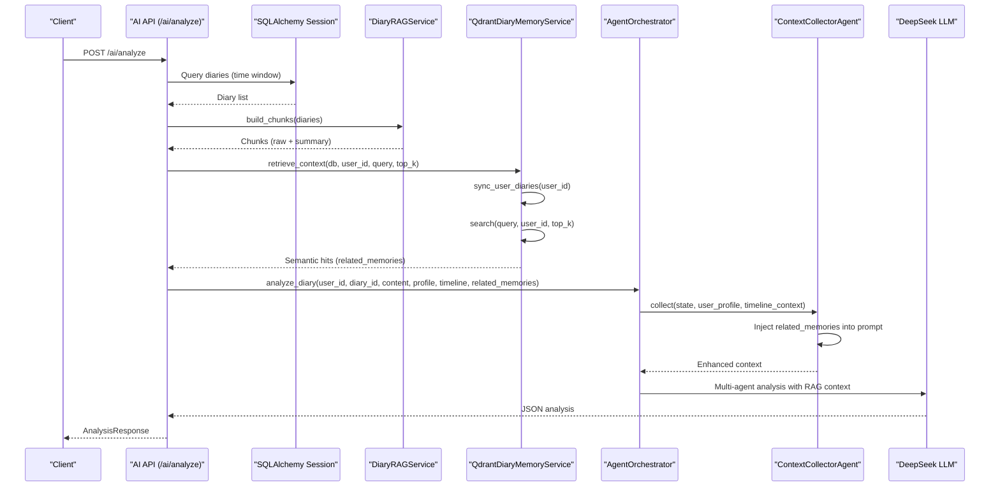
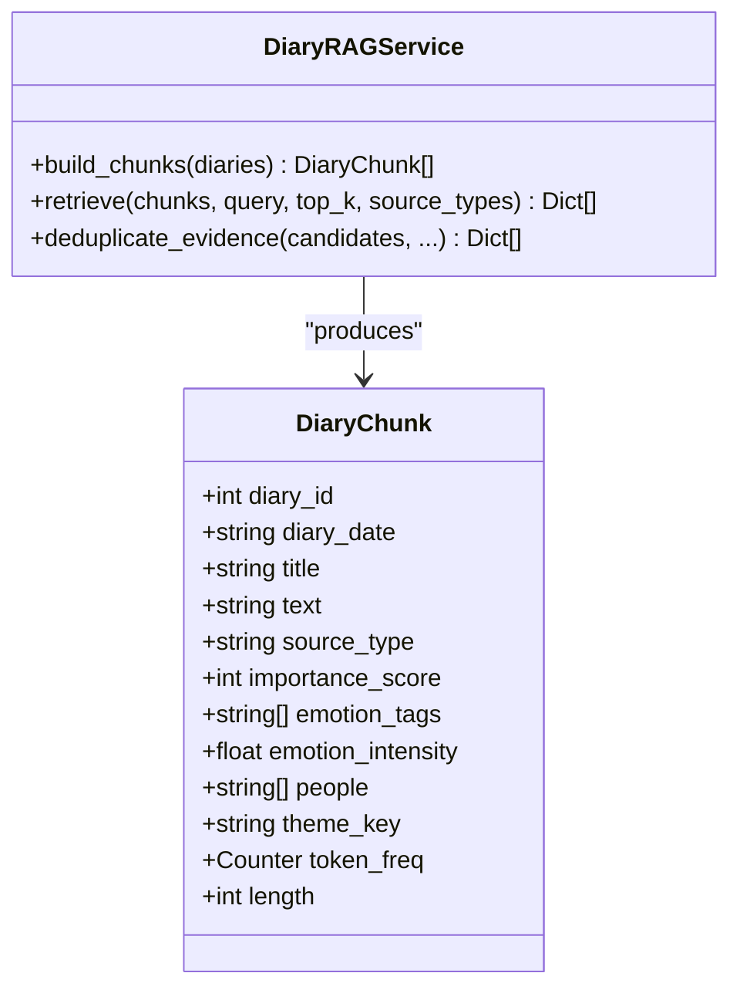
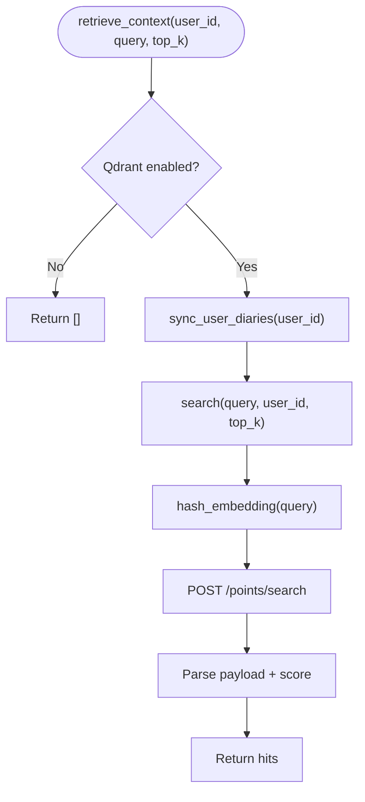
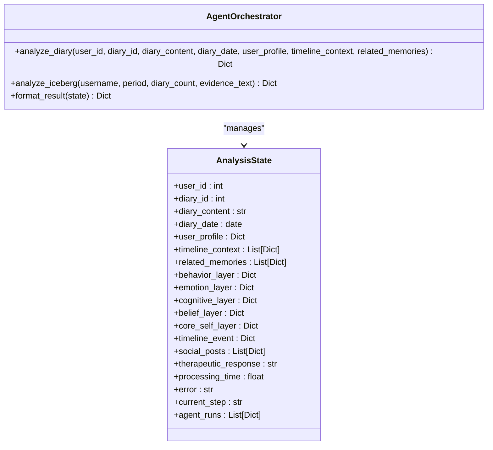
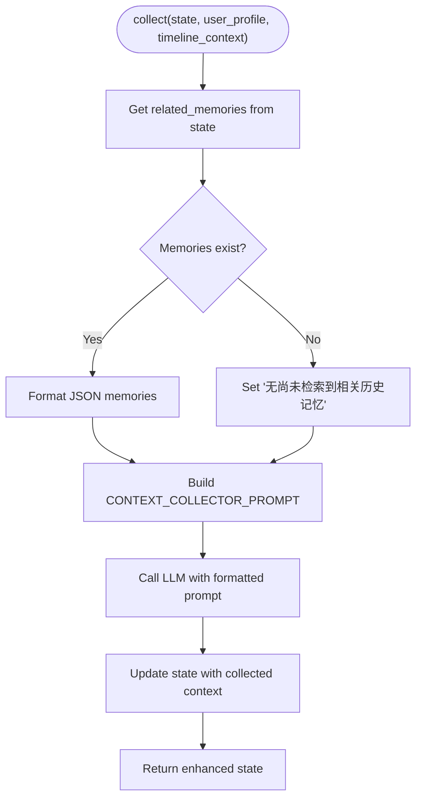
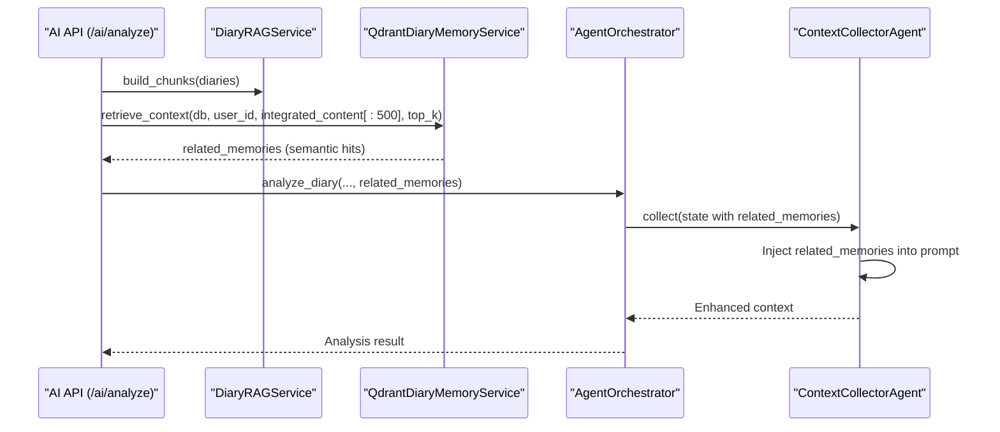
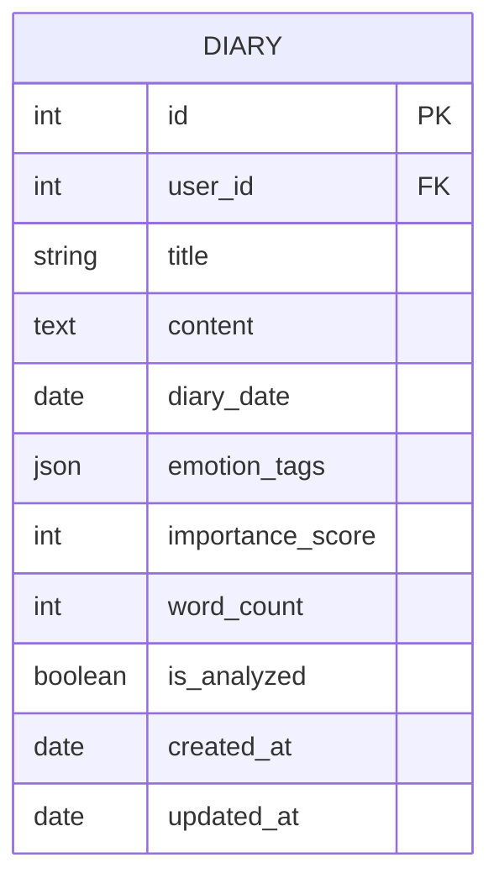
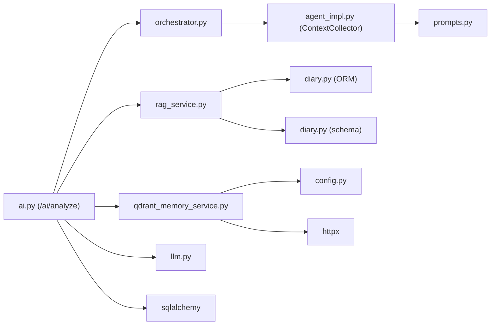

# Retrieval-Augmented Generation (RAG)

<cite>
**Referenced Files in This Document**
- [rag_service.py](file://backend/app/services/rag_service.py)
- [qdrant_memory_service.py](file://backend/app/services/qdrant_memory_service.py)
- [diary.py](file://backend/app/models/diary.py)
- [diary.py (schema)](file://backend/app/schemas/diary.py)
- [diaries.py](file://backend/app/api/v1/diaries.py)
- [ai.py](file://backend/app/api/v1/ai.py)
- [config.py](file://backend/app/core/config.py)
- [llm.py](file://backend/app/agents/llm.py)
- [orchestrator.py](file://backend/app/agents/orchestrator.py)
- [agent_impl.py](file://backend/app/agents/agent_impl.py)
- [prompts.py](file://backend/app/agents/prompts.py)
- [requirements.txt](file://backend/requirements.txt)
</cite>

## Update Summary
**Changes Made**
- Enhanced RAG memory integration with Qdrant vector database in the `/ai/analyze` endpoint
- Added related_memories parameter support in the `analyze_diary` method
- Implemented RAG context injection in prompts through the context collector agent
- Added Qdrant query logic in AI endpoints for semantic memory retrieval
- Updated architecture diagrams to reflect the new hybrid retrieval approach

## Table of Contents
1. [Introduction](#introduction)
2. [Project Structure](#project-structure)
3. [Core Components](#core-components)
4. [Architecture Overview](#architecture-overview)
5. [Detailed Component Analysis](#detailed-component-analysis)
6. [Dependency Analysis](#dependency-analysis)
7. [Performance Considerations](#performance-considerations)
8. [Troubleshooting Guide](#troubleshooting-guide)
9. [Conclusion](#conclusion)
10. [Appendices](#appendices)

## Introduction
This document explains the custom Retrieval-Augmented Generation (RAG) implementation powering the "Comprehensive Analysis" and "Analyze Diary" features in the Yinji application. The system now features enhanced RAG memory integration with Qdrant vector database, providing both lexical and semantic memory retrieval capabilities for comprehensive psychological growth analysis.

Key enhancements include:
- Diary preprocessing pipeline: text cleaning, chunk segmentation, metadata extraction
- BM25-based lexical retrieval with weighted scoring and evidence deduplication
- Qdrant vector database integration for semantic memory search and user-scoped context retrieval
- Hybrid retrieval strategy combining lexical and semantic signals
- Related memories parameter support for contextual analysis
- RAG context injection in agent prompts for enhanced analysis quality

## Project Structure
The RAG system spans services, models, schemas, APIs, and configuration with enhanced Qdrant integration:
- Services: RAG chunking and retrieval, Qdrant memory sync/search with user-scoped context
- Models/Schemas: Diary entity and Pydantic DTOs
- API: Endpoints that orchestrate RAG-driven analysis with semantic memory retrieval
- Config: Qdrant connection and vector dimension settings
- Agents: Multi-agent orchestration with RAG context injection
- LLM: DeepSeek client used downstream for synthesis

**Diagram sources**
- [ai.py:267-403](file://backend/app/api/v1/ai.py#L267-L403)
- [ai.py:392-644](file://backend/app/api/v1/ai.py#L392-L644)
- [rag_service.py:147-360](file://backend/app/services/rag_service.py#L147-L360)
- [qdrant_memory_service.py:45-188](file://backend/app/services/qdrant_memory_service.py#L45-L188)
- [orchestrator.py:27-53](file://backend/app/agents/orchestrator.py#L27-L53)
- [agent_impl.py:100-148](file://backend/app/agents/agent_impl.py#L100-L148)
- [prompts.py:9-33](file://backend/app/agents/prompts.py#L9-L33)

**Section sources**
- [ai.py:267-403](file://backend/app/api/v1/ai.py#L267-L403)
- [ai.py:392-644](file://backend/app/api/v1/ai.py#L392-L644)
- [rag_service.py:147-360](file://backend/app/services/rag_service.py#L147-L360)
- [qdrant_memory_service.py:45-188](file://backend/app/services/qdrant_memory_service.py#L45-L188)
- [orchestrator.py:27-53](file://backend/app/agents/orchestrator.py#L27-L53)
- [agent_impl.py:100-148](file://backend/app/agents/agent_impl.py#L100-L148)
- [prompts.py:9-33](file://backend/app/agents/prompts.py#L9-L33)

## Core Components
- **DiaryRAGService**: Builds chunks from diary entries, runs BM25-style lexical retrieval with temporal, importance, emotion, repetition, and people heuristics, and deduplicates evidence.
- **QdrantDiaryMemoryService**: Hash-based embedding encoder, collection lifecycle, user-scoped sync, semantic search with context injection, and retrieve-context wrapper.
- **AgentOrchestrator**: Manages multi-agent workflow with related_memories parameter support for contextual analysis.
- **ContextCollectorAgent**: Collects user context and injects related memories into analysis prompts.
- **API orchestration**: Enhanced with Qdrant-based semantic memory retrieval for the `/ai/analyze` endpoint.
- **Configuration**: Qdrant URL/API key/collection/vector dimension settings.

Key capabilities:
- Lexical chunking with overlap and sentence-aware segmentation
- Theme-aware grouping and repetition penalty
- Recency decay and weighted fusion
- Evidence deduplication using token Jaccard similarity
- Semantic search via Qdrant with cosine distance and user isolation
- Related memories parameter injection in agent prompts
- Hybrid retrieval combining lexical and semantic signals

**Section sources**
- [rag_service.py:147-360](file://backend/app/services/rag_service.py#L147-L360)
- [qdrant_memory_service.py:45-188](file://backend/app/services/qdrant_memory_service.py#L45-L188)
- [ai.py:392-644](file://backend/app/api/v1/ai.py#L392-L644)
- [orchestrator.py:27-53](file://backend/app/agents/orchestrator.py#L27-L53)
- [agent_impl.py:100-148](file://backend/app/agents/agent_impl.py#L100-L148)
- [config.py:92-108](file://backend/app/core/config.py#L92-L108)

## Architecture Overview
The enhanced RAG pipeline now includes Qdrant-based semantic memory retrieval. The `/ai/analyze` endpoint performs user-integrated analysis with related memories injection, while `/ai/comprehensive-analysis` focuses on multi-agent iceburg analysis with lexical-only retrieval.

**Diagram sources**
- [ai.py:392-644](file://backend/app/api/v1/ai.py#L392-L644)
- [qdrant_memory_service.py:175-186](file://backend/app/services/qdrant_memory_service.py#L175-L186)
- [orchestrator.py:27-53](file://backend/app/agents/orchestrator.py#L27-L53)
- [agent_impl.py:100-148](file://backend/app/agents/agent_impl.py#L100-L148)

## Detailed Component Analysis

### Enhanced DiaryRAGService
Responsibilities remain similar to the lexical-only version, with the addition of supporting the hybrid retrieval workflow:
- Chunk construction: summary chunk per diary plus sentence-aware overlapping chunks from raw content
- Metadata extraction: people, emotion intensity, theme key, token frequency, length
- Lexical retrieval: BM25-like scoring with IDF, TF, length normalization; temporal decay; importance/emotion/repetition penalties; people hit bonus; source-type bonus
- Evidence deduplication: per-diary cap, per-reason cap, and token-set Jaccard similarity threshold

**Diagram sources**
- [rag_service.py:15-29](file://backend/app/services/rag_service.py#L15-L29)
- [rag_service.py:147-360](file://backend/app/services/rag_service.py#L147-L360)

Key algorithms and scoring remain unchanged from the lexical-only implementation.

**Section sources**
- [rag_service.py:31-360](file://backend/app/services/rag_service.py#L31-L360)

### Enhanced QdrantDiaryMemoryService
The Qdrant service now includes enhanced functionality for user-scoped semantic memory retrieval:
- Hash-based embedding generator (token → MD5 → dim-indexed histogram → normalized)
- Collection creation/ensurance with cosine distance
- User-scoped sync of diary vectors with payload
- Semantic search constrained by user_id filter
- Retrieve-context wrapper that ensures fresh data before search
- Enhanced error handling with graceful degradation

**Diagram sources**
- [qdrant_memory_service.py:175-186](file://backend/app/services/qdrant_memory_service.py#L175-L186)
- [qdrant_memory_service.py:94-131](file://backend/app/services/qdrant_memory_service.py#L94-L131)
- [qdrant_memory_service.py:133-173](file://backend/app/services/qdrant_memory_service.py#L133-L173)

**Section sources**
- [qdrant_memory_service.py:26-38](file://backend/app/services/qdrant_memory_service.py#L26-L38)
- [qdrant_memory_service.py:62-83](file://backend/app/services/qdrant_memory_service.py#L62-L83)
- [qdrant_memory_service.py:102-131](file://backend/app/services/qdrant_memory_service.py#L102-L131)
- [qdrant_memory_service.py:133-173](file://backend/app/services/qdrant_memory_service.py#L133-L173)
- [qdrant_memory_service.py:175-186](file://backend/app/services/qdrant_memory_service.py#L175-L186)
- [config.py:92-108](file://backend/app/core/config.py#L92-L108)

### Enhanced AgentOrchestrator with Related Memories Support
The orchestrator now supports the related_memories parameter for contextual analysis:
- Initialize state with related_memories parameter
- Pass related_memories through the multi-agent workflow
- Coordinate between lexical and semantic memory retrieval
- Manage processing time and error states

**Diagram sources**
- [orchestrator.py:27-53](file://backend/app/agents/orchestrator.py#L27-L53)
- [orchestrator.py:298-337](file://backend/app/agents/orchestrator.py#L298-L337)

**Section sources**
- [orchestrator.py:27-53](file://backend/app/agents/orchestrator.py#L27-L53)
- [orchestrator.py:298-337](file://backend/app/agents/orchestrator.py#L298-L337)

### Enhanced ContextCollectorAgent with RAG Context Injection
The context collector agent now injects related memories into analysis prompts:
- Build prompt with user profile, timeline context, and related memories
- Handle empty related memories gracefully
- Format memories for JSON parsing
- Maintain backward compatibility with lexical-only retrieval

**Diagram sources**
- [agent_impl.py:100-148](file://backend/app/agents/agent_impl.py#L100-L148)
- [prompts.py:9-33](file://backend/app/agents/prompts.py#L9-L33)

**Section sources**
- [agent_impl.py:100-148](file://backend/app/agents/agent_impl.py#L100-L148)
- [prompts.py:9-33](file://backend/app/agents/prompts.py#L9-L33)

### Enhanced API Orchestration with Hybrid Retrieval
The `/ai/analyze` endpoint now includes Qdrant-based semantic memory retrieval:
- Fetch diaries within a rolling window
- Build lexical chunks and retrieve candidates for multiple reasons
- **NEW**: Retrieve related memories from Qdrant using user-scoped semantic search
- Inject related memories into agent prompts for enhanced analysis
- Deduplicate evidence and synthesize JSON via LLM

**Diagram sources**
- [ai.py:392-644](file://backend/app/api/v1/ai.py#L392-L644)
- [rag_service.py:147-360](file://backend/app/services/rag_service.py#L147-L360)
- [qdrant_memory_service.py:175-186](file://backend/app/services/qdrant_memory_service.py#L175-L186)
- [orchestrator.py:27-53](file://backend/app/agents/orchestrator.py#L27-L53)
- [agent_impl.py:100-148](file://backend/app/agents/agent_impl.py#L100-L148)

**Section sources**
- [ai.py:392-644](file://backend/app/api/v1/ai.py#L392-L644)

### Data Models and Schemas
- Diary ORM model defines fields used by RAG (title, content, emotion_tags, importance_score, diary_date)
- Pydantic schemas define request/response shapes for diary operations

**Diagram sources**
- [diary.py:29-64](file://backend/app/models/diary.py#L29-L64)

**Section sources**
- [diary.py:29-64](file://backend/app/models/diary.py#L29-L64)
- [diary.py (schema):9-63](file://backend/app/schemas/diary.py#L9-L63)

## Dependency Analysis
Enhanced internal dependencies with Qdrant integration:
- API depends on RAG and Qdrant services for hybrid retrieval
- Agent orchestrator depends on context collector with related memories support
- RAG depends on SQLAlchemy models for metadata and schemas for validation
- Qdrant service depends on configuration for cluster settings
- Context collector depends on prompt templates for memory injection

**Diagram sources**
- [ai.py:392-644](file://backend/app/api/v1/ai.py#L392-L644)
- [rag_service.py:147-360](file://backend/app/services/rag_service.py#L147-L360)
- [qdrant_memory_service.py:45-188](file://backend/app/services/qdrant_memory_service.py#L45-L188)
- [orchestrator.py:27-53](file://backend/app/agents/orchestrator.py#L27-L53)
- [agent_impl.py:100-148](file://backend/app/agents/agent_impl.py#L100-L148)
- [prompts.py:9-33](file://backend/app/agents/prompts.py#L9-L33)
- [diary.py:29-64](file://backend/app/models/diary.py#L29-L64)
- [diary.py (schema):9-63](file://backend/app/schemas/diary.py#L9-L63)
- [config.py:92-108](file://backend/app/core/config.py#L92-L108)

**Section sources**
- [requirements.txt:1-26](file://backend/requirements.txt#L1-L26)
- [config.py:92-108](file://backend/app/core/config.py#L92-L108)

## Performance Considerations
Enhanced performance considerations with Qdrant integration:
- **Chunk sizing and overlap**: Maintain existing optimal settings for lexical retrieval
- **BM25 tuning**: Keep existing parameters for lexical scoring stability
- **Fusion weights**: Maintain existing weight distribution for balanced lexical-semantic integration
- **Deduplication**: Keep existing thresholds to prevent memory redundancy
- **Qdrant embedding**: Hash-based encoding remains deterministic and lightweight
- **Vector dimensionality**: Optimize Qdrant vector dimension (default 256) based on corpus size and performance requirements
- **Semantic search limits**: Cap top_k for Qdrant searches to balance relevance and performance
- **User isolation**: Leverage user_id filters to prevent cross-user memory leakage
- **Graceful degradation**: Qdrant failures fall back to lexical-only analysis
- **Memory caching**: Consider caching frequently accessed related memories for repeated analyses
- **Batch operations**: Use Qdrant upsert for efficient user memory synchronization

**Section sources**
- [qdrant_memory_service.py:133-173](file://backend/app/services/qdrant_memory_service.py#L133-L173)
- [qdrant_memory_service.py:175-186](file://backend/app/services/qdrant_memory_service.py#L175-L186)
- [config.py:92-108](file://backend/app/core/config.py#L92-L108)

## Troubleshooting Guide
Enhanced troubleshooting for Qdrant integration:
- **No candidates returned**:
  - Verify query tokens are not empty after tokenization
  - Check that source_types filter does not exclude all chunks
  - Confirm diaries exist within the selected date window
- **Empty Qdrant results**:
  - Ensure Qdrant URL/API key/collection are configured in environment variables
  - Verify collection exists and vectors were upserted during sync
  - Confirm user_id filter matches stored payload
  - Check network connectivity to Qdrant cluster
- **Related memories injection failures**:
  - Verify related_memories parameter is properly passed to agent orchestrator
  - Check JSON formatting of memory payloads
  - Ensure prompt templates include related_memories placeholder
- **LLM parsing failures**:
  - Validate JSON response format and retry with stricter prompts
  - Check that related_memories are properly injected into prompts
- **Deduplication too aggressive**:
  - Lower Jaccard threshold or increase per-reason cap
- **Slow retrieval**:
  - Reduce top_k for both lexical and semantic searches
  - Limit payload fields to essential metadata
  - Pre-filter diaries by date range
- **Qdrant performance issues**:
  - Monitor collection size and optimize vector dimensions
  - Check Qdrant cluster health and resource utilization
  - Implement connection pooling for HTTP requests

**Section sources**
- [rag_service.py:210-317](file://backend/app/services/rag_service.py#L210-L317)
- [qdrant_memory_service.py:133-173](file://backend/app/services/qdrant_memory_service.py#L133-L173)
- [ai.py:506-523](file://backend/app/api/v1/ai.py#L506-L523)
- [agent_impl.py:112-124](file://backend/app/agents/agent_impl.py#L112-L124)

## Conclusion
The enhanced Yinji RAG implementation now provides comprehensive memory integration through Qdrant vector database, combining lexical and semantic retrieval capabilities. The system supports related memories parameter injection in agent prompts, enabling richer contextual analysis for both individual diary analysis and comprehensive psychological growth assessment. The modular design maintains backward compatibility while adding powerful semantic memory capabilities, with graceful degradation when Qdrant is unavailable. This enhancement significantly improves analysis quality by providing users with contextually rich insights derived from both explicit lexical patterns and implicit semantic associations in their personal memory space.

## Appendices

### Enhanced Retrieval Workflow Examples
- **Lexical-only retrieval** (comprehensive analysis):
  - Build chunks from diaries
  - Retrieve with source_types restricted to raw or summary
  - Deduplicate and synthesize
- **Hybrid retrieval with semantic memory** (analyze diary):
  - Build chunks from diaries
  - Retrieve lexical candidates
  - **NEW**: Retrieve related memories from Qdrant using user-scoped semantic search
  - **NEW**: Inject related memories into agent prompts for enhanced context
  - Merge, deduplicate, and synthesize

**Section sources**
- [ai.py:313-337](file://backend/app/api/v1/ai.py#L313-L337)
- [ai.py:506-534](file://backend/app/api/v1/ai.py#L506-L534)
- [rag_service.py:147-360](file://backend/app/services/rag_service.py#L147-L360)
- [qdrant_memory_service.py:175-186](file://backend/app/services/qdrant_memory_service.py#L175-L186)

### Enhanced Chunk Size Optimization Tips
- Maintain existing optimal settings: max_len around 200–300 characters and overlap ~20–40%
- Consider increased overlap for dense topics (e.g., therapy notes) to preserve context
- Prefer sentence-aware splitting to maintain coherence
- **NEW**: Consider reducing chunk size for Qdrant embedding efficiency

**Section sources**
- [rag_service.py:38-62](file://backend/app/services/rag_service.py#L38-L62)

### Enhanced Memory Retrieval Patterns
- **Lexical retrieval**: Retrieve context per query by filtering chunks by source types
- **Semantic retrieval**: **NEW** Retrieve context per query by syncing user's recent diaries and searching with user_id filter
- **Hybrid retrieval**: **NEW** Combine lexical and semantic results with weighted fusion
- **Memory injection**: **NEW** Inject related memories into agent prompts for enhanced analysis

**Section sources**
- [qdrant_memory_service.py:85-131](file://backend/app/services/qdrant_memory_service.py#L85-L131)
- [qdrant_memory_service.py:133-173](file://backend/app/services/qdrant_memory_service.py#L133-L173)
- [agent_impl.py:112-124](file://backend/app/agents/agent_impl.py#L112-L124)

### Enhanced Cost Management and Indexing
- **Qdrant configuration**: Align vector dimension with embedding function (default 256)
- **Distance metric**: Use cosine distance for normalized hash embeddings
- **Query optimization**: Limit returned fields and top_k to reduce cost and latency
- **Collection management**: Ensure collection exists and is properly sized for expected workload
- **Graceful degradation**: Qdrant failures automatically fall back to lexical-only analysis
- **Resource monitoring**: Monitor Qdrant cluster performance and optimize based on usage patterns

**Section sources**
- [config.py:92-108](file://backend/app/core/config.py#L92-L108)
- [qdrant_memory_service.py:62-83](file://backend/app/services/qdrant_memory_service.py#L62-L83)
- [qdrant_memory_service.py:139-148](file://backend/app/services/qdrant_memory_service.py#L139-L148)