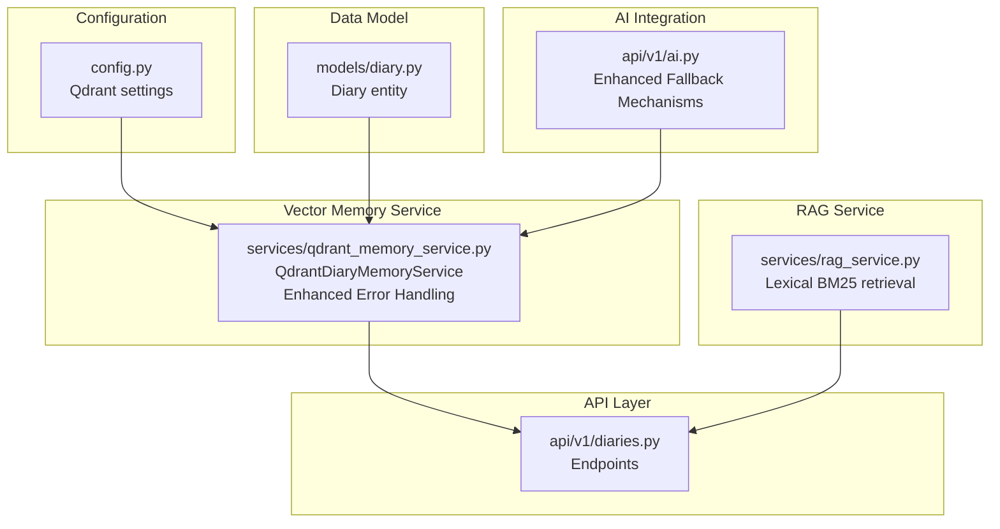
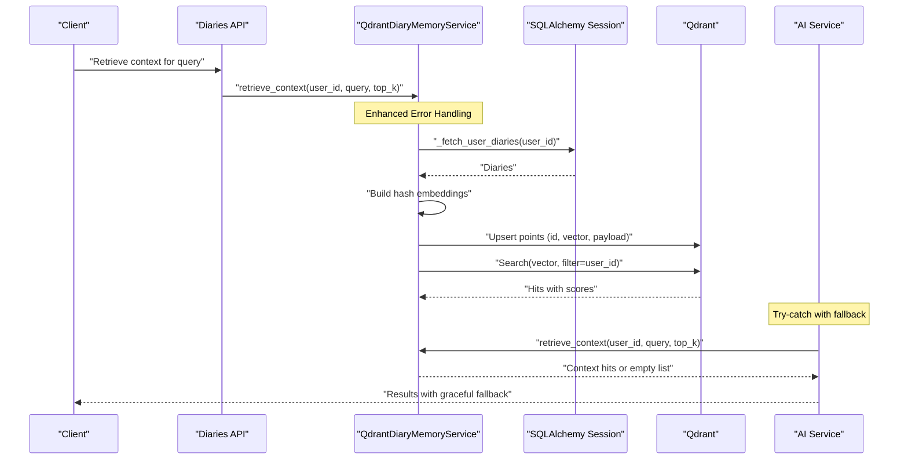
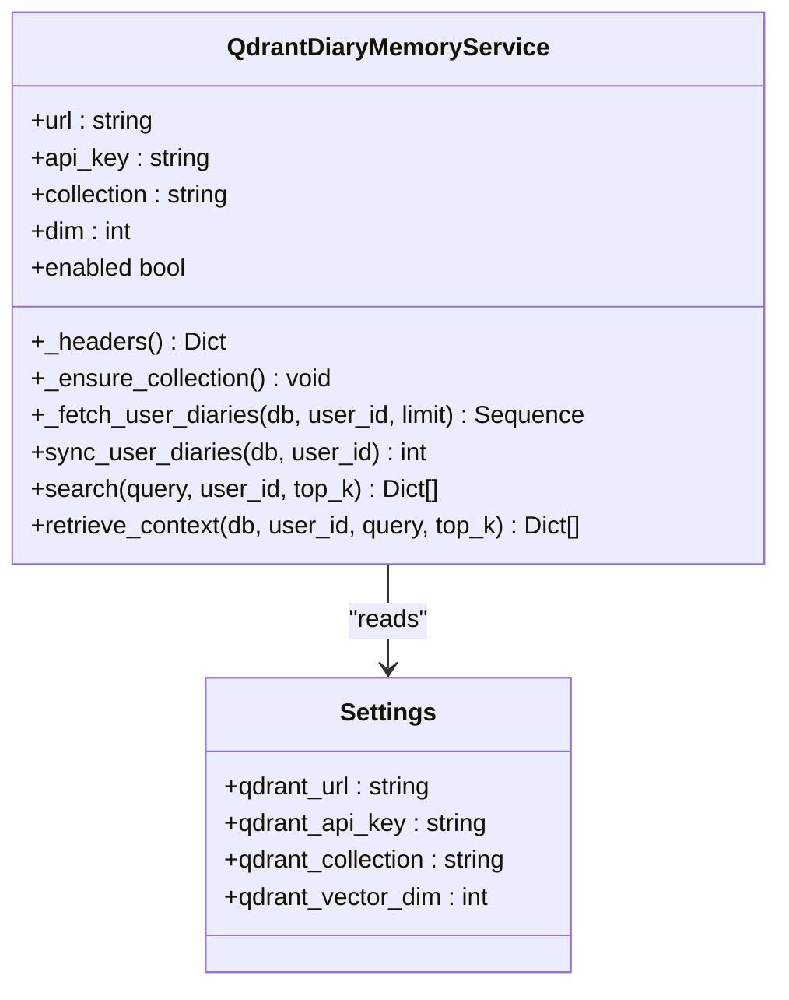
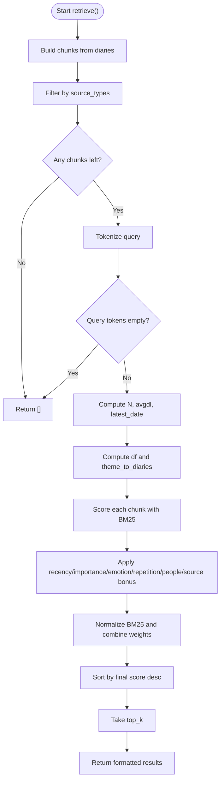
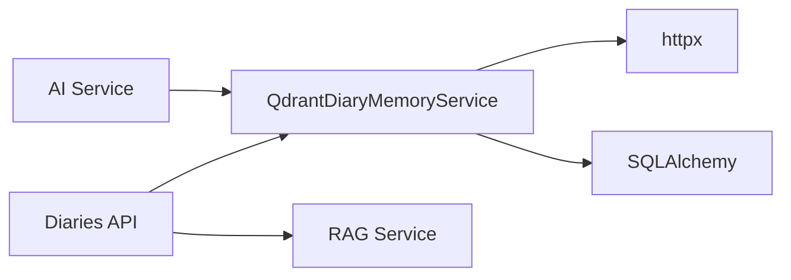
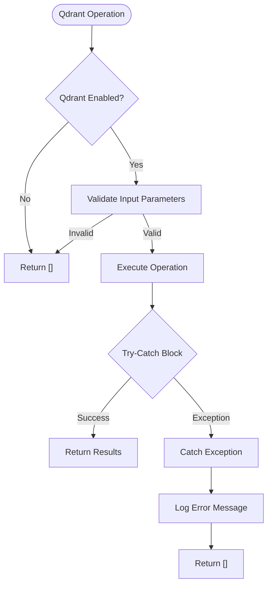

# Vector Storage and Qdrant Integration

<cite>
**Referenced Files in This Document**
- [qdrant_memory_service.py](file://backend/app/services/qdrant_memory_service.py)
- [config.py](file://backend/app/core/config.py)
- [diary.py](file://backend/app/models/diary.py)
- [rag_service.py](file://backend/app/services/rag_service.py)
- [diaries.py](file://backend/app/api/v1/diaries.py)
- [ai.py](file://backend/app/api/v1/ai.py)
- [requirements.txt](file://backend/requirements.txt)
- [.env.example](file://backend/.env.example)
</cite>

## Update Summary
**Changes Made**
- Enhanced error handling in Qdrant memory service with comprehensive exception catching
- Improved fallback mechanisms for graceful degradation when Qdrant is unavailable
- Better integration with AI analysis workflow including proper error handling and logging
- Added robust fallback to "no memory mode" when vector storage fails

## Table of Contents
1. [Introduction](#introduction)
2. [Project Structure](#project-structure)
3. [Core Components](#core-components)
4. [Architecture Overview](#architecture-overview)
5. [Detailed Component Analysis](#detailed-component-analysis)
6. [Dependency Analysis](#dependency-analysis)
7. [Performance Considerations](#performance-considerations)
8. [Enhanced Error Handling and Fallback Mechanisms](#enhanced-error-handling-and-fallback-mechanisms)
9. [Troubleshooting Guide](#troubleshooting-guide)
10. [Conclusion](#conclusion)
11. [Appendices](#appendices)

## Introduction
This document explains the vector storage system and Qdrant integration used by the Retrieval-Augmented Generation (RAG) pipeline for diary memory retrieval. The system has been enhanced with improved error handling, fallback mechanisms, and better integration with the AI analysis workflow. It covers:
- Embedding generation for diary chunks and query vectors
- Qdrant collection management and vector indexing
- Metadata storage alongside embeddings
- Semantic search using cosine similarity
- Hybrid retrieval combining lexical BM25 and vector similarity
- Enhanced error handling and graceful fallback mechanisms
- Configuration, performance tuning, and scalability guidance
- Troubleshooting vector storage and query performance

## Project Structure
The vector memory system spans configuration, models, services, and APIs with enhanced error handling:
- Configuration defines Qdrant endpoint, credentials, collection name, and vector dimension
- Models define the diary entity persisted in the database
- Services implement vector embedding, collection creation/upsert, and semantic search with robust error handling
- APIs orchestrate retrieval in the broader analysis workflow with graceful fallback
- AI service integrates vector memory with comprehensive error handling and logging

**Diagram sources**
- [config.py:72-88](file://backend/app/core/config.py#L72-L88)
- [diary.py:29-64](file://backend/app/models/diary.py#L29-L64)
- [qdrant_memory_service.py:45-188](file://backend/app/services/qdrant_memory_service.py#L45-L188)
- [rag_service.py:147-360](file://backend/app/services/rag_service.py#L147-L360)
- [diaries.py:29-491](file://backend/app/api/v1/diaries.py#L29-L491)
- [ai.py:506-537](file://backend/app/api/v1/ai.py#L506-L537)

**Section sources**
- [config.py:72-88](file://backend/app/core/config.py#L72-L88)
- [diary.py:29-64](file://backend/app/models/diary.py#L29-L64)
- [qdrant_memory_service.py:45-188](file://backend/app/services/qdrant_memory_service.py#L45-L188)
- [rag_service.py:147-360](file://backend/app/services/rag_service.py#L147-L360)
- [diaries.py:29-491](file://backend/app/api/v1/diaries.py#L29-L491)
- [ai.py:506-537](file://backend/app/api/v1/ai.py#L506-L537)

## Core Components
- **QdrantDiaryMemoryService**: Manages Qdrant collection lifecycle, builds hash-based embeddings, synchronizes user diaries, performs semantic search with cosine similarity, and includes comprehensive error handling for graceful fallback.
- **Diary model**: Provides the source data for vectorization and metadata enrichment.
- **Lexical BM25 service**: Implements keyword-based retrieval with recency, importance, emotion, repetition, and people heuristics.
- **Configuration**: Centralizes Qdrant endpoint, API key, collection name, and vector dimension.
- **AI Integration**: Orchestrates vector memory retrieval within the AI analysis workflow with proper error handling and logging.
- **Dependencies**: httpx for HTTP requests to Qdrant, SQLAlchemy for database operations.

Key responsibilities:
- Embedding generation: Tokenization and hashing-based vectorization with L2 normalization
- Collection management: Creation with Cosine distance and configured dimension
- Upsert: Bulk insertion of diary vectors with metadata payload
- Search: Vector similarity search constrained by user filter
- Hybrid retrieval: Lexical BM25 scoring combined with vector recall
- **Enhanced Error Handling**: Comprehensive exception catching with graceful fallback to empty results
- **Fallback Mechanisms**: Graceful degradation when Qdrant is unavailable or fails

**Section sources**
- [qdrant_memory_service.py:19-38](file://backend/app/services/qdrant_memory_service.py#L19-L38)
- [qdrant_memory_service.py:62-83](file://backend/app/services/qdrant_memory_service.py#L62-L83)
- [qdrant_memory_service.py:94-131](file://backend/app/services/qdrant_memory_service.py#L94-L131)
- [qdrant_memory_service.py:133-173](file://backend/app/services/qdrant_memory_service.py#L133-L173)
- [qdrant_memory_service.py:175-186](file://backend/app/services/qdrant_memory_service.py#L175-L186)
- [diary.py:29-64](file://backend/app/models/diary.py#L29-L64)
- [config.py:72-88](file://backend/app/core/config.py#L72-L88)
- [requirements.txt:22](file://backend/requirements.txt#L22)

## Architecture Overview
The system integrates vector memory with lexical retrieval for robust diary search with enhanced error handling:
- **Vector path**: Diaries fetched from DB → Hash embedding → Qdrant upsert → Qdrant search → ranked results with fallback
- **Lexical path**: Diaries chunked and scored via BM25 with recency and metadata boosts
- **Hybrid**: Combine lexical and vector results with unified reranking
- **Enhanced Error Handling**: Try-catch blocks with graceful fallback to "no memory mode" when Qdrant fails

**Diagram sources**
- [qdrant_memory_service.py:85-131](file://backend/app/services/qdrant_memory_service.py#L85-L131)
- [qdrant_memory_service.py:133-173](file://backend/app/services/qdrant_memory_service.py#L133-L173)
- [qdrant_memory_service.py:175-186](file://backend/app/services/qdrant_memory_service.py#L175-L186)
- [ai.py:506-537](file://backend/app/api/v1/ai.py#L506-L537)
- [diaries.py:29-491](file://backend/app/api/v1/diaries.py#L29-L491)

## Detailed Component Analysis

### QdrantDiaryMemoryService
Implements:
- Tokenization for multilingual support
- Hash-based embedding with MD5-based indexing and L2 normalization
- Collection creation with Cosine distance and configured dimension
- Fetching user diaries and building points with metadata payload
- Upserting points and performing vector search with user filter
- **Enhanced Error Handling**: Comprehensive exception catching in `retrieve_context` method

**Diagram sources**
- [qdrant_memory_service.py:45-188](file://backend/app/services/qdrant_memory_service.py#L45-L188)
- [config.py:72-88](file://backend/app/core/config.py#L72-L88)

Key behaviors:
- **Embedding function**: Tokenize text, compute MD5 hash per token, map to dimension via modulo, normalize
- **Collection**: Created with size equal to configured dimension and Cosine distance
- **Payload**: Stores user_id, diary_id, diary_date, title, snippet, emotion_tags, importance_score
- **Search**: Filters by user_id, returns score and payload fields
- **Enhanced Error Handling**: `retrieve_context` method catches all exceptions and returns empty list for graceful fallback

**Section sources**
- [qdrant_memory_service.py:19-38](file://backend/app/services/qdrant_memory_service.py#L19-L38)
- [qdrant_memory_service.py:62-83](file://backend/app/services/qdrant_memory_service.py#L62-L83)
- [qdrant_memory_service.py:94-131](file://backend/app/services/qdrant_memory_service.py#L94-L131)
- [qdrant_memory_service.py:133-173](file://backend/app/services/qdrant_memory_service.py#L133-L173)
- [qdrant_memory_service.py:175-186](file://backend/app/services/qdrant_memory_service.py#L175-L186)

### Lexical BM25 Retrieval (RAG Service)
Implements:
- Chunking diaries into overlapping segments
- Token frequency counting and document frequency computation
- BM25 scoring with idf and tf–idf-like normalization
- Recency, importance, emotion intensity, repetition, people hit, and source-type bonuses
- Deduplication via Jaccard similarity on token sets

**Diagram sources**
- [rag_service.py:147-360](file://backend/app/services/rag_service.py#L147-L360)

**Section sources**
- [rag_service.py:147-360](file://backend/app/services/rag_service.py#L147-L360)

### AI Service Integration with Enhanced Error Handling
The AI service now includes comprehensive error handling for Qdrant operations:
- Try-catch blocks around Qdrant retrieval operations
- Clear logging messages indicating whether memories were found or Qdrant is unconfigured
- Graceful fallback to "no memory mode" when Qdrant fails
- Proper exception handling with informative error messages

**Section sources**
- [ai.py:506-537](file://backend/app/api/v1/ai.py#L506-L537)

### Configuration and Environment
- Qdrant settings: URL, API key, collection name, vector dimension
- Example environment variables provided for local setup

**Section sources**
- [config.py:72-88](file://backend/app/core/config.py#L72-L88)
- [.env.example:35-39](file://backend/.env.example#L35-L39)

## Dependency Analysis
External dependencies relevant to vector storage:
- httpx: HTTP client for Qdrant REST API calls
- SQLAlchemy: ORM for fetching diaries from the database

**Diagram sources**
- [qdrant_memory_service.py:11-16](file://backend/app/services/qdrant_memory_service.py#L11-L16)
- [requirements.txt:22](file://backend/requirements.txt#L22)
- [diaries.py:23-27](file://backend/app/api/v1/diaries.py#L23-L27)
- [ai.py:506-537](file://backend/app/api/v1/ai.py#L506-L537)

**Section sources**
- [requirements.txt:22](file://backend/requirements.txt#L22)
- [qdrant_memory_service.py:11-16](file://backend/app/services/qdrant_memory_service.py#L11-L16)
- [diaries.py:23-27](file://backend/app/api/v1/diaries.py#L23-L27)
- [ai.py:506-537](file://backend/app/api/v1/ai.py#L506-L537)

## Performance Considerations
- Vector dimensionality
  - Current implementation uses a fixed dimension with a hashing-based sparse vector
  - Dimension affects memory footprint and search latency; ensure Qdrant vector size matches configuration
- Indexing and distance metric
  - Collection created with Cosine distance; suitable for normalized vectors
  - Normalization is applied in the embedding function
- Batch upsert and search limits
  - Upsert batches all user diaries; tune limit to balance freshness vs. cost
  - Search limit is capped to reduce payload size and latency
- Payload size
  - Payload includes snippet and metadata; keep snippet length reasonable to minimize storage and transfer costs
- Network timeouts
  - Async HTTP client with explicit timeouts; adjust based on network conditions
- Hybrid retrieval
  - Lexical BM25 provides precise lexical matches; combine with vector recall for robustness
- Scalability
  - Consider sharding by user_id or partitioning large datasets
  - Monitor Qdrant resource usage and scale replicas accordingly
  - For very large collections, consider approximate nearest neighbor (ANN) indices and optimized filters
- **Enhanced Error Handling Benefits**
  - Prevents cascading failures when Qdrant is unavailable
  - Maintains system stability with graceful fallback mechanisms
  - Reduces user-facing errors through proper exception handling

## Enhanced Error Handling and Fallback Mechanisms

### Comprehensive Exception Handling
The Qdrant memory service now includes robust error handling throughout the retrieval process:

**Key Enhancements:**
- **Enabled Check**: All methods first check if Qdrant is enabled before proceeding
- **Empty Input Validation**: Methods validate input parameters and return empty results gracefully
- **Try-Catch Blocks**: Critical operations are wrapped in try-catch blocks
- **Graceful Degradation**: On any exception, methods return empty results instead of crashing
- **Logging Integration**: AI service provides clear logging about memory retrieval status

### Fallback Mechanisms
The system implements multiple layers of fallback:

**Primary Fallback:**
- `retrieve_context` method catches all exceptions and returns empty list
- Ensures the AI analysis workflow continues even without vector memory

**Secondary Fallback:**
- AI service logs appropriate messages based on whether memories were found or Qdrant is unconfigured
- Falls back to "no memory mode" when vector storage fails

**Error Recovery:**
- System continues processing without blocking the main workflow
- Users receive consistent responses regardless of vector storage availability

**Diagram sources**
- [qdrant_memory_service.py:175-186](file://backend/app/services/qdrant_memory_service.py#L175-L186)
- [ai.py:506-537](file://backend/app/api/v1/ai.py#L506-L537)

**Section sources**
- [qdrant_memory_service.py:175-186](file://backend/app/services/qdrant_memory_service.py#L175-L186)
- [ai.py:506-537](file://backend/app/api/v1/ai.py#L506-L537)

## Troubleshooting Guide
Common issues and resolutions with enhanced error handling:

### Qdrant Connection Issues
- **Verify QDRANT_URL and QDRANT_API_KEY** are set and reachable
- **Check network connectivity and firewall rules**
- **Monitor Qdrant service health** - the system will gracefully fall back if unavailable
- **Review AI service logs** for clear indication of Qdrant unavailability

### Collection Creation Errors
- Ensure the collection does not conflict with existing schema; the service creates the collection with the configured dimension and Cosine distance
- **System automatically handles collection creation failures** with graceful fallback

### Empty or Low-Quality Embeddings
- Ensure input text is not empty; the embedding function returns a zero vector for empty input
- Confirm tokenization captures meaningful tokens for the target language
- **Enhanced validation prevents crashes** on malformed input

### Slow Search Performance
- Reduce top_k limit and payload fields
- Ensure user_id filter is indexed in Qdrant
- Consider increasing Qdrant resources or scaling out
- **System maintains performance** through graceful fallback mechanisms

### Payload Mismatch
- Verify payload keys match those stored during upsert (user_id, diary_id, diary_date, title, snippet, emotion_tags, importance_score)
- **Enhanced error handling prevents system crashes** on payload mismatches

### Hybrid Retrieval Not Combining Results
- Implement a post-processing step to merge BM25 and vector results with unified reranking
- **System continues with lexical-only results** if vector retrieval fails

### Enhanced Error Handling Specific Issues
- **Qdrant Unavailable**: System falls back to empty results and logs appropriate messages
- **Network Timeouts**: Operations timeout gracefully without blocking the main workflow
- **Database Connection Issues**: Sync operations fail safely, allowing continued processing
- **Configuration Errors**: Invalid settings are handled gracefully with empty results

**Section sources**
- [qdrant_memory_service.py:62-83](file://backend/app/services/qdrant_memory_service.py#L62-L83)
- [qdrant_memory_service.py:94-131](file://backend/app/services/qdrant_memory_service.py#L94-L131)
- [qdrant_memory_service.py:133-173](file://backend/app/services/qdrant_memory_service.py#L133-L173)
- [qdrant_memory_service.py:175-186](file://backend/app/services/qdrant_memory_service.py#L175-L186)
- [ai.py:506-537](file://backend/app/api/v1/ai.py#L506-L537)

## Conclusion
The vector storage system leverages a lightweight hashing-based embedding approach with Qdrant for efficient semantic search over user diaries. The enhanced implementation now includes comprehensive error handling, graceful fallback mechanisms, and improved integration with the AI analysis workflow. These enhancements ensure robust operation even when Qdrant is unavailable, providing users with consistent experiences while maintaining system stability. Combined with lexical BM25 retrieval, it provides robust, interpretable, and scalable memory-augmented search. Proper configuration of Qdrant settings, careful payload design, and thoughtful hybrid reranking enable high-quality recall and relevance for diary-based analysis.

## Appendices

### Configuration Examples
- Qdrant settings
  - QDRANT_URL: Qdrant cluster endpoint
  - QDRANT_API_KEY: API key for authentication
  - QDRANT_COLLECTION: Name of the collection storing diary vectors
  - QDRANT_VECTOR_DIM: Vector dimension used for hashing and indexing
- Example environment variables
  - See the example environment file for defaults and placeholders

**Section sources**
- [config.py:72-88](file://backend/app/core/config.py#L72-L88)
- [.env.example:35-39](file://backend/.env.example#L35-L39)

### Embedding Generation Details
- Tokenization: Lowercase, extract English tokens (min 2 chars) and Chinese characters
- Hashing: MD5 per token; index into vector via modulo by dimension
- Normalization: L2-normalize resulting vector
- Query vectors: Built identically to diary vectors

**Section sources**
- [qdrant_memory_service.py:19-38](file://backend/app/services/qdrant_memory_service.py#L19-L38)

### Qdrant Collection Management
- Creation: Ensures collection exists with configured dimension and Cosine distance
- Upsert: Bulk inserts points with id, vector, and payload
- Search: Performs vector search with user filter and returns payload fields
- **Enhanced Error Handling**: All operations include comprehensive exception handling

**Section sources**
- [qdrant_memory_service.py:62-83](file://backend/app/services/qdrant_memory_service.py#L62-L83)
- [qdrant_memory_service.py:94-131](file://backend/app/services/qdrant_memory_service.py#L94-L131)
- [qdrant_memory_service.py:133-173](file://backend/app/services/qdrant_memory_service.py#L133-L173)
- [qdrant_memory_service.py:175-186](file://backend/app/services/qdrant_memory_service.py#L175-L186)

### Hybrid Retrieval Strategy
- Lexical BM25: Scores based on idf, tf normalization, recency, importance, emotion, repetition, people hit, and source bonus
- Vector recall: Semantic search with cosine similarity and enhanced error handling
- Unified rerank: Merge and reorder results for final presentation
- **Graceful Fallback**: System continues with lexical-only results if vector retrieval fails

**Section sources**
- [rag_service.py:210-317](file://backend/app/services/rag_service.py#L210-L317)

### Enhanced Error Handling Implementation
- **Comprehensive Exception Catching**: All critical operations are wrapped in try-catch blocks
- **Graceful Degradation**: Methods return empty results instead of crashing on errors
- **Clear Logging**: AI service provides informative messages about memory retrieval status
- **System Stability**: Enhanced error handling prevents cascading failures and maintains user experience

**Section sources**
- [qdrant_memory_service.py:175-186](file://backend/app/services/qdrant_memory_service.py#L175-L186)
- [ai.py:506-537](file://backend/app/api/v1/ai.py#L506-L537)