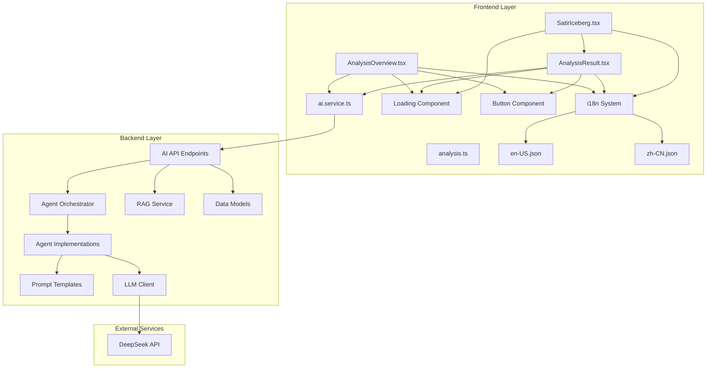
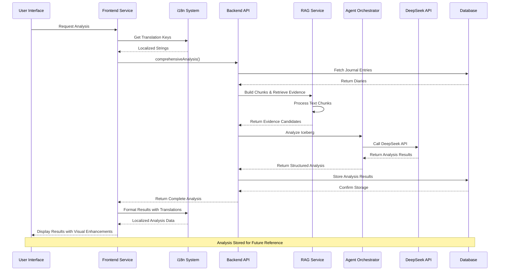
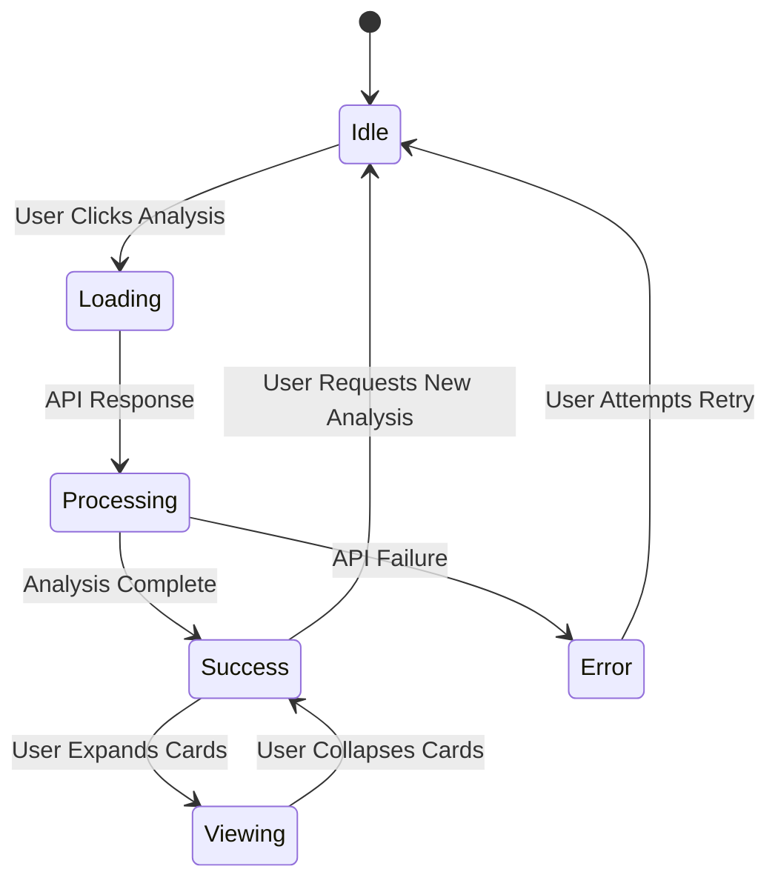
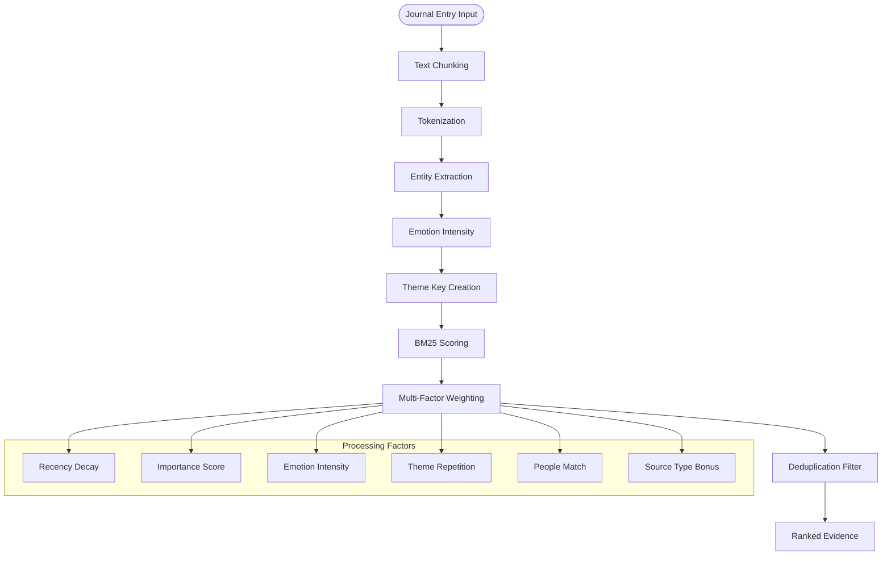
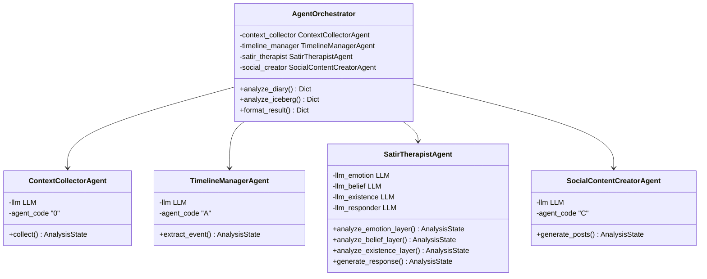
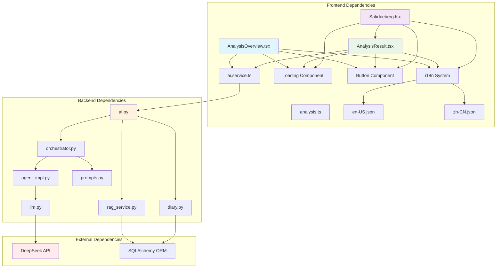

# Analysis Overview Component

<cite>
**Referenced Files in This Document**
- [AnalysisOverview.tsx](file://frontend/src/pages/analysis/AnalysisOverview.tsx)
- [AnalysisResult.tsx](file://frontend/src/pages/analysis/AnalysisResult.tsx)
- [SatirIceberg.tsx](file://frontend/src/pages/analysis/SatirIceberg.tsx)
- [Loading.tsx](file://frontend/src/components/common/Loading.tsx)
- [button.tsx](file://frontend/src/components/ui/button.tsx)
- [analysis.ts](file://frontend/src/types/analysis.ts)
- [ai.service.ts](file://frontend/src/services/ai.service.ts)
- [ai.py](file://backend/app/api/v1/ai.py)
- [rag_service.py](file://backend/app/services/rag_service.py)
- [orchestrator.py](file://backend/app/agents/orchestrator.py)
- [agent_impl.py](file://backend/app/agents/agent_impl.py)
- [prompts.py](file://backend/app/agents/prompts.py)
- [llm.py](file://backend/app/agents/llm.py)
- [diary.py](file://backend/app/models/diary.py)
- [diary.schema.py](file://backend/app/schemas/diary.py)
- [en-US.json](file://frontend/src/i18n/locales/en-US.json)
- [zh-CN.json](file://frontend/src/i18n/locales/zh-CN.json)
- [index.ts](file://frontend/src/i18n/index.ts)
</cite>

## Update Summary
**Changes Made**
- Documented comprehensive internationalization implementation for analysis components
- Added translation key structure documentation for AnalysisOverview, AnalysisResult, and SatirIceberg
- Updated visual enhancement documentation to include multilingual support
- Enhanced internationalization architecture with react-i18next integration
- Documented translation key categories and naming conventions

## Table of Contents
1. [Introduction](#introduction)
2. [Project Structure](#project-structure)
3. [Core Components](#core-components)
4. [Architecture Overview](#architecture-overview)
5. [Detailed Component Analysis](#detailed-component-analysis)
6. [Internationalization System](#internationalization-system)
7. [Visual Enhancement System](#visual-enhancement-system)
8. [Dependency Analysis](#dependency-analysis)
9. [Performance Considerations](#performance-considerations)
10. [Troubleshooting Guide](#troubleshooting-guide)
11. [Conclusion](#conclusion)

## Introduction

The Analysis Overview Component is a sophisticated React-based interface that presents comprehensive psychological insights derived from user journal entries using the Satir Iceberg Model. This component serves as the primary user interface for displaying multi-layered analysis results, featuring five distinct depth levels that progressively reveal deeper psychological patterns and insights.

**Updated** The component now features comprehensive internationalization support with consistent multilingual UI elements across AnalysisOverview, AnalysisResult, and SatirIceberg components. All analysis-related UI elements utilize translation keys for seamless language switching between Chinese and English.

The component integrates advanced AI-powered analysis capabilities, combining Retrieval-Augmented Generation (RAG) techniques with multi-agent orchestration to provide users with meaningful self-reflection opportunities. It transforms raw journal data into structured insights about behavior patterns, emotional trends, cognitive processes, core beliefs, and deepest desires.

Enhanced with comprehensive ice-themed visual design system including decorative elements, loading animations, and improved button styling with gradient backgrounds and hover effects.

## Project Structure

The Analysis Overview Component follows a clear separation of concerns across the frontend and backend architecture with integrated internationalization support:



**Diagram sources**
- [AnalysisOverview.tsx:1-425](file://frontend/src/pages/analysis/AnalysisOverview.tsx#L1-L425)
- [AnalysisResult.tsx:1-401](file://frontend/src/pages/analysis/AnalysisResult.tsx#L1-L401)
- [SatirIceberg.tsx:1-220](file://frontend/src/pages/analysis/SatirIceberg.tsx#L1-L220)
- [Loading.tsx:1-55](file://frontend/src/components/common/Loading.tsx#L1-L55)
- [button.tsx:1-52](file://frontend/src/components/ui/button.tsx#L1-L52)
- [ai.service.ts:1-112](file://frontend/src/services/ai.service.ts#L1-L112)
- [ai.py:268-388](file://backend/app/api/v1/ai.py#L268-L388)

**Section sources**
- [AnalysisOverview.tsx:1-425](file://frontend/src/pages/analysis/AnalysisOverview.tsx#L1-L425)
- [AnalysisResult.tsx:1-401](file://frontend/src/pages/analysis/AnalysisResult.tsx#L1-L401)
- [SatirIceberg.tsx:1-220](file://frontend/src/pages/analysis/SatirIceberg.tsx#L1-L220)
- [ai.service.ts:1-112](file://frontend/src/services/ai.service.ts#L1-L112)
- [ai.py:268-388](file://backend/app/api/v1/ai.py#L268-L388)

## Core Components

### Frontend Analysis Component

The Analysis Overview Component is built around several key frontend elements with enhanced visual design and comprehensive internationalization support:

#### Iceberg Layer Configuration
The component defines five distinct layers of psychological analysis, each with unique visual styling and semantic meaning:

| Layer | Depth Level | Purpose | Visual Indicators | Translation Keys |
|-------|-------------|---------|-------------------|------------------|
| Behavior | Surface Level | Observable actions and patterns | Wave icon, sky blue gradients | `icebergOverview.layers.behavior` |
| Emotion | Subsurface Level | Feelings and emotional patterns | Droplet icon, blue gradients | `icebergOverview.layers.emotion` |
| Cognition | Deeper Level | Thinking patterns and beliefs | Brain icon, indigo gradients | `icebergOverview.layers.cognition` |
| Belief | Deep Level | Core values and life principles | Key icon, violet gradients | `icebergOverview.layers.belief` |
| Yearning | Deepest Level | Fundamental desires and life energy | Heart icon, purple gradients | `icebergOverview.layers.yearning` |

#### Interactive Card System
Each layer is presented as an expandable card with smooth animations and progressive disclosure:

- **Summary View**: Initial collapsed state showing layer summary with translated labels
- **Expanded Details**: Full breakdown of patterns, evidence, and insights with localized content
- **Visual Enhancements**: Color-coded indicators, emotion flow visualization
- **Progressive Animation**: Staggered entrance effects for depth perception
- **Ice-Themed Styling**: Layer-specific gradient backgrounds and border styles

#### Evidence Presentation
The component displays supporting evidence with:
- **Source Attribution**: Diary dates and titles with proper localization
- **Relevance Scoring**: Quality indicators for each evidence piece
- **Context Snippets**: Extracted text fragments from original entries
- **Reason Classification**: Why each piece was selected for analysis

#### Visual Decorative Elements
The component incorporates comprehensive ice-themed decorative elements:
- **Hero Iceberg Images**: During idle states, decorative iceberg imagery enhances the thematic experience
- **Loading Screen Graphics**: Animated exploration graphics provide engaging feedback during analysis
- **Background Gradients**: Multi-layered gradient backgrounds create immersive visual depth
- **Subtle Animations**: Progressive disclosure animations with staggered timing

**Section sources**
- [AnalysisOverview.tsx:8-60](file://frontend/src/pages/analysis/AnalysisOverview.tsx#L8-L60)
- [AnalysisOverview.tsx:80-238](file://frontend/src/pages/analysis/AnalysisOverview.tsx#L80-L238)
- [AnalysisOverview.tsx:240-425](file://frontend/src/pages/analysis/AnalysisOverview.tsx#L240-L425)

### Backend Analysis Pipeline

The backend implements a sophisticated multi-agent system for processing analysis requests:

#### RAG-Based Evidence Collection
The system employs Retrieval-Augmented Generation to gather relevant evidence from user journals:

1. **Chunk Processing**: Original journal entries are split into manageable text segments
2. **Semantic Indexing**: Each chunk is processed for themes, emotions, and key entities
3. **Weighted Retrieval**: Evidence is ranked based on relevance, recency, and importance
4. **Deduplication**: Similar evidence is filtered to prevent redundancy

#### Multi-Agent Orchestration
The analysis pipeline coordinates multiple specialized agents:

1. **Context Collector**: Gathers user profile and timeline context
2. **Timeline Manager**: Extracts significant events from journal content
3. **Satir Analyst**: Performs five-layer psychological analysis
4. **Social Content Creator**: Generates shareable content variants

**Section sources**
- [rag_service.py:147-360](file://backend/app/services/rag_service.py#L147-L360)
- [orchestrator.py:18-340](file://backend/app/agents/orchestrator.py#L18-L340)
- [agent_impl.py:92-484](file://backend/app/agents/agent_impl.py#L92-L484)

## Architecture Overview

The Analysis Overview Component implements a comprehensive microservices architecture with clear separation between presentation, business logic, and data processing layers, enhanced with internationalization support:



**Diagram sources**
- [ai.service.ts:44-47](file://frontend/src/services/ai.service.ts#L44-L47)
- [ai.py:268-388](file://backend/app/api/v1/ai.py#L268-L388)
- [orchestrator.py:132-294](file://backend/app/agents/orchestrator.py#L132-L294)

The architecture follows these key principles:

### Data Flow Patterns
1. **Request Processing**: Frontend → Backend API → Agent Orchestration
2. **Evidence Gathering**: RAG Service → Multi-layer Analysis
3. **Result Formatting**: Agent Results → Structured Output
4. **Persistence**: Analysis Results → Database Storage

### Error Handling Strategy
- **Frontend**: Graceful loading states and error messaging with visual feedback
- **Backend**: Comprehensive exception handling with fallback responses
- **API Layer**: HTTP status codes and detailed error messages
- **Database**: Transaction rollback and warning propagation

**Section sources**
- [ai.py:268-388](file://backend/app/api/v1/ai.py#L268-L388)
- [AnalysisOverview.tsx:249-263](file://frontend/src/pages/analysis/AnalysisOverview.tsx#L249-L263)

## Detailed Component Analysis

### Frontend Component Implementation

#### State Management Architecture
The Analysis Overview Component implements sophisticated state management for handling complex user interactions:



**Diagram sources**
- [AnalysisOverview.tsx:241-263](file://frontend/src/pages/analysis/AnalysisOverview.tsx#L241-L263)

#### Enhanced Visual Design System
The component employs a sophisticated color and animation system with comprehensive ice-themed styling:

| Layer | Gradient | Border | Text Color | Tag Background |
|-------|----------|--------|------------|----------------|
| Behavior | Sky Blue | Sky-200 | Sky-700 | Sky-50 |
| Emotion | Blue | Blue-200 | Blue-700 | Blue-50 |
| Cognition | Indigo | Indigo-200 | Indigo-700 | Indigo-50 |
| Belief | Violet | Violet-300 | Violet-100 | Violet-900/30 |
| Yearning | Purple | Purple-400 | Amber-100 | Purple-900/30 |

#### Advanced Animation and Interaction Patterns
The component implements progressive disclosure with enhanced visual effects:
- **Staggered Animations**: Cards appear with increasing delays (120ms intervals) with smooth opacity transitions
- **Gradient Backgrounds**: Layer-specific linear gradients create visual depth and thematic consistency
- **Interactive Elements**: Expand/collapse buttons with chevron icons and hover effects
- **Visual Feedback**: Enhanced hover states with color transitions and active selections
- **Ice-Themed Decorations**: Subtle decorative elements and background gradients

#### Button Styling Enhancements
The component utilizes improved button styling with:
- **Gradient Backgrounds**: Linear gradients for primary action buttons
- **Hover Effects**: Smooth color transitions and scaling animations
- **Active States**: Press-down animations for tactile feedback
- **Disabled States**: Reduced opacity for non-interactive elements
- **Consistent Sizing**: Standardized dimensions with responsive design

**Section sources**
- [AnalysisOverview.tsx:8-60](file://frontend/src/pages/analysis/AnalysisOverview.tsx#L8-L60)
- [AnalysisOverview.tsx:241-425](file://frontend/src/pages/analysis/AnalysisOverview.tsx#L241-L425)
- [button.tsx:6-30](file://frontend/src/components/ui/button.tsx#L6-L30)

### Backend Processing Pipeline

#### RAG Service Implementation
The Retrieval-Augmented Generation service provides sophisticated text processing:



**Diagram sources**
- [rag_service.py:147-360](file://backend/app/services/rag_service.py#L147-L360)

#### Agent Orchestration System
The multi-agent system coordinates specialized analysis capabilities:



**Diagram sources**
- [orchestrator.py:18-340](file://backend/app/agents/orchestrator.py#L18-L340)
- [agent_impl.py:92-484](file://backend/app/agents/agent_impl.py#L92-L484)

**Section sources**
- [rag_service.py:147-360](file://backend/app/services/rag_service.py#L147-L360)
- [orchestrator.py:18-340](file://backend/app/agents/orchestrator.py#L18-L340)
- [agent_impl.py:92-484](file://backend/app/agents/agent_impl.py#L92-L484)

### Data Models and Types

#### Analysis Response Structure
The component handles complex nested data structures representing multi-layer analysis:

```mermaid
erDiagram
ICEBERG_ANALYSIS_RESPONSE {
behavior_layer BehaviorLayer
emotion_layer EmotionLayer
cognition_layer CognitionLayer
belief_layer BeliefLayer
yearning_layer YearningLayer
letter string
evidence EvidenceItem[]
metadata AnalysisMetadata
}
BEHAVIOR_LAYER {
patterns BehaviorPattern[]
summary string
}
EMOTION_LAYER {
emotion_flow EmotionPhase[]
turning_points TurningPoint[]
summary string
}
COGNITION_LAYER {
thought_patterns ThoughtPattern[]
summary string
}
BELIEF_LAYER {
core_beliefs CoreBelief[]
self_narrative string
summary string
}
YEARNING_LAYER {
yearnings Yearning[]
life_energy string
summary string
}
ICEBERG_ANALYSIS_RESPONSE ||--|| BEHAVIOR_LAYER
ICEBERG_ANALYSIS_RESPONSE ||--|| EMOTION_LAYER
ICEBERG_ANALYSIS_RESPONSE ||--|| COGNITION_LAYER
ICEBERG_ANALYSIS_RESPONSE ||--|| BELIEF_LAYER
ICEBERG_ANALYSIS_RESPONSE ||--|| YEARNING_LAYER
```

**Diagram sources**
- [analysis.ts:119-139](file://frontend/src/types/analysis.ts#L119-L139)

**Section sources**
- [analysis.ts:119-139](file://frontend/src/types/analysis.ts#L119-L139)
- [analysis.ts:46-139](file://frontend/src/types/analysis.ts#L46-L139)

## Internationalization System

### Translation Key Structure

The analysis components utilize a comprehensive translation key system with structured categorization:

#### Translation Key Categories

**Analysis Overview (icebergOverview)**
- `title`: "Iceberg Journey" / "冰山之旅"
- `analysisFailed`: "Iceberg analysis failed" / "冰山分析失败"
- `dive1-dive4`: Diving progression labels
- `layers`: Layer-specific translations with sublabels
- `processingTime`: "Processing time {{time}}s" / "分析耗时 {{time}}s"

**Analysis Result (analysisResult)**
- `aiAnalysis`: "AI Analysis" / "AI 分析"
- `satirModel`: "Satir Iceberg Model" / "萨提亚冰山模型"
- `timelineEvent`: "Timeline Event" / "时间轴事件"
- `healingResponse`: "Healing Response" / "疗愈回复"
- `socialPosts`: "Social Posts" / "朋友圈文案"

**Satir Iceberg (satirIceberg)**
- `behaviorLayer`: "Behavior Layer" / "行为层"
- `emotionLayer`: "Emotion Layer" / "情绪层"
- `cognitiveLayer`: "Cognitive Layer" / "认知层"
- `beliefLayer`: "Belief Layer" / "信念层"
- `existenceLayer`: "Existence Layer" / "存在层"

#### Translation Key Implementation

All components implement internationalization through react-i18next:

```typescript
// AnalysisOverview.tsx
const { t } = useTranslation();
// Usage examples:
t('icebergOverview.layers.behavior')
t('icebergOverview.startJourney')
t('icebergOverview.expand')

// AnalysisResult.tsx  
const { t } = useTranslation();
// Usage examples:
t('analysisResult.aiAnalysis')
t('analysisResult.satirModel')
t('analysisResult.timelineEvent')

// SatirIceberg.tsx
const { t } = useTranslation();
// Usage examples:
t('satirIceberg.behaviorLayer')
t('satirIceberg.emotionLayer')
```

#### Language Detection and Fallback

The i18n system provides automatic language detection with fallback support:

```typescript
// i18n/index.ts
i18n
  .use(LanguageDetector)
  .use(initReactI18next)
  .init({
    resources: {
      'zh-CN': { translation: zh_CN },
      'en-US': { translation: en_US },
    },
    fallbackLng: 'zh-CN',
    detection: {
      order: ['localStorage', 'navigator'],
      lookupLocalStorage: 'yinji-language',
      caches: ['localStorage'],
    },
  });
```

**Section sources**
- [AnalysisOverview.tsx:246](file://frontend/src/pages/analysis/AnalysisOverview.tsx#L246)
- [AnalysisResult.tsx:19](file://frontend/src/pages/analysis/AnalysisResult.tsx#L19)
- [SatirIceberg.tsx:12](file://frontend/src/pages/analysis/SatirIceberg.tsx#L12)
- [en-US.json:625-666](file://frontend/src/i18n/locales/en-US.json#L625-L666)
- [zh-CN.json:625-666](file://frontend/src/i18n/locales/zh-CN.json#L625-L666)
- [index.ts:9-41](file://frontend/src/i18n/index.ts#L9-L41)

## Visual Enhancement System

### Ice-Themed Decorative Elements

The Analysis Overview Component incorporates comprehensive ice-themed visual enhancements:

#### Hero Image System
During idle states, the component displays decorative iceberg imagery:
- **Hero Iceberg Image**: Prominent iceberg illustration with transparency and drop shadow effects
- **Thematic Consistency**: Images use transparent backgrounds to blend with gradient backgrounds
- **Responsive Design**: Images scale appropriately across different screen sizes
- **Visual Depth**: Opacity and shadow effects create layered visual appeal

#### Loading Screen Animations
Enhanced loading states feature animated exploration graphics:
- **Animated Exploration Graphics**: Custom animated SVG graphics for loading feedback
- **Progressive Loading**: Staggered loading indicators with smooth transitions
- **Thematic Loading**: Ice-themed loading animations that match the overall design language
- **User Engagement**: Engaging animations keep users informed during processing

#### Background Gradient System
The component uses sophisticated multi-layered gradient backgrounds:
- **Multi-Tone Gradients**: Complex gradient combinations from light blue to deep purple
- **Directional Flow**: Diagonal gradient directions that enhance visual movement
- **Subtle Transitions**: Smooth color transitions that complement the ice theme
- **Responsive Gradients**: Backgrounds adapt to different screen orientations

#### Layer-Specific Visual Styling
Each analysis layer receives unique visual treatment:
- **Gradient Backgrounds**: Each layer has its own custom gradient scheme
- **Border Styles**: Distinct border treatments for visual layer separation
- **Text Color Schemes**: Layer-appropriate text colors for readability
- **Tag Backgrounds**: Specialized tag styling with appropriate contrast

### Enhanced Button Styling System

The component implements improved button styling with gradient backgrounds and hover effects:

#### Primary Action Buttons
- **Gradient Backgrounds**: Linear gradients from vibrant blues to purples
- **Hover Animations**: Smooth color transitions and slight scaling effects
- **Active States**: Press-down animations for tactile feedback
- **Disabled States**: Reduced opacity and subtle styling changes

#### Secondary Action Buttons
- **Transparent Styling**: Semi-transparent backgrounds with border accents
- **Active Highlighting**: Subtle glow effects on active states
- **Consistent Dimensions**: Standardized sizing with responsive adjustments

#### Interactive Element Enhancements
- **Hover Effects**: Smooth transitions for all interactive elements
- **Focus States**: Clear visual indicators for keyboard navigation
- **Touch Targets**: Adequate sizing for mobile interaction
- **Accessibility**: Proper contrast ratios and focus management

### Animation and Transition System

The component implements a comprehensive animation framework:

#### Progressive Disclosure
- **Staggered Appearances**: 120ms delays between card animations
- **Smooth Transitions**: 700ms duration for opacity and position changes
- **Depth Perception**: Sequential animations create visual depth hierarchy
- **Performance Optimization**: Efficient animation timing and easing functions

#### Loading Animations
- **Spinner Animations**: Smooth rotating indicators with proper accessibility
- **Progress Indicators**: Visual feedback for long-running operations
- **State Transitions**: Seamless switching between different UI states
- **Performance Monitoring**: Timely feedback for user experience

**Section sources**
- [AnalysisOverview.tsx:278-347](file://frontend/src/pages/analysis/AnalysisOverview.tsx#L278-L347)
- [AnalysisOverview.tsx:380-403](file://frontend/src/pages/analysis/AnalysisOverview.tsx#L380-L403)
- [Loading.tsx:9-45](file://frontend/src/components/common/Loading.tsx#L9-L45)
- [button.tsx:6-30](file://frontend/src/components/ui/button.tsx#L6-L30)

## Dependency Analysis

The Analysis Overview Component exhibits strong modularity with clear dependency boundaries and comprehensive internationalization support:



**Diagram sources**
- [AnalysisOverview.tsx:1-6](file://frontend/src/pages/analysis/AnalysisOverview.tsx#L1-L6)
- [AnalysisResult.tsx:1-11](file://frontend/src/pages/analysis/AnalysisResult.tsx#L1-L11)
- [SatirIceberg.tsx:1-5](file://frontend/src/pages/analysis/SatirIceberg.tsx#L1-L5)
- [ai.py:23-31](file://backend/app/api/v1/ai.py#L23-L31)
- [llm.py:13-220](file://backend/app/agents/llm.py#L13-L220)

### Component Coupling Analysis

The component demonstrates excellent separation of concerns with enhanced visual integration and comprehensive internationalization:

- **Frontend**: Pure UI logic with minimal business logic and comprehensive visual enhancements
- **Backend**: Well-structured API layer with clear service boundaries
- **Data Access**: Clean SQLAlchemy models with proper relationships
- **External Integration**: Dedicated LLM client with clear interface
- **Visual Components**: Separate loading and button components for reusability
- **Internationalization**: Centralized i18n system with structured translation keys

### Potential Circular Dependencies
No circular dependencies detected in the analysis component structure.

**Section sources**
- [AnalysisOverview.tsx:1-6](file://frontend/src/pages/analysis/AnalysisOverview.tsx#L1-L6)
- [AnalysisResult.tsx:1-11](file://frontend/src/pages/analysis/AnalysisResult.tsx#L1-L11)
- [SatirIceberg.tsx:1-5](file://frontend/src/pages/analysis/SatirIceberg.tsx#L1-L5)
- [ai.py:23-31](file://backend/app/api/v1/ai.py#L23-L31)
- [diary.py:29-133](file://backend/app/models/diary.py#L29-L133)

## Performance Considerations

### Frontend Performance Optimization
The Analysis Overview Component implements several performance optimization strategies with enhanced visual considerations:

#### Lazy Loading and Progressive Rendering
- **Staggered Card Appearances**: 120ms delays between card animations with smooth transitions
- **Conditional Rendering**: Evidence only loaded when cards are expanded
- **Memory Management**: Proper cleanup of animation listeners and timers
- **Image Optimization**: Efficient loading of decorative iceberg images
- **Animation Performance**: Hardware-accelerated CSS transitions for smooth animations

#### Network Optimization
- **Request Debouncing**: Prevents rapid successive analysis requests
- **Error Caching**: Failed requests are not retried automatically
- **Timeout Handling**: 60-second timeout for analysis completion
- **Background Loading**: Visual assets load independently of core functionality

### Backend Performance Strategies
The backend implements comprehensive optimization techniques:

#### RAG Processing Efficiency
- **Chunk Size Optimization**: 260-character chunks with 40-character overlap
- **Early Termination**: Stop processing when sufficient evidence found
- **Memory Management**: Efficient token counting and deduplication
- **Agent Parallelization**: Multiple agents can operate concurrently

#### Agent Parallelization
- **Asynchronous Processing**: Multiple agents can operate concurrently
- **Resource Pooling**: Shared LLM clients with connection pooling
- **Batch Operations**: Multiple evidence items processed together

### Scalability Considerations
- **Database Indexing**: Proper indexing on user_id, diary_date, and created_at
- **Pagination**: Limits on returned evidence items (max 18)
- **Caching**: Analysis results cached for quick retrieval
- **Asset Optimization**: Efficient image compression and caching strategies

## Troubleshooting Guide

### Common Frontend Issues

#### Analysis Loading Problems
**Symptoms**: Loading spinner remains indefinitely
**Causes**: 
- Network connectivity issues
- Backend API timeouts
- Large analysis windows requiring extensive processing
- Visual asset loading failures

**Solutions**:
1. Verify network connectivity
2. Reduce analysis window size (30 days vs 90 days)
3. Check browser console for JavaScript errors
4. Clear browser cache and retry
5. Verify visual asset URLs are accessible

#### Visual Rendering Issues
**Symptoms**: Cards not appearing or animations not working
**Causes**:
- CSS animation conflicts
- Browser compatibility issues
- DOM manipulation errors
- Missing visual assets
- Gradient rendering issues

**Solutions**:
1. Check browser developer tools for CSS errors
2. Verify animation support in target browsers
3. Test with different browsers/devices
4. Verify all visual assets are properly loaded
5. Check gradient rendering support in older browsers

#### Internationalization Issues
**Symptoms**: Missing translations or fallback text
**Causes**:
- Missing translation keys in locale files
- Incorrect key naming conventions
- Language detection failures
- Cache synchronization issues

**Solutions**:
1. Verify translation keys exist in both locale files
2. Check key naming follows established conventions
3. Clear localStorage language preference
4. Restart application to reload translations
5. Validate i18n configuration

### Backend Troubleshooting

#### API Response Failures
**Common Error Codes**:
- **400 Bad Request**: Invalid analysis parameters
- **404 Not Found**: User or diary not found
- **500 Internal Server Error**: Processing failures

**Diagnostic Steps**:
1. Check API endpoint availability
2. Verify authentication tokens
3. Review backend logs for stack traces
4. Validate database connectivity

#### Analysis Processing Issues
**Symptoms**: Long processing times or incomplete results
**Causes**:
- Insufficient journal entries
- LLM API rate limiting
- Database performance issues
- Visual processing overhead

**Solutions**:
1. Ensure adequate journal history (minimum 3 entries)
2. Check LLM API quota limits
3. Monitor database query performance
4. Consider reducing analysis window size
5. Optimize visual asset delivery

### Database and Persistence Issues

#### Analysis Storage Failures
**Symptoms**: Analysis results not persisting
**Causes**:
- Database transaction failures
- Schema migration issues
- Permission problems

**Solutions**:
1. Verify database connectivity
2. Check schema migration status
3. Review database permissions
4. Enable database logging for debugging

**Section sources**
- [AnalysisOverview.tsx:249-263](file://frontend/src/pages/analysis/AnalysisOverview.tsx#L249-L263)
- [ai.py:297-301](file://backend/app/api/v1/ai.py#L297-L301)
- [ai.py:365-369](file://backend/app/api/v1/ai.py#L365-L369)

## Conclusion

The Analysis Overview Component represents a sophisticated implementation of modern web application architecture, seamlessly integrating frontend interactivity with backend AI-powered analysis capabilities. The component successfully bridges the gap between complex psychological analysis and intuitive user experience through careful design and implementation choices.

**Updated** The component now features comprehensive internationalization support with consistent multilingual UI elements across AnalysisOverview, AnalysisResult, and SatirIceberg components. All analysis-related UI elements utilize structured translation keys for seamless language switching between Chinese and English, while maintaining the technical excellence and architectural integrity of the original design.

### Key Strengths

**Architectural Excellence**: The component demonstrates excellent separation of concerns with clear frontend/backend boundaries, modular agent systems, and robust data flow patterns.

**Enhanced User Experience**: The comprehensive visual enhancement system creates an immersive ice-themed experience with decorative elements, loading animations, and polished interactive components.

**Internationalization Excellence**: The centralized i18n system with structured translation keys ensures consistent multilingual support across all analysis components, enabling seamless language switching and cultural adaptation.

**User Experience Innovation**: The progressive disclosure approach, smooth animations, and layered presentation create an engaging and meaningful user journey through psychological self-discovery.

**Technical Sophistication**: Implementation of RAG techniques, multi-agent orchestration, and comprehensive error handling showcases advanced software engineering practices.

### Areas for Enhancement

**Performance Optimization**: Consider implementing virtual scrolling for large evidence sets and lazy-loading of detailed analysis content.

**Accessibility**: Enhanced screen reader support and keyboard navigation would improve accessibility compliance.

**Testing Coverage**: Expanded unit and integration testing would improve reliability and maintainability.

**Visual Asset Management**: Consider implementing more efficient asset loading strategies and fallback mechanisms for better performance.

**Translation Management**: Implement automated translation validation and missing key detection for improved translation quality assurance.

The Analysis Overview Component serves as an exemplary model for building complex, data-driven applications that prioritize both technical excellence and user experience. Its modular architecture, clear design patterns, comprehensive visual enhancement system, and robust internationalization support provide a solid foundation for future enhancements and extensions.