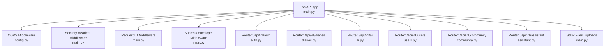
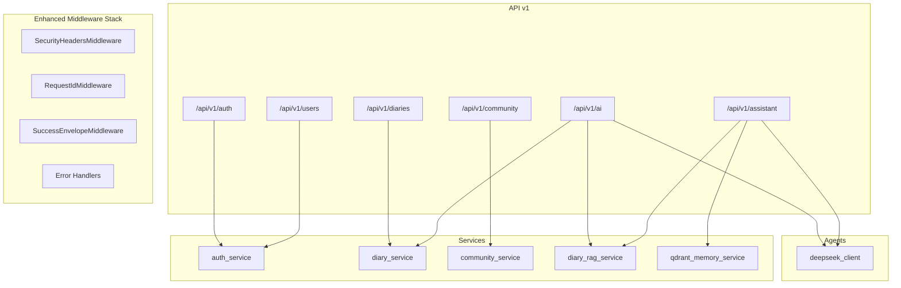
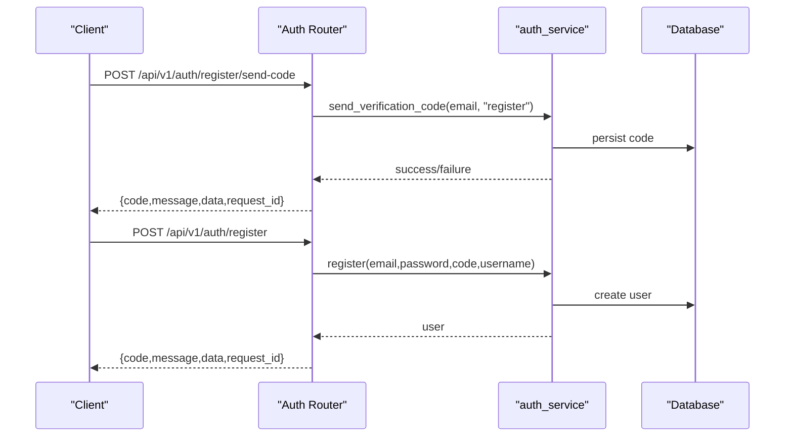
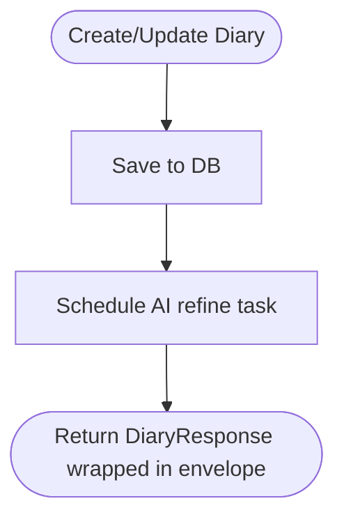
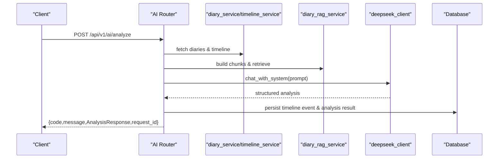
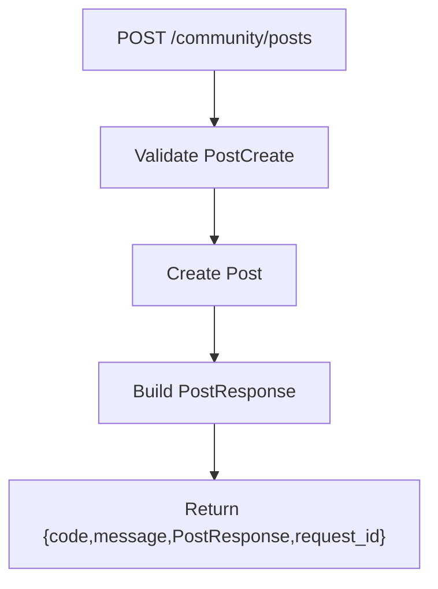
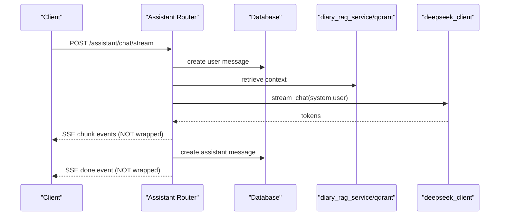
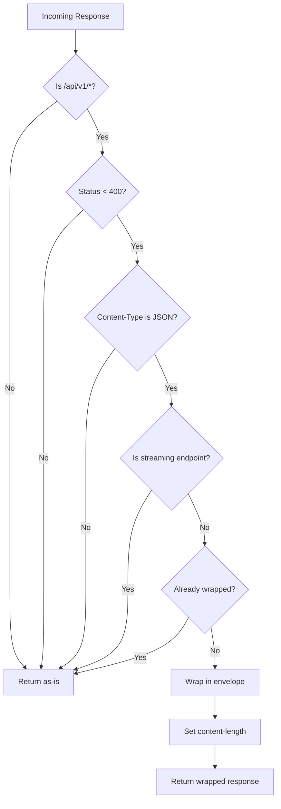

# API Layer

<cite>
**Referenced Files in This Document**
- [main.py](file://backend/main.py)
- [config.py](file://backend/app/core/config.py)
- [auth.py](file://backend/app/api/v1/auth.py)
- [diaries.py](file://backend/app/api/v1/diaries.py)
- [ai.py](file://backend/app/api/v1/ai.py)
- [community.py](file://backend/app/api/v1/community.py)
- [assistant.py](file://backend/app/api/v1/assistant.py)
- [users.py](file://backend/app/api/v1/users.py)
- [auth_schemas.py](file://backend/app/schemas/auth.py)
- [diary_schemas.py](file://backend/app/schemas/diary.py)
- [ai_schemas.py](file://backend/app/schemas/ai.py)
- [community_schemas.py](file://backend/app/schemas/community.py)
- [rate_limit.py](file://backend/app/core/rate_limit.py)
</cite>

## Update Summary
**Changes Made**
- Added unified success response envelope middleware system with SuccessEnvelopeMiddleware class
- Enhanced API documentation with comprehensive documentation entry points
- Implemented intelligent response wrapping that excludes streaming endpoints
- Added standardized success response structure { code, message, data, request_id }
- Enhanced error handling system with request tracking integration
- Improved API documentation with multiple entry points and metadata endpoints

## Table of Contents
1. [Introduction](#introduction)
2. [Project Structure](#project-structure)
3. [Core Components](#core-components)
4. [Architecture Overview](#architecture-overview)
5. [Detailed Component Analysis](#detailed-component-analysis)
6. [Unified Success Response Envelope Middleware](#unified-success-response-envelope-middleware)
7. [Enhanced Error Handling System](#enhanced-error-handling-system)
8. [Request Tracking and Security](#request-tracking-and-security)
9. [Comprehensive API Documentation Enhancement](#comprehensive-api-documentation-enhancement)
10. [Dependency Analysis](#dependency-analysis)
11. [Performance Considerations](#performance-considerations)
12. [Troubleshooting Guide](#troubleshooting-guide)
13. [Conclusion](#conclusion)
14. [Appendices](#appendices)

## Introduction
This document describes the API layer of the 映记 backend, built with FastAPI. It covers the versioned API group v1, routing registration, endpoint categories, request/response schemas, authentication requirements, unified success response envelope middleware system, enhanced error handling, and comprehensive API documentation enhancement. The API layer now includes intelligent response wrapping, standardized success payloads, request tracking capabilities, enhanced security headers, and multiple API documentation entry points.

## Project Structure
The API layer is organized under app/api/v1 with dedicated routers for each domain:
- Authentication (/api/v1/auth)
- Diaries (/api/v1/diaries)
- AI analysis (/api/v1/ai)
- Users (/api/v1/users)
- Community (/api/v1/community)
- Assistant (/api/v1/assistant)

The main application initializes the FastAPI app, registers CORS, mounts static uploads, and includes all v1 routers with a shared prefix and tags for grouping. The application now includes enhanced middleware stack for unified response handling, request tracking, and security.



**Diagram sources**
- [main.py:51-87](file://backend/main.py#L51-L87)
- [config.py:17-20](file://backend/app/core/config.py#L17-L20)

**Section sources**
- [main.py:51-87](file://backend/main.py#L51-L87)

## Core Components
- **API versioning**: All routes are registered under /api/v1 with a version tag. The application title and version are set from configuration.
- **Authentication**: JWT-based via a dependency that requires an active user; endpoints include register, login (code/password), reset password, logout, and profile retrieval.
- **Data validation**: Pydantic models define request/response schemas with field-level validation and constraints.
- **Unified success response envelope**: Intelligent middleware system that automatically wraps successful API responses in standardized structure { code, message, data, request_id } while excluding streaming endpoints.
- **Enhanced error handling**: Comprehensive error handling system with standardized error payload structure, request tracking, and multiple error handlers for different exception types.
- **Rate limiting**: The configuration defines maximum code requests per period and code expiration; enforcement occurs in the authentication service.
- **CORS**: Configured from environment-derived origins.
- **Security headers**: Enhanced security headers middleware provides defense-in-depth security measures.

**Section sources**
- [main.py:51-87](file://backend/main.py#L51-L87)
- [config.py:17-60](file://backend/app/core/config.py#L17-L60)

## Architecture Overview
The API layer composes domain-specific routers that depend on:
- Database sessions (async SQLAlchemy)
- Services (business logic)
- Agents (LLM clients)
- Schemas (validation and serialization)
- Enhanced middleware stack for unified response handling, request tracking, and security



**Diagram sources**
- [main.py:69-87](file://backend/main.py#L69-L87)
- [main.py:108-152](file://backend/main.py#L108-L152)
- [auth.py:18-20](file://backend/app/api/v1/auth.py#L18-L20)
- [diaries.py:23-27](file://backend/app/api/v1/diaries.py#L23-L27)
- [ai.py:22-29](file://backend/app/api/v1/ai.py#L22-L29)
- [assistant.py:17-24](file://backend/app/api/v1/assistant.py#L17-L24)

## Detailed Component Analysis

### Authentication Endpoints
- **Route prefix**: /api/v1/auth
- **Authentication requirement**: Most endpoints require an active user token via a dependency; /auth/me retrieves the current user.
- **Endpoints**:
  - POST /auth/register/send-code: Send registration code
  - POST /auth/register/verify: Verify registration code
  - POST /auth/register: Register user (returns token)
  - POST /auth/login/send-code: Send login code
  - POST /auth/login: Login with code
  - POST /auth/login/password: Login with password
  - POST /auth/reset-password/send-code: Send reset code
  - POST /auth/reset-password: Reset password
  - POST /auth/logout: Logout
  - GET /auth/me: Get current user info
  - GET /auth/test-email: Test email sending (dev-only)
- **Request/response schemas**:
  - SendCodeRequest, VerifyCodeRequest, RegisterRequest, LoginRequest, PasswordLoginRequest, ResetPasswordRequest
  - TokenResponse, UserResponse
- **Enhanced validation and error handling**:
  - Type constraints enforced by Pydantic
  - HTTPException with 400/429/500 depending on failure type
  - Standardized error responses with request tracking
  - Captcha verification with enhanced security
- **Unified response envelope**:
  - All successful responses are automatically wrapped in standardized structure
  - Request IDs included for end-to-end correlation
  - Error responses maintain compatibility with existing client code
- **Typical usage**:
  - Registration flow: send-code → verify → register
  - Login flow: send-code → login or password-login
  - After successful login, use the returned bearer token for protected endpoints



**Diagram sources**
- [auth.py:118-200](file://backend/app/api/v1/auth.py#L118-L200)
- [auth_schemas.py:10-37](file://backend/app/schemas/auth.py#L10-L37)

**Section sources**
- [auth.py:18-504](file://backend/app/api/v1/auth.py#L18-L504)
- [auth_schemas.py:10-106](file://backend/app/schemas/auth.py#L10-L106)

### Diary Management Endpoints
- **Route prefix**: /api/v1/diaries
- **Authentication requirement**: Active user required
- **Endpoints**:
  - CRUD: POST /, GET /, GET /{diary_id}, PUT /{diary_id}, DELETE /{diary_id}
  - Date queries: GET /date/{target_date}
  - Pagination: GET /
  - Images: POST /upload-image
  - Timeline: GET /timeline/recent, GET /timeline/range, GET /timeline/date/{target_date}, POST /timeline/rebuild
  - Terrain: GET /timeline/terrain
  - Growth daily insight: GET /growth/daily-insight
- **Request/response schemas**:
  - DiaryCreate, DiaryUpdate, DiaryResponse, DiaryListResponse
  - TimelineEventCreate, TimelineEventResponse
- **Enhanced validation and error handling**:
  - Pydantic validators enforce content length and defaults
  - 404 Not Found for missing resources with standardized error responses
  - Image upload validates MIME type and size
  - Async task scheduling with error handling for AI refinement
- **Unified response envelope**:
  - All successful CRUD operations return standardized envelope structure
  - Request IDs included for audit trails
  - Error responses maintain compatibility with existing client code
- **Notes**:
  - Timeline AI refinement runs asynchronously after creation/update
  - Timeline rebuild is idempotent over a date range



**Diagram sources**
- [diaries.py:55-182](file://backend/app/api/v1/diaries.py#L55-L182)

**Section sources**
- [diaries.py:29-493](file://backend/app/api/v1/diaries.py#L29-L493)
- [diary_schemas.py:9-101](file://backend/app/schemas/diary.py#L9-L101)

### AI Analysis Endpoints
- **Route prefix**: /api/v1/ai
- **Authentication requirement**: Active user required
- **Endpoints**:
  - POST /ai/generate-title: AI-generated title suggestion
  - GET /ai/daily-guidance: Personalized writing prompt
  - GET/PUT /ai/social-style-samples: Manage social post style samples
  - POST /ai/comprehensive-analysis: RAG-based user-level analysis
  - POST /ai/analyze: Integrated analysis (async-friendly)
  - GET /ai/analyze-async: Placeholder for async analysis
  - GET /ai/analyses: List saved analysis records
  - GET /ai/result/{diary_id}: Retrieve last saved analysis for a diary
  - POST /ai/satir-analysis: Iceberg model analysis only
  - POST /ai/social-posts: Generate social posts only
- **Request/response schemas**:
  - AnalysisRequest, ComprehensiveAnalysisRequest
  - AnalysisResponse, ComprehensiveAnalysisResponse, DailyGuidanceResponse, TitleSuggestionResponse
- **Enhanced validation and error handling**:
  - Content length checks for title generation
  - JSON parsing helpers for structured LLM outputs
  - 404/400/500 as appropriate with standardized error responses
  - Async task scheduling with comprehensive error handling
- **Unified response envelope**:
  - All successful AI analysis responses are automatically wrapped
  - Request IDs enable correlation across complex AI operations
  - Error responses maintain compatibility with existing client code
- **Notes**:
  - Uses RAG retrieval and hybrid ranking
  - Integrates with timeline and diary services
  - Results cached per diary for reuse



**Diagram sources**
- [ai.py:406-638](file://backend/app/api/v1/ai.py#L406-L638)
- [diaries.py:23-27](file://backend/app/api/v1/diaries.py#L23-L27)

**Section sources**
- [ai.py:31-902](file://backend/app/api/v1/ai.py#L31-L902)
- [ai_schemas.py:9-108](file://backend/app/schemas/ai.py#L9-L108)

### Community Endpoints
- **Route prefix**: /api/v1/community
- **Authentication requirement**: Active user required
- **Endpoints**:
  - Circles: GET /community/circles
  - Posts: POST /community/posts, GET /community/posts, GET /community/posts/mine, GET /community/posts/{post_id}, PUT /community/posts/{post_id}, DELETE /community/posts/{post_id}
  - Comments: POST /community/posts/{post_id}/comments, GET /community/posts/{post_id}/comments, DELETE /community/comments/{comment_id}
  - Interactions: POST /community/posts/{post_id}/like, POST /community/posts/{post_id}/collect, GET /community/collections
  - History: GET /community/history
  - Images: POST /community/upload-image
- **Request/response schemas**:
  - PostCreate, PostUpdate, PostResponse, PostListResponse
  - CommentCreate, CommentResponse, CommentListResponse
  - CircleInfo, ViewHistoryItem, ViewHistoryResponse
- **Enhanced validation and error handling**:
  - MIME/type checks for image uploads
  - 404/400 as needed for permissions and existence with standardized error responses
  - Anonymous posting supported
  - Likes, collects, and collections tracked per user
- **Unified response envelope**:
  - All successful community operations return standardized envelope structure
  - Request IDs enable audit trails for social interactions
  - Error responses maintain compatibility with existing client code
- **Notes**:
  - Anonymous posting supported
  - Likes, collects, and collections tracked per user



**Diagram sources**
- [community.py:39-156](file://backend/app/api/v1/community.py#L39-L156)

**Section sources**
- [community.py:20-324](file://backend/app/api/v1/community.py#L20-L324)
- [community_schemas.py:12-124](file://backend/app/schemas/community.py#L12-L124)

### Assistant Endpoints (Chat Sessions, Voice Interactions)
- **Route prefix**: /api/v1/assistant
- **Authentication requirement**: Active user required
- **Endpoints**:
  - Profile: GET /assistant/profile, PUT /assistant/profile
  - Sessions: GET /assistant/sessions, POST /assistant/sessions, DELETE /assistant/sessions/{session_id}
  - Messages: GET /assistant/sessions/{session_id}/messages, POST /assistant/sessions/{session_id}/clear
  - Chat: POST /assistant/chat/stream (Server-Sent Events stream)
- **Request/response models**:
  - AssistantProfileResponse, AssistantProfileUpdateRequest
  - AssistantSessionResponse, CreateSessionRequest
  - AssistantMessageResponse
- **Enhanced validation and error handling**:
  - Session existence checks
  - Message content length validation
  - SSE events for streaming with error handling
  - Async task scheduling for memory operations
- **Important**: Streaming endpoints are excluded from response envelope wrapping to maintain streaming compatibility
- **Notes**:
  - Streamed responses use SSE with meta/chunk/done/error frames
  - RAG context retrieved from Qdrant or local RAG



**Diagram sources**
- [assistant.py:26-389](file://backend/app/api/v1/assistant.py#L26-L389)

**Section sources**
- [assistant.py:26-389](file://backend/app/api/v1/assistant.py#L26-L389)

### Users Endpoints
- **Route prefix**: /api/v1/users
- **Authentication requirement**: Active user required
- **Endpoints**:
  - GET /users/profile: Get user profile
  - PUT /users/profile: Update profile (username, MBTI, social style, current state, catchphrases)
  - POST /users/avatar: Upload avatar (jpg/png/gif/webp, ≤2MB)
- **Request/response schemas**:
  - UserResponse, ProfileUpdateRequest
- **Enhanced validation and error handling**:
  - MIME/type and size checks for avatar
  - Old avatar cleanup on upload
  - Standardized error responses for all operations
- **Unified response envelope**:
  - All successful user profile operations return standardized envelope structure
  - Request IDs enable audit trails for profile changes
  - Error responses maintain compatibility with existing client code

**Section sources**
- [users.py:14-103](file://backend/app/api/v1/users.py#L14-L103)
- [auth_schemas.py:58-84](file://backend/app/schemas/auth.py#L58-L84)

## Unified Success Response Envelope Middleware

The API layer now includes a sophisticated SuccessEnvelopeMiddleware that automatically wraps all successful API responses in a standardized structure while intelligently excluding streaming endpoints:

### SuccessEnvelopeMiddleware Implementation
The middleware operates with the following intelligent filtering logic:
- **Excludes non-API paths**: Only processes requests starting with /api/v1/
- **Excludes error responses**: Only wraps responses with status codes < 400
- **Excludes non-JSON responses**: Only processes application/json content-type
- **Excludes streaming endpoints**: Specifically skips /api/v1/assistant/chat/stream
- **Prevents double-wrapping**: Detects existing envelope structure and avoids duplication

### Standardized Success Response Structure
All successful API responses now follow a consistent structure:
```json
{
  "code": 200,
  "message": "Success",
  "data": { /* original response payload */ },
  "request_id": "a1b2c3d4-e5f6-7890-abcd-ef1234567890"
}
```

### Intelligent Response Handling
- **Automatic wrapping**: Successful JSON responses are automatically wrapped
- **Request correlation**: Each response includes the request ID for end-to-end tracing
- **Streaming compatibility**: SSE streaming endpoints remain unaffected
- **Backward compatibility**: Existing client code continues to work without modification

### Middleware Flow


**Diagram sources**
- [main.py:118-154](file://backend/main.py#L118-L154)

**Section sources**
- [main.py:118-154](file://backend/main.py#L118-L154)

## Enhanced Error Handling System

The API layer now includes a comprehensive error handling system with standardized error payload structure and multiple specialized handlers:

### Standardized Error Payload Structure
All error responses now follow a consistent structure:
```json
{
  "code": 404,
  "message": "Resource not found",
  "data": null,
  "request_id": "a1b2c3d4-e5f6-7890-abcd-ef1234567890",
  "detail": "Resource not found"
}
```

### Error Handler Types
- **HTTP Exception Handler**: Handles StarletteHTTPException instances
- **Validation Exception Handler**: Handles RequestValidationError for Pydantic validation failures
- **Unhandled Exception Handler**: Catches all other exceptions with detailed logging

### Request Tracking Integration
The error handling system automatically includes request IDs in all error responses, enabling comprehensive request tracing across the entire system.

**Section sources**
- [main.py:90-152](file://backend/main.py#L90-L152)

## Request Tracking and Security

### RequestIdMiddleware
The RequestIdMiddleware provides end-to-end request tracking:
- Generates unique X-Request-ID headers for each request
- Propagates request IDs through the entire middleware stack
- Adds X-Request-ID response headers for client-side correlation
- Enables comprehensive request tracing across all API operations

### Security Headers Middleware
Enhanced security through comprehensive response headers:
- **X-Content-Type-Options**: nosniff - Prevents MIME type sniffing
- **X-Frame-Options**: DENY - Protects against clickjacking attacks
- **X-XSS-Protection**: 1; mode=block - Enables XSS protection
- **Referrer-Policy**: strict-origin-when-cross-origin - Controls referrer leakage
- **Permissions-Policy**: Restricts sensitive APIs (camera, microphone, geolocation)

### Rate Limiting Integration
The error handling system works seamlessly with rate limiting:
- HTTP 429 responses include standardized error payload
- Request IDs help track rate limit violations
- Consistent error handling across all rate-limited operations

**Section sources**
- [main.py:69-87](file://backend/main.py#L69-L87)
- [main.py:108-152](file://backend/main.py#L108-L152)
- [rate_limit.py:44-57](file://backend/app/core/rate_limit.py#L44-L57)

## Comprehensive API Documentation Enhancement

The API now provides multiple standardized documentation entry points for developer convenience and enhanced metadata support:

### Standardized OpenAPI Schema
- **Endpoint**: `/api/openapi.json`
- **Purpose**: Provides standardized OpenAPI schema for external tooling
- **Compatibility**: Maintains backward compatibility with existing documentation tools

### Multiple Swagger UI Entry Points
The system provides several Swagger UI endpoints to accommodate different developer preferences:

1. **Primary Endpoint**: `/api/doc`
   - Clean, modern Swagger UI interface
   - Default documentation experience

2. **Slash-Separated Variant**: `/api/doc/`
   - Compatible with trailing slash conventions
   - Handles edge cases in various proxy configurations

3. **Alternative Convention**: `/api/docs`
   - Supports team preferences for "docs" naming
   - Maintains full feature parity

4. **Slash-Separated Docs**: `/api/docs/`
   - Complete trailing slash support
   - Ensures consistent behavior across environments

### Redoc Documentation
- **Endpoint**: `/api/redoc`
- **Purpose**: Alternative documentation interface using Redoc
- **Features**: Clean, developer-friendly interface with interactive examples

### Enhanced Documentation Metadata
The system provides comprehensive metadata endpoints for better developer experience:

1. **Authentication Guide**: `/api/meta/auth-guide`
   - Detailed authentication modes (Bearer/Cookie)
   - Refresh token flow explanation
   - Practical usage scenarios

2. **Error Codes Reference**: `/api/meta/error-codes`
   - Complete error code catalog
   - Detailed descriptions and examples
   - Standardized error response format

3. **API Examples**: `/api/meta/examples`
   - Real-world request/response examples
   - Common operation patterns
   - Integration guidance

### Documentation Entry Point Comparison

| Endpoint | Type | Description |
|----------|------|-------------|
| `/api/openapi.json` | Schema | Standardized OpenAPI schema |
| `/api/doc` | UI | Primary Swagger UI documentation |
| `/api/doc/` | UI | Swagger UI with trailing slash |
| `/api/docs` | UI | Alternative Swagger UI naming |
| `/api/docs/` | UI | Alternative with trailing slash |
| `/api/redoc` | UI | Redoc documentation |
| `/api/meta/auth-guide` | Meta | Authentication usage guide |
| `/api/meta/error-codes` | Meta | Error code reference |
| `/api/meta/examples` | Meta | API usage examples |

**Section sources**
- [main.py:216-264](file://backend/main.py#L216-L264)

## Dependency Analysis
- **Router composition**: Each router module defines endpoints and depends on services, agents, and schemas.
- **Cross-router dependencies**:
  - diaries.py depends on timeline_service and diary_service
  - ai.py depends on diary_service, timeline_service, diary_rag_service, and deepseek_client
  - assistant.py depends on qdrant_memory_service, diary_rag_service, and deepseek_client
  - community.py depends on community_service
  - users.py depends on auth service for profile updates
- **Enhanced middleware dependencies**:
  - All endpoints benefit from standardized error handling
  - Request tracking available across all operations
  - Success envelope wrapping available for all non-streaming endpoints
  - Security headers applied consistently
- **External integrations**:
  - DeepSeek LLM client for chat and streaming
  - Qdrant memory service for semantic retrieval
  - SMTP/email service for verification emails

```mermaid
graph LR
AUTH["auth.py"] --> S_AUTH["auth_service"]
DIARIES["diaries.py"] --> S_DIARY["diary_service"]
DIARIES --> S_TIMELINE["timeline_service"]
AI["ai.py"] --> S_DIARY
AI --> S_TIMELINE
AI --> S_RAG["diary_rag_service"]
AI --> AG_LLM["deepseek_client"]
COMM["community.py"] --> S_COMM["community_service"]
ASSI["assistant.py"] --> S_RAG
ASSI --> S_MEM["qdrant_memory_service"]
ASSI --> AG_LLM
USERS["users.py"] --> S_AUTH
MID["Enhanced Middleware"] --> AUTH
MID --> DIARIES
MID --> AI
MID --> COMM
MID --> ASSI
MID --> USERS
```



**Diagram sources**
- [main.py:69-87](file://backend/main.py#L69-L87)
- [main.py:108-152](file://backend/main.py#L108-L152)
- [auth.py:18-20](file://backend/app/api/v1/auth.py#L18-L20)
- [diaries.py:23-27](file://backend/app/api/v1/diaries.py#L23-L27)
- [ai.py:22-29](file://backend/app/api/v1/ai.py#L22-L29)
- [assistant.py:17-24](file://backend/app/api/v1/assistant.py#L17-L24)
- [community.py:16-17](file://backend/app/api/v1/community.py#L16-L17)
- [users.py:10-12](file://backend/app/api/v1/users.py#L10-L12)

**Section sources**
- [main.py:155-187](file://backend/main.py#L155-L187)

## Performance Considerations
- **Asynchronous design**: All endpoints use async SQLAlchemy sessions and async operations for LLM calls.
- **Streaming responses**: Assistant chat uses SSE to stream tokens, reducing perceived latency.
- **Caching and reuse**:
  - AI analysis results are persisted per diary to avoid recomputation.
  - Growth daily insights are cached per date per user.
- **Retrieval efficiency**:
  - Hybrid RAG retrieval with deduplication and limits.
  - Qdrant-backed semantic retrieval with fallback to local RAG.
- **Enhanced error handling performance**:
  - Standardized error responses reduce client-side error processing overhead.
  - Request tracking adds minimal performance overhead with significant debugging benefits.
- **Middleware efficiency**:
  - Security headers are applied efficiently without blocking operations.
  - Request ID generation uses UUID library for optimal performance.
  - Success envelope middleware performs lightweight JSON parsing and wrapping.
- **Response envelope optimization**:
  - Intelligent filtering prevents unnecessary processing of streaming and error responses.
  - Double-wrapping detection prevents redundant processing.
- **Recommendations**:
  - Add rate limiting middleware for high-frequency endpoints.
  - Consider pagination limits and query timeouts for AI and community endpoints.
  - Monitor LLM latency and implement circuit breakers.
  - Implement request ID correlation in distributed tracing systems.

## Troubleshooting Guide
- **Authentication failures**:
  - Verify token presence and validity; check 401/403 responses.
  - Registration/login/reset flows return 400/429; inspect detail messages for cause.
  - All authentication errors include standardized error payloads with request IDs.
- **Validation errors**:
  - Pydantic validation errors surface as 422 with detailed error arrays.
  - Each validation error includes field name, message, and error type.
  - Review field constraints (length, type, range) for resolution.
- **Resource not found**:
  - 404 responses for missing diaries, posts, comments, or sessions.
  - All 404 responses include standardized error payloads with request IDs.
- **Rate limiting**:
  - Excessive verification code requests trigger 429; wait until cooldown.
  - Rate limit errors include standardized error payloads with request IDs.
- **Image uploads**:
  - Ensure allowed MIME types and size limits; check upload directories exist.
  - All upload errors return standardized error responses.
- **AI/Assistant errors**:
  - LLM failures return 500 with standardized error payloads.
  - Check logs for model errors; request IDs enable precise correlation.
  - Assistant streaming errors emit SSE error frames with proper error handling.
- **Request tracking**:
  - Include X-Request-ID header in all requests for end-to-end correlation.
  - Use request IDs to trace issues across multiple API operations.
- **Response envelope issues**:
  - Non-JSON responses are not wrapped (expected behavior).
  - Streaming endpoints bypass envelope wrapping (expected behavior).
  - Error responses maintain compatibility with existing client code.
- **Documentation access**:
  - Try multiple documentation endpoints if one is blocked by corporate firewall.
  - Use `/api/openapi.json` for programmatic documentation access.
  - Access `/api/meta/examples` for practical usage examples.

**Section sources**
- [main.py:108-152](file://backend/main.py#L108-L152)
- [auth.py:64-81](file://backend/app/api/v1/auth.py#L64-L81)
- [diaries.py:124-131](file://backend/app/api/v1/diaries.py#L124-L131)
- [assistant.py:384-386](file://backend/app/api/v1/assistant.py#L384-L386)

## Conclusion
The 映记 API layer has been significantly enhanced with comprehensive error handling, unified success response envelope middleware, request tracking, security improvements, and multiple documentation entry points. The new SuccessEnvelopeMiddleware class automatically wraps all successful API responses in standardized structure { code, message, data, request_id } while intelligently excluding streaming endpoints. The enhanced error handling system provides consistent error reporting across all endpoints, while the RequestIdMiddleware enables end-to-end request correlation. The comprehensive API documentation enhancement provides multiple entry points and metadata endpoints for better developer experience. These improvements maintain the existing functionality while adding robust operational capabilities for production deployment.

## Appendices

### API Versioning Strategy
- All endpoints are grouped under /api/v1 with a shared prefix and tags.
- Application version is exposed via app metadata.
- Enhanced error handling maintains backward compatibility while improving error reporting.

**Section sources**
- [main.py:51-87](file://backend/main.py#L51-L87)
- [config.py:14-16](file://backend/app/core/config.py#L14-L16)

### Rate Limiting and Validation Patterns
- **Rate limiting**:
  - Verification code requests per period and expiry configured in settings.
  - Enforced in authentication service; returns 429 when exceeded.
  - All rate limit errors include standardized error payloads with request IDs.
- **Request validation**:
  - Pydantic models define strict field constraints and defaults.
  - Custom validators handle content normalization and defaults.
  - Validation errors return standardized error payloads with detailed error arrays.

**Section sources**
- [config.py:72-81](file://backend/app/core/config.py#L72-L81)
- [diary_schemas.py:18-32](file://backend/app/schemas/diary.py#L18-L32)
- [rate_limit.py:44-57](file://backend/app/core/rate_limit.py#L44-L57)

### Enhanced Error Handling Configuration
- **Standardized error payload**: Consistent structure across all error responses
- **Request tracking**: Automatic request ID inclusion in all responses
- **Multiple error handlers**: Specialized handling for different exception types
- **Backward compatibility**: Maintains existing API behavior while improving error reporting

**Section sources**
- [main.py:90-152](file://backend/main.py#L90-L152)

### Success Envelope Middleware Configuration
- **Intelligent filtering**: Only processes /api/v1/* successful JSON responses
- **Streaming exclusion**: Excludes /api/v1/assistant/chat/stream to maintain compatibility
- **Double-wrapping prevention**: Detects existing envelope structure
- **Request correlation**: Automatically includes request IDs in all successful responses

**Section sources**
- [main.py:118-154](file://backend/main.py#L118-L154)

### Example Usage Scenarios
- **Register and login**:
  - Send code → Verify code → Register → Receive token → Use token for protected routes.
  - All operations include standardized error handling and request tracking.
- **Write and analyze a diary**:
  - Create diary → Optionally generate title → Trigger integrated analysis → Retrieve saved result.
  - AI operations include comprehensive error handling and request correlation.
- **Community participation**:
  - Create post → Add comments → Like/collect → Browse history.
  - All community operations benefit from enhanced error handling.
- **Chat with Assistant**:
  - Start or select a session → Stream chat → Clear or archive session.
  - Streaming includes proper error handling and request tracking.
- **Access documentation**:
  - Use any of the multiple documentation endpoints: `/api/doc`, `/api/doc/`, `/api/docs`, `/api/docs/`, or `/api/redoc`.
  - Access `/api/meta/auth-guide`, `/api/meta/error-codes`, or `/api/meta/examples` for comprehensive guidance.
- **Response envelope behavior**:
  - Non-JSON responses remain unwrapped (expected).
  - Streaming endpoints bypass envelope wrapping (expected).
  - Error responses maintain compatibility with existing client code.