# Security Architecture

<cite>
**Referenced Files in This Document**
- [main.py](file://backend/main.py)
- [config.py](file://backend/app/core/config.py)
- [security.py](file://backend/app/core/security.py)
- [deps.py](file://backend/app/core/deps.py)
- [auth.py](file://backend/app/api/v1/auth.py)
- [auth_service.py](file://backend/app/services/auth_service.py)
- [captcha_service.py](file://backend/app/services/captcha_service.py)
- [rate_limit.py](file://backend/app/core/rate_limit.py)
- [database.py](file://backend/app/models/database.py)
- [auth_schemas.py](file://backend/app/schemas/auth.py)
- [email_service.py](file://backend/app/services/email_service.py)
- [db.py](file://backend/app/db.py)
- [requirements.txt](file://backend/requirements.txt)
- [test_security.py](file://backend/tests/test_security.py)
- [SliderCaptcha.tsx](file://frontend/src/components/common/SliderCaptcha.tsx)
</cite>

## Update Summary
**Changes Made**
- Added RequestIdMiddleware for request tracking with X-Request-ID header generation
- Enhanced SecurityHeadersMiddleware with comprehensive security headers configuration
- Implemented standardized error response format with request_id tracking
- Integrated middleware registration at application startup
- Added exception handlers with consistent error payload structure

## Table of Contents
1. [Introduction](#introduction)
2. [Project Structure](#project-structure)
3. [Core Components](#core-components)
4. [Architecture Overview](#architecture-overview)
5. [Detailed Component Analysis](#detailed-component-analysis)
6. [Enhanced Security Features](#enhanced-security-features)
7. [Dependency Analysis](#dependency-analysis)
8. [Performance Considerations](#performance-considerations)
9. [Troubleshooting Guide](#troubleshooting-guide)
10. [Conclusion](#conclusion)
11. [Appendices](#appendices)

## Introduction
This document presents the enhanced security architecture of the 映记 backend system. The system now features a comprehensive security framework including JWT-based authentication with refresh tokens, custom sliding puzzle captcha integration, advanced rate limiting, enhanced API security measures, robust protection against automated attacks, and comprehensive middleware-based request tracking and security headers. The architecture focuses on multi-layered security controls including human verification, anti-bot measures, session management, user authorization patterns, CORS configuration, CSRF protection posture, input validation strategies, dependency injection patterns for security services, middleware implementation, rate limiting, brute force protection, security headers configuration, request tracking, and standardized error response formats.

## Project Structure
The security-relevant parts of the backend are organized around:
- Application entry and middleware configuration (CORS, security headers, request tracking)
- Core security utilities (JWT, bcrypt, and captcha services)
- Enhanced rate limiting with dual protection layers
- Dependency injection for authentication and authorization
- Authentication API endpoints with captcha integration
- Service layer with captcha verification and enhanced security
- Data models for users, verification codes, and captcha tokens
- Email service for verification code delivery
- Configuration management for secrets and policies
- Frontend captcha component integration
- Tests validating security primitives

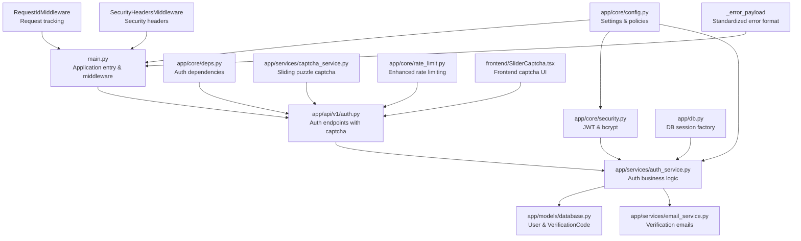

**Diagram sources**
- [main.py:61-87](file://backend/main.py#L61-L87)
- [main.py:90-156](file://backend/main.py#L90-L156)
- [auth.py:83-116](file://backend/app/api/v1/auth.py#L83-L116)
- [auth_service.py:16-358](file://backend/app/services/auth_service.py#L16-L358)
- [captcha_service.py:1-137](file://backend/app/services/captcha_service.py#L1-L137)
- [rate_limit.py:10-58](file://backend/app/core/rate_limit.py#L10-L58)
- [SliderCaptcha.tsx:58-255](file://frontend/src/components/common/SliderCaptcha.tsx#L58-L255)

**Section sources**
- [main.py:61-87](file://backend/main.py#L61-L87)
- [main.py:90-156](file://backend/main.py#L90-L156)
- [config.py:10-105](file://backend/app/core/config.py#L10-L105)

## Core Components
- **JWT-based authentication**: token creation, decoding, and expiration handling with refresh token support.
- **Password hashing**: bcrypt via passlib.
- **Session management**: FastAPI async SQLAlchemy sessions with cookie-based refresh token storage.
- **Authorization**: bearer token extraction and user resolution with enhanced security checks.
- **Enhanced rate limiting**: Dual-layer protection with IP-based sliding window and captcha-based verification.
- **Sliding puzzle captcha**: Custom implementation with HMAC signing, anti-bot measures, and token validation.
- **Brute force protection**: Account lockout via user activation flag, verification code expiry, and captcha token replay prevention.
- **Input validation**: Pydantic schemas with field constraints and captcha verification.
- **CORS**: configured origins from settings.
- **CSRF protection**: Enhanced via captcha requirement and secure cookie handling.
- **Security headers**: Comprehensive protection headers including CSP, X-Frame-Options, X-Content-Type-Options, and Permissions-Policy.
- **Request tracking**: X-Request-ID header generation for request correlation and debugging.
- **Standardized error responses**: Consistent error payload structure across all API endpoints.

**Section sources**
- [security.py:16-87](file://backend/app/core/security.py#L16-L87)
- [auth_service.py:19-358](file://backend/app/services/auth_service.py#L19-L358)
- [captcha_service.py:15-29](file://backend/app/services/captcha_service.py#L15-L29)
- [rate_limit.py:10-58](file://backend/app/core/rate_limit.py#L10-L58)
- [auth_schemas.py:10-21](file://backend/app/schemas/auth.py#L10-L21)
- [main.py:61-87](file://backend/main.py#L61-L87)
- [main.py:90-156](file://backend/main.py#L90-L156)

## Architecture Overview
The enhanced authentication flow integrates FastAPI routing, dependency injection, service-layer logic, captcha verification, persistence, and comprehensive middleware for request tracking and security headers. The diagram below maps the end-to-end authentication flow from request to response with the new middleware implementations.

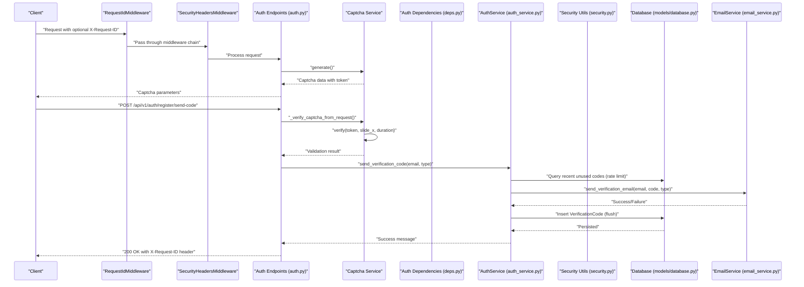

**Diagram sources**
- [main.py:81-87](file://backend/main.py#L81-L87)
- [main.py:69-78](file://backend/main.py#L69-L78)
- [auth.py:83-116](file://backend/app/api/v1/auth.py#L83-L116)
- [auth.py:64-81](file://backend/app/api/v1/auth.py#L64-L81)
- [captcha_service.py:46-70](file://backend/app/services/captcha_service.py#L46-L70)
- [auth_service.py:19-98](file://backend/app/services/auth_service.py#L19-L98)
- [security.py:48-65](file://backend/app/core/security.py#L48-L65)

## Detailed Component Analysis

### JWT Authentication System
- **Token generation**: Uses HS256 with a secret key from settings. Expiration is configurable in minutes with separate access and refresh token configurations.
- **Token decoding**: Validates signature and checks expiration; returns None on failure.
- **Token consumption**: Bearer scheme via HTTPBearer dependency; resolves user by sub claim.
- **Refresh token support**: Enhanced with cookie-based refresh token storage and automatic refresh endpoint.

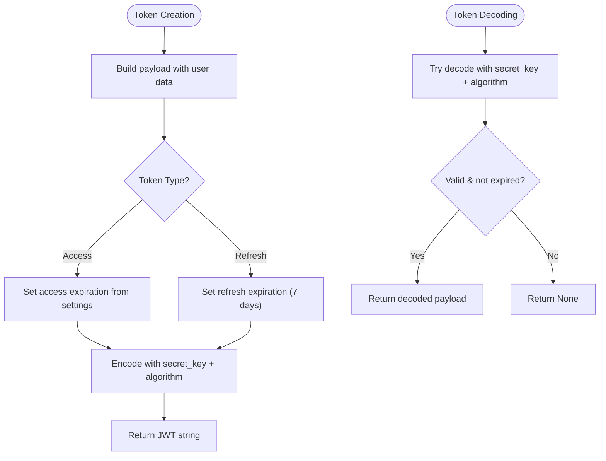

**Diagram sources**
- [security.py:48-87](file://backend/app/core/security.py#L48-L87)
- [config.py:28-38](file://backend/app/core/config.py#L28-L38)

**Section sources**
- [security.py:48-87](file://backend/app/core/security.py#L48-L87)
- [deps.py:18-66](file://backend/app/core/deps.py#L18-L66)
- [auth_service.py:342-354](file://backend/app/services/auth_service.py#L342-L354)

### Password Hashing with bcrypt
- Password hashing uses passlib with bcrypt scheme.
- Verification compares plaintext against stored hash.
- Tests confirm bcrypt prefix and fixed-length hashes.

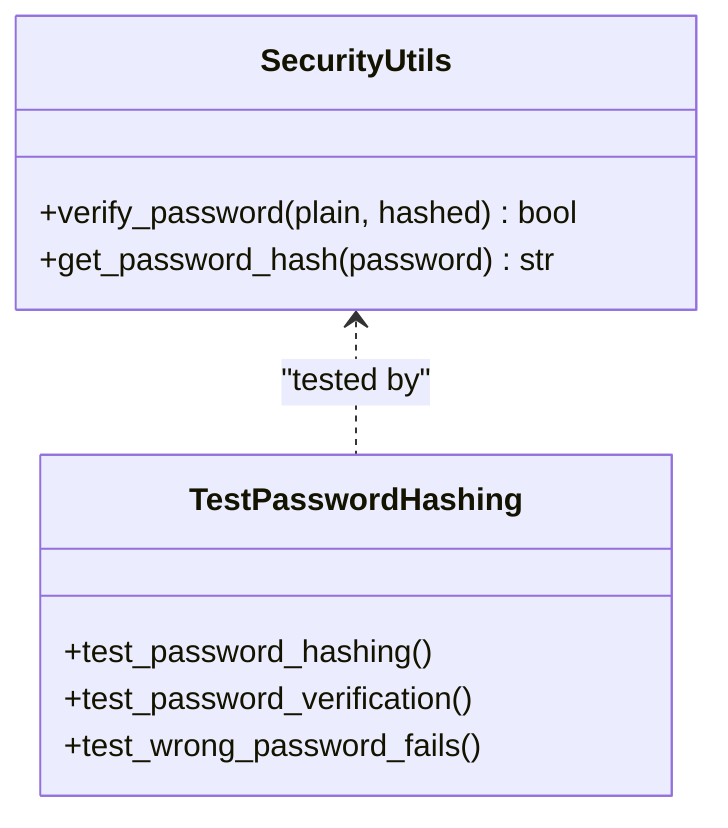

**Diagram sources**
- [security.py:21-45](file://backend/app/core/security.py#L21-L45)
- [test_security.py:15-46](file://backend/tests/test_security.py#L15-L46)

**Section sources**
- [security.py:21-45](file://backend/app/core/security.py#L21-L45)
- [test_security.py:15-46](file://backend/tests/test_security.py#L15-L46)

### Session Management
- Asynchronous SQLAlchemy sessions are provided via a dependency factory.
- Sessions are created per-request and closed automatically.
- **Enhanced**: Cookie-based refresh token storage with secure, httpOnly flags.

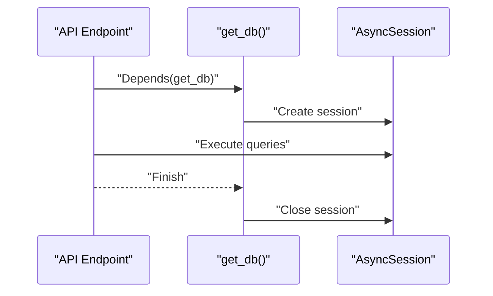

**Diagram sources**
- [db.py:31-43](file://backend/app/db.py#L31-L43)

**Section sources**
- [db.py:31-43](file://backend/app/db.py#L31-L43)

### User Authorization Patterns
- Bearer token extraction via HTTPBearer.
- Current user resolution validates token and loads user from DB.
- Active user check denies access for disabled accounts.
- **Enhanced**: Refresh token validation with automatic cookie refresh.

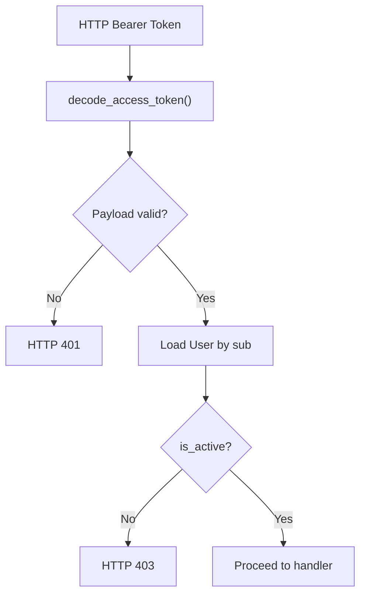

**Diagram sources**
- [deps.py:18-66](file://backend/app/core/deps.py#L18-L66)
- [security.py:68-87](file://backend/app/core/security.py#L68-L87)

**Section sources**
- [deps.py:18-66](file://backend/app/core/deps.py#L18-L66)

### CORS Configuration
- Origins are parsed from settings and applied to the CORSMiddleware.
- Credentials, methods, and headers are permitted broadly.

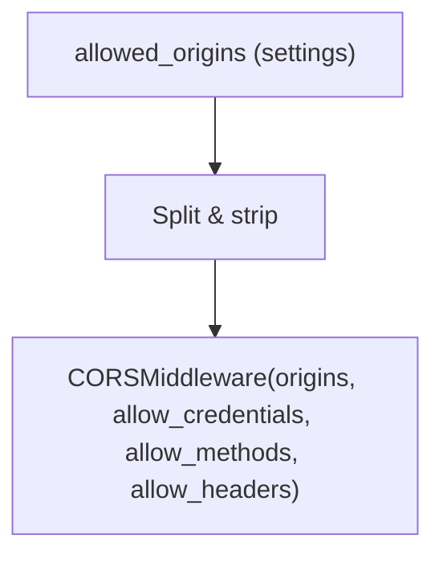

**Diagram sources**
- [config.py:17-20](file://backend/app/core/config.py#L17-L20)
- [config.py:98-100](file://backend/app/core/config.py#L98-L100)
- [main.py:51-58](file://backend/main.py#L51-L58)

**Section sources**
- [config.py:17-20](file://backend/app/core/config.py#L17-L20)
- [config.py:98-100](file://backend/app/core/config.py#L98-L100)
- [main.py:51-58](file://backend/main.py#L51-L58)

### CSRF Protection
- **Enhanced**: Implemented via mandatory sliding puzzle captcha for all sensitive operations.
- **Cookie-based CSRF protection**: Secure, httpOnly cookies with SameSite lax policy.
- **Token-based protection**: HMAC-signed captcha tokens prevent tampering.

**Section sources**
- [auth.py:64-81](file://backend/app/api/v1/auth.py#L64-L81)
- [captcha_service.py:24-34](file://backend/app/services/captcha_service.py#L24-L34)
- [auth.py:36-55](file://backend/app/api/v1/auth.py#L36-L55)

### Input Validation Strategies
- Pydantic schemas enforce field types, lengths, and optional patterns.
- **Enhanced**: Captcha verification integrated into request validation.
- Examples include email validation, fixed-length verification codes, captcha token validation, and minimum password lengths.

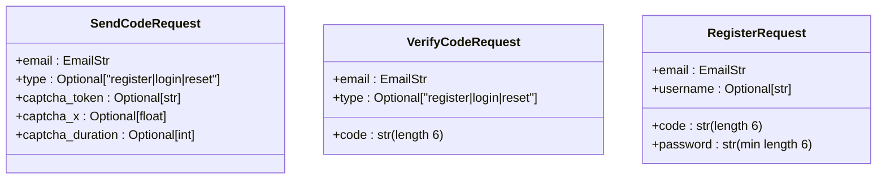

**Diagram sources**
- [auth_schemas.py:10-40](file://backend/app/schemas/auth.py#L10-L40)

**Section sources**
- [auth_schemas.py:10-40](file://backend/app/schemas/auth.py#L10-L40)
- [test_security.py:113-164](file://backend/tests/test_security.py#L113-L164)

### Dependency Injection Patterns for Security Services
- Centralized dependencies for bearer auth and current user retrieval.
- Service layer encapsulates business logic and interacts with models and external services.
- **Enhanced**: Captcha service integration and rate limiting dependencies.

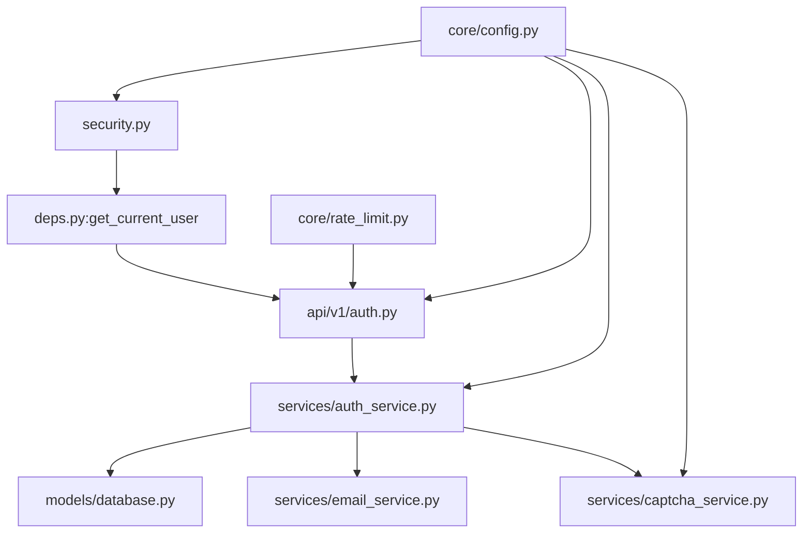

**Diagram sources**
- [deps.py:18-66](file://backend/app/core/deps.py#L18-L66)
- [auth.py:22-504](file://backend/app/api/v1/auth.py#L22-L504)
- [auth_service.py:16-358](file://backend/app/services/auth_service.py#L16-L358)
- [captcha_service.py:132-137](file://backend/app/services/captcha_service.py#L132-L137)
- [rate_limit.py:52-58](file://backend/app/core/rate_limit.py#L52-L58)

**Section sources**
- [deps.py:18-66](file://backend/app/core/deps.py#L18-L66)
- [auth.py:22-504](file://backend/app/api/v1/auth.py#L22-L504)
- [auth_service.py:16-358](file://backend/app/services/auth_service.py#L16-L358)

### Enhanced Middleware Implementation

#### Request Tracking Middleware
The RequestIdMiddleware provides comprehensive request tracking capabilities:

- **X-Request-ID Generation**: Automatically generates unique request IDs using UUID4 when not provided by clients.
- **Request State Tracking**: Stores request ID in request.state for downstream processing.
- **Response Header Inclusion**: Returns X-Request-ID header in all responses for correlation.
- **Client Override Support**: Allows clients to provide custom X-Request-ID in requests.

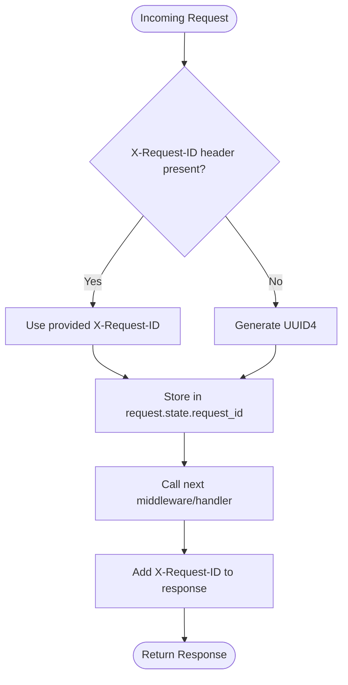

**Diagram sources**
- [main.py:81-87](file://backend/main.py#L81-L87)

**Section sources**
- [main.py:81-87](file://backend/main.py#L81-L87)

#### Security Headers Middleware
The SecurityHeadersMiddleware implements comprehensive security headers for all responses:

- **X-Content-Type-Options**: Prevents MIME-type sniffing with "nosniff"
- **X-Frame-Options**: Blocks clickjacking attacks with "DENY"
- **X-XSS-Protection**: Enables XSS filtering with "1; mode=block"
- **Referrer-Policy**: Controls referrer information sharing
- **Permissions-Policy**: Restricts browser features (camera, microphone, geolocation)

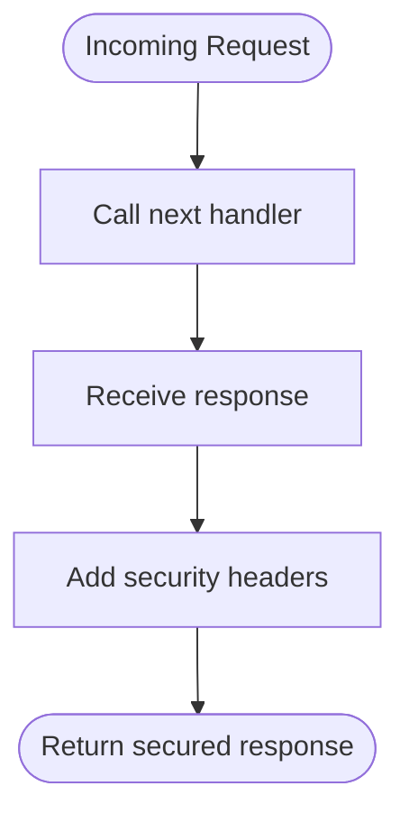

**Diagram sources**
- [main.py:69-78](file://backend/main.py#L69-L78)

**Section sources**
- [main.py:69-78](file://backend/main.py#L69-L78)

#### Standardized Error Response Format
The centralized error handling system provides consistent error responses:

- **Unified Error Payload**: Structured response with code, message, data, and request_id fields.
- **Backward Compatibility**: Includes "detail" field for frontend compatibility.
- **Request Correlation**: Links errors to specific requests via X-Request-ID.
- **Exception Handlers**: Handles HTTP exceptions, validation errors, and unhandled exceptions.

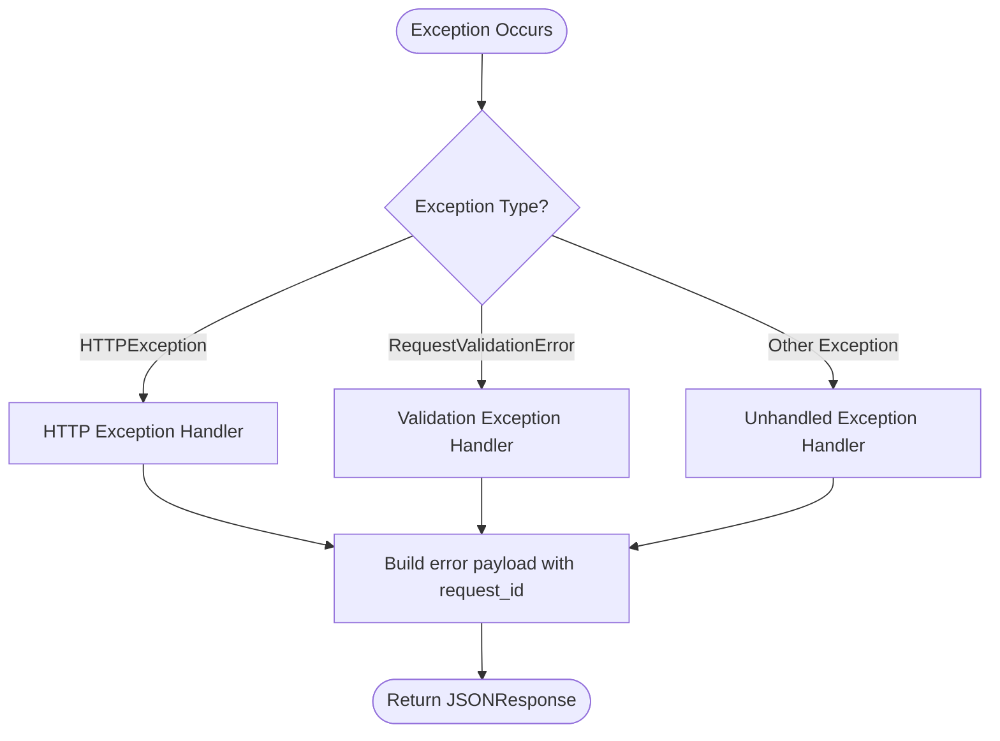

**Diagram sources**
- [main.py:90-156](file://backend/main.py#L90-L156)

**Section sources**
- [main.py:90-156](file://backend/main.py#L90-L156)

### Rate Limiting and Brute Force Protection
- **Enhanced**: Dual-layer rate limiting with IP-based sliding window and captcha-based verification.
- **IP-based rate limiting**: 5 requests per minute for verification code operations.
- **Captcha-based rate limiting**: Additional protection against automated captcha solving.
- Verification codes expire after a short period, mitigating brute force reuse.
- User account status (active) blocks access for disabled users.
- **Enhanced**: Captcha token replay prevention with memory-based tracking.

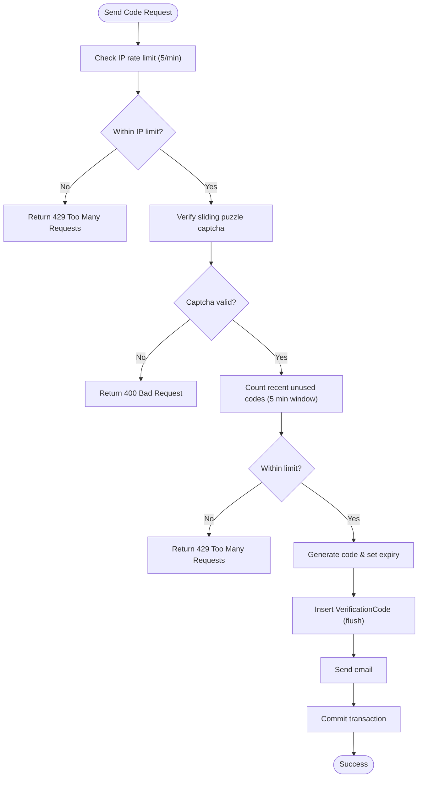

**Diagram sources**
- [auth_service.py:19-98](file://backend/app/services/auth_service.py#L19-L98)
- [rate_limit.py:38-49](file://backend/app/core/rate_limit.py#L38-L49)
- [auth.py:130-131](file://backend/app/api/v1/auth.py#L130-L131)

**Section sources**
- [auth_service.py:19-98](file://backend/app/services/auth_service.py#L19-L98)
- [rate_limit.py:38-49](file://backend/app/core/rate_limit.py#L38-L49)
- [auth.py:130-131](file://backend/app/api/v1/auth.py#L130-L131)

### Secure API Endpoint Implementation Example
- **Enhanced**: Registration flow demonstrates secure handling of verification codes, password hashing, captcha verification, and token issuance with cookie storage.
- **Enhanced**: Login endpoints support both code-based and password-based authentication with captcha verification.
- **Enhanced**: Refresh token endpoint handles automatic token renewal via cookie-based authentication.
- Error responses use appropriate HTTP status codes and messages with standardized format.

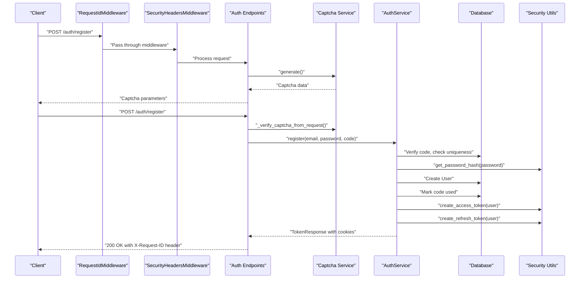

**Diagram sources**
- [main.py:81-87](file://backend/main.py#L81-L87)
- [main.py:69-78](file://backend/main.py#L69-L78)
- [auth.py:83-116](file://backend/app/api/v1/auth.py#L83-L116)
- [auth.py:64-81](file://backend/app/api/v1/auth.py#L64-L81)
- [auth_service.py:142-201](file://backend/app/services/auth_service.py#L142-L201)
- [security.py:35-65](file://backend/app/core/security.py#L35-L65)

**Section sources**
- [auth.py:83-116](file://backend/app/api/v1/auth.py#L83-L116)
- [auth.py:64-81](file://backend/app/api/v1/auth.py#L64-L81)
- [auth_service.py:142-201](file://backend/app/services/auth_service.py#L142-L201)

### Error Handling for Security Violations
- Authentication failures return 401 with WWW-Authenticate header.
- Disabled or inactive users receive 403.
- Verification errors return 400; rate-limit exceeded returns 429.
- **Enhanced**: Captcha validation errors return 400 with specific error messages.
- **Enhanced**: Captcha token replay attempts return 400 with "already used" message.
- **Enhanced**: All error responses include standardized format with request_id correlation.
- Tests validate proper error responses and validation behavior.

**Section sources**
- [deps.py:35-66](file://backend/app/core/deps.py#L35-L66)
- [auth.py:36-53](file://backend/app/api/v1/auth.py#L36-L53)
- [auth_service.py:131-140](file://backend/app/services/auth_service.py#L131-L140)
- [captcha_service.py:73-123](file://backend/app/services/captcha_service.py#L73-L123)
- [test_security.py:113-164](file://backend/tests/test_security.py#L113-L164)

## Enhanced Security Features

### Sliding Puzzle Captcha Integration
The system now implements a custom sliding puzzle captcha with comprehensive anti-bot measures:

- **Custom puzzle generation**: Random gap positions with geometric constraints
- **HMAC signing**: Tokens signed with server secret for tamper prevention
- **Anti-bot validation**: Minimum sliding duration (300ms) prevents automation
- **Precision checking**: ±6 pixel tolerance for human-like accuracy
- **Replay protection**: Memory-based token tracking with automatic cleanup
- **Expiration handling**: 120-second token lifetime with cleanup mechanism

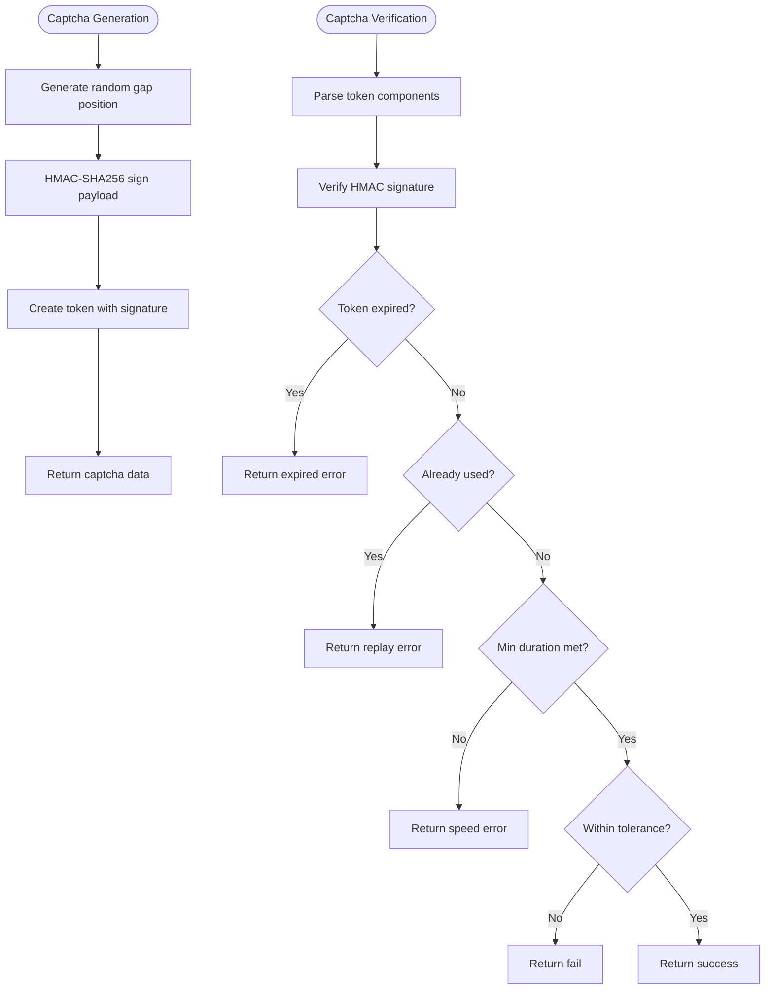

**Diagram sources**
- [captcha_service.py:46-70](file://backend/app/services/captcha_service.py#L46-L70)
- [captcha_service.py:73-123](file://backend/app/services/captcha_service.py#L73-L123)

**Section sources**
- [captcha_service.py:15-29](file://backend/app/services/captcha_service.py#L15-L29)
- [captcha_service.py:46-70](file://backend/app/services/captcha_service.py#L46-L70)
- [captcha_service.py:73-123](file://backend/app/services/captcha_service.py#L73-L123)

### Enhanced Rate Limiting System
The system implements a dual-layer rate limiting strategy:

- **IP-based sliding window**: 5 requests per minute per IP address
- **Captcha-based protection**: Additional layer preventing automated captcha solving
- **Memory-based tracking**: Efficient in-memory tracking with automatic cleanup
- **Distributed considerations**: Ready for Redis migration in multi-instance deployments

**Section sources**
- [rate_limit.py:10-58](file://backend/app/core/rate_limit.py#L10-L58)
- [auth.py:130-131](file://backend/app/api/v1/auth.py#L130-L131)
- [auth.py:165-166](file://backend/app/api/v1/auth.py#L165-L166)

### Refresh Token Authentication
The system implements comprehensive refresh token management:

- **Cookie-based storage**: Secure, httpOnly refresh tokens stored in cookies
- **Automatic renewal**: Seamless token refresh without user intervention
- **Enhanced security**: Separate access and refresh token lifetimes
- **Graceful degradation**: Automatic logout on refresh token invalidation

**Section sources**
- [auth.py:36-55](file://backend/app/api/v1/auth.py#L36-L55)
- [auth.py:415-464](file://backend/app/api/v1/auth.py#L415-L464)
- [security.py:58-65](file://backend/app/core/security.py#L58-L65)

### Frontend Captcha Integration
The frontend implements a sophisticated sliding puzzle interface:

- **Canvas-based rendering**: Dynamic puzzle generation with gradient backgrounds
- **Realistic physics**: Smooth sliding with momentum and shadow effects
- **Visual feedback**: Success/failure animations and retry mechanisms
- **Responsive design**: Adaptive sizing for different screen dimensions
- **Performance optimization**: Device pixel ratio scaling for crisp rendering

**Section sources**
- [SliderCaptcha.tsx:58-255](file://frontend/src/components/common/SliderCaptcha.tsx#L58-L255)

### Request Tracking and Debugging
The middleware-based request tracking system provides comprehensive observability:

- **Unique Request Correlation**: X-Request-ID header enables end-to-end request tracing
- **Consistent Logging**: All requests and responses include correlation identifiers
- **Debugging Support**: Easy correlation of client requests with server logs
- **Production Ready**: Minimal performance overhead with efficient UUID generation

**Section sources**
- [main.py:81-87](file://backend/main.py#L81-L87)

### Standardized Error Response Format
The centralized error handling ensures consistent error reporting across all API endpoints:

- **Structured Error Payload**: Unified format with code, message, data, and request_id fields
- **Backward Compatibility**: Maintains "detail" field for frontend compatibility
- **Request Correlation**: All errors include X-Request-ID for debugging
- **Comprehensive Coverage**: Handles HTTP exceptions, validation errors, and unhandled exceptions
- **Developer Experience**: Clear error messages with structured data for programmatic handling

**Section sources**
- [main.py:90-156](file://backend/main.py#L90-L156)

## Dependency Analysis
External dependencies relevant to security include FastAPI, python-jose for JWT, passlib for bcrypt, pydantic/pydantic-settings for configuration and validation, cryptography libraries for HMAC signing, and uuid for request tracking.

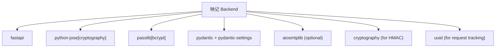

**Diagram sources**
- [requirements.txt:2-26](file://backend/requirements.txt#L2-L26)

**Section sources**
- [requirements.txt:2-26](file://backend/requirements.txt#L2-L26)

## Performance Considerations
- JWT decoding is lightweight; avoid excessive token payloads.
- bcrypt hashing cost can be tuned via passlib configuration if needed.
- Database queries for verification codes and users should leverage indexes on email and verification code fields.
- Email sending is asynchronous when available; otherwise executed in thread pool.
- **Enhanced**: Captcha service uses memory-based tracking for efficient token validation.
- **Enhanced**: Rate limiter implements sliding window algorithm with O(1) cleanup complexity.
- **Enhanced**: Security headers middleware adds minimal overhead to response processing.
- **Enhanced**: Request tracking middleware has negligible performance impact with UUID generation.
- **Enhanced**: Error handling system maintains consistent performance across all exception types.

## Troubleshooting Guide
Common issues and resolutions:
- Invalid or expired tokens: Ensure correct secret key and algorithm match configuration; verify expiration timing.
- Authentication failures: Confirm Bearer token presence and validity; check user activation status.
- Verification code errors: Validate code length and type; ensure code is not expired or already used.
- Rate limit exceeded: Implement client-side backoff and reduce request frequency.
- CORS issues: Verify allowed origins and credentials configuration.
- **Enhanced**: Captcha validation failures: Check minimum duration (≥300ms) and precision tolerance (±6px).
- **Enhanced**: Captcha token replay: Ensure tokens are not reused; check memory cleanup mechanism.
- **Enhanced**: Refresh token issues: Verify cookie storage and automatic renewal flow.
- **Enhanced**: Request tracking issues: Check X-Request-ID header presence and correlation with logs.
- **Enhanced**: Security header problems: Verify middleware registration order and response modification.
- **Enhanced**: Error response format issues: Ensure standardized error payload structure across all endpoints.

**Section sources**
- [security.py:68-87](file://backend/app/core/security.py#L68-L87)
- [deps.py:35-66](file://backend/app/core/deps.py#L35-L66)
- [auth_service.py:118-140](file://backend/app/services/auth_service.py#L118-L140)
- [captcha_service.py:73-123](file://backend/app/services/captcha_service.py#L73-L123)
- [config.py:98-100](file://backend/app/core/config.py#L98-L100)
- [main.py:81-87](file://backend/main.py#L81-L87)
- [main.py:69-78](file://backend/main.py#L69-L78)

## Conclusion
The 映记 backend implements a comprehensive security architecture with robust multi-layered protection. The enhanced system features custom sliding puzzle captcha integration with HMAC signing and anti-bot measures, dual-layer rate limiting with IP-based and captcha-based protection, refresh token authentication with cookie-based session management, comprehensive security headers, request tracking with X-Request-ID correlation, and standardized error response formats. The modular design with dependency injection supports maintainable security practices while providing strong protection against automated attacks and brute force attempts. The new middleware-based approach ensures consistent security enforcement across all API endpoints with minimal performance impact.

## Appendices

### Best Practices Checklist
- **Enhanced**: Implement CSRF protection via mandatory captcha for sensitive operations.
- **Enhanced**: Add comprehensive security headers (CSP, X-Frame-Options, X-Content-Type-Options, X-XSS-Protection, Referrer-Policy, Permissions-Policy).
- **Enhanced**: Configure HTTPS-only cookies with secure flag in production environments.
- **Enhanced**: Implement rate limiting for all public endpoints beyond captcha verification.
- **Enhanced**: Consider Redis-based distributed rate limiting for multi-instance deployments.
- **Enhanced**: Enable request tracking middleware for all production deployments.
- **Enhanced**: Implement comprehensive logging with X-Request-ID correlation for debugging.
- **Enhanced**: Regular monitoring and logging of security events for anomaly detection.
- **Enhanced**: Implement token rotation for refresh tokens in high-security scenarios.
- **Enhanced**: Consider adding additional CAPTCHA challenges for suspicious activities.
- **Enhanced**: Ensure all error responses include standardized format with request_id for debugging.
- **Enhanced**: Implement proper exception handling with consistent error payload structure.