# AI Psychological Analysis

<cite>
**Referenced Files in This Document**
- [ai.py](file://backend/app/api/v1/ai.py)
- [rag_service.py](file://backend/app/services/rag_service.py)
- [orchestrator.py](file://backend/app/agents/orchestrator.py)
- [agent_impl.py](file://backend/app/agents/agent_impl.py)
- [prompts.py](file://backend/app/agents/prompts.py)
- [state.py](file://backend/app/agents/state.py)
- [llm.py](file://backend/app/agents/llm.py)
- [diary_service.py](file://backend/app/services/diary_service.py)
- [qdrant_memory_service.py](file://backend/app/services/qdrant_memory_service.py)
- [diary.py](file://backend/app/models/diary.py)
- [ai.py](file://backend/app/schemas/ai.py)
- [diaries.py](file://backend/app/api/v1/diaries.py)
- [community.py](file://backend/app/api/v1/community.py)
- [SatirIceberg.tsx](file://frontend/src/pages/analysis/SatirIceberg.tsx)
- [AnalysisResult.tsx](file://frontend/src/pages/analysis/AnalysisResult.tsx)
- [en-US.json](file://frontend/src/i18n/locales/en-US.json)
- [zh-CN.json](file://frontend/src/i18n/locales/zh-CN.json)
- [analysis.ts](file://frontend/src/types/analysis.ts)
</cite>

## Update Summary
**Changes Made**
- Enhanced Satir Iceberg Model documentation to reflect specialized psychological terminology translation
- Added comprehensive coverage of therapeutic response generation and AI analysis result translation
- Updated frontend localization documentation for psychological terms across English and Chinese interfaces
- Expanded analysis result visualization documentation with translated terminology
- Added detailed explanation of multi-language support for psychological concepts

## Table of Contents
1. [Introduction](#introduction)
2. [Project Structure](#project-structure)
3. [Core Components](#core-components)
4. [Architecture Overview](#architecture-overview)
5. [Detailed Component Analysis](#detailed-component-analysis)
6. [Dependency Analysis](#dependency-analysis)
7. [Performance Considerations](#performance-considerations)
8. [Troubleshooting Guide](#troubleshooting-guide)
9. [Conclusion](#conclusion)
10. [Appendices](#appendices)

## Introduction
This document explains the AI Psychological Analysis feature that powers multi-day diary analysis, retrieval-augmented generation (RAG), the Satir Iceberg Model, hybrid evidence selection, agent orchestration, social content generation, visualization-ready results, backend architecture, memory management with Qdrant, and streaming response handling. The system now includes comprehensive translation of specialized psychological terminology and AI analysis results, ensuring accessibility across different languages while maintaining clinical accuracy.

## Project Structure
The AI Psychological Analysis spans backend APIs, agent orchestration, RAG services, memory services, and persistence models. The most relevant modules are:
- API endpoints for analysis, guidance, and social content
- Agent orchestration coordinating multiple specialized agents
- RAG service implementing hybrid lexical and semantic retrieval
- Memory service integrating Qdrant for vector-based recall
- Persistence models for diaries, timelines, and AI analysis results
- Schemas defining request/response contracts
- Frontend components with internationalization support for psychological terms

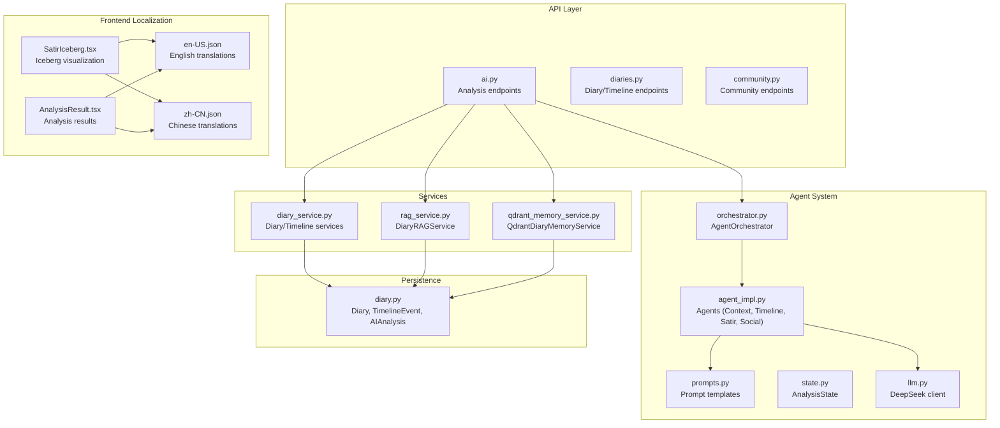

**Diagram sources**
- [ai.py:1-907](file://backend/app/api/v1/ai.py#L1-L907)
- [orchestrator.py:1-176](file://backend/app/agents/orchestrator.py#L1-L176)
- [agent_impl.py:1-491](file://backend/app/agents/agent_impl.py#L1-L491)
- [prompts.py:1-438](file://backend/app/agents/prompts.py#L1-L438)
- [state.py:1-45](file://backend/app/agents/state.py#L1-L45)
- [llm.py:1-220](file://backend/app/agents/llm.py#L1-L220)
- [rag_service.py:1-360](file://backend/app/services/rag_service.py#L1-L360)
- [qdrant_memory_service.py:1-190](file://backend/app/services/qdrant_memory_service.py#L1-L190)
- [diary_service.py:1-637](file://backend/app/services/diary_service.py#L1-L637)
- [diary.py:1-186](file://backend/app/models/diary.py#L1-L186)
- [SatirIceberg.tsx:1-220](file://frontend/src/pages/analysis/SatirIceberg.tsx#L1-L220)
- [AnalysisResult.tsx:1-401](file://frontend/src/pages/analysis/AnalysisResult.tsx#L1-L401)
- [en-US.json:720-737](file://frontend/src/i18n/locales/en-US.json#L720-L737)
- [zh-CN.json:720-737](file://frontend/src/i18n/locales/zh-CN.json#L720-L737)

**Section sources**
- [ai.py:1-907](file://backend/app/api/v1/ai.py#L1-L907)
- [rag_service.py:1-360](file://backend/app/services/rag_service.py#L1-L360)
- [orchestrator.py:1-176](file://backend/app/agents/orchestrator.py#L1-L176)
- [agent_impl.py:1-491](file://backend/app/agents/agent_impl.py#L1-L491)
- [prompts.py:1-438](file://backend/app/agents/prompts.py#L1-L438)
- [state.py:1-45](file://backend/app/agents/state.py#L1-L45)
- [llm.py:1-220](file://backend/app/agents/llm.py#L1-L220)
- [diary_service.py:1-637](file://backend/app/services/diary_service.py#L1-L637)
- [qdrant_memory_service.py:1-190](file://backend/app/services/qdrant_memory_service.py#L1-L190)
- [diary.py:1-186](file://backend/app/models/diary.py#L1-L186)

## Core Components
- Multi-day analysis pipeline: Aggregates diary windows, builds integrated content, and orchestrates agents for time-axis extraction, Satir Iceberg analysis, and social content generation.
- RAG evidence selection: Hybrid BM25 + recency + importance + emotion intensity + repetition + people hit + source bonus ranking.
- Satir Iceberg Model: Five-layer analysis (behavior → emotion → cognition → beliefs → core self) with therapeutic response synthesis and comprehensive terminology translation.
- Agent orchestration: Structured workflow with context collection, timeline extraction, layered analysis, and social content creation.
- Social content generation: Personalized posts aligned with user's social style and past samples.
- Backend architecture: FastAPI endpoints, SQLAlchemy models, async services, and optional Qdrant vector memory.
- Streaming responses: DeepSeek client supports streaming mode for progressive token delivery.
- **Enhanced**: Multi-language psychological terminology translation ensuring clinical accuracy across English and Chinese interfaces.

**Section sources**
- [ai.py:267-403](file://backend/app/api/v1/ai.py#L267-L403)
- [rag_service.py:210-317](file://backend/app/services/rag_service.py#L210-L317)
- [agent_impl.py:205-394](file://backend/app/agents/agent_impl.py#L205-L394)
- [orchestrator.py:27-131](file://backend/app/agents/orchestrator.py#L27-L131)
- [llm.py:94-143](file://backend/app/agents/llm.py#L94-L143)
- [SatirIceberg.tsx:14-50](file://frontend/src/pages/analysis/SatirIceberg.tsx#L14-L50)
- [en-US.json:720-737](file://frontend/src/i18n/locales/en-US.json#L720-L737)
- [zh-CN.json:720-737](file://frontend/src/i18n/locales/zh-CN.json#L720-L737)

## Architecture Overview
The system integrates user-level diary aggregation, RAG-based evidence selection, agent-driven psychological analysis, and social content generation. Results are persisted and can be retrieved later for visualization and further analysis. The architecture now includes comprehensive translation infrastructure for psychological terminology.

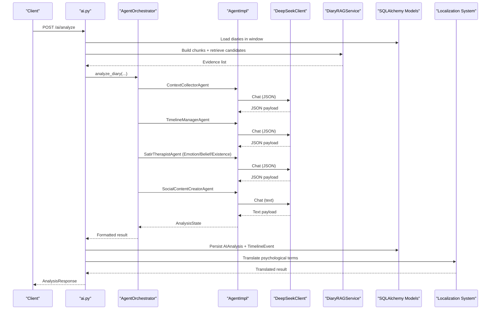

**Diagram sources**
- [ai.py:406-638](file://backend/app/api/v1/ai.py#L406-L638)
- [orchestrator.py:27-131](file://backend/app/agents/orchestrator.py#L27-L131)
- [agent_impl.py:92-491](file://backend/app/agents/agent_impl.py#L92-L491)
- [rag_service.py:147-208](file://backend/app/services/rag_service.py#L147-L208)
- [diary.py:102-132](file://backend/app/models/diary.py#L102-L132)
- [SatirIceberg.tsx:12-13](file://frontend/src/pages/analysis/SatirIceberg.tsx#L12-L13)
- [en-US.json:720-737](file://frontend/src/i18n/locales/en-US.json#L720-L737)
- [zh-CN.json:720-737](file://frontend/src/i18n/locales/zh-CN.json#L720-L737)

## Detailed Component Analysis

### Multi-Day Analysis Pipeline
- Window selection: Uses a configurable window_days and max_diaries to fetch diaries for analysis.
- Integrated content: Concatenates diary sections with metadata to form a unified corpus.
- User profile: Aggregated top emotions, average importance, and analysis scope.
- Timeline context: Retrieves recent events within the analysis window for richer context.
- Agent orchestration: Executes context collection, timeline extraction, Satir layers, and social content generation.
- Persistence: Saves AIAnalysis and updates TimelineEvent; marks diaries as analyzed.

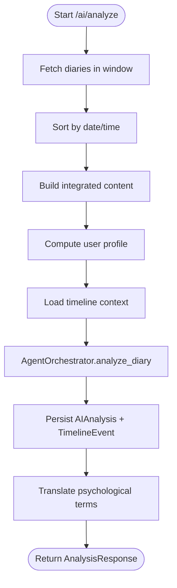

**Diagram sources**
- [ai.py:406-638](file://backend/app/api/v1/ai.py#L406-L638)

**Section sources**
- [ai.py:406-638](file://backend/app/api/v1/ai.py#L406-L638)

### RAG Evidence Selection (Hybrid BM25 + Lexical/Semantic)
- Chunk building: Splits content into overlapping segments and builds daily summaries; extracts people, emotion intensity, and theme keys.
- Retrieval: Applies BM25 with idf/tf normalization, plus recency, importance, emotion intensity, repetition, people hit, and source bonus.
- Ranking formula: Weighted combination of BM25-normalized score and auxiliary signals.
- Deduplication: Jaccard similarity threshold prevents redundant evidence while respecting per-diary and per-reason limits.

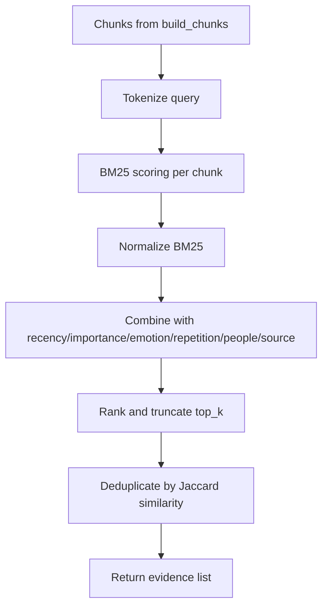

**Diagram sources**
- [rag_service.py:147-356](file://backend/app/services/rag_service.py#L147-L356)

**Section sources**
- [rag_service.py:147-356](file://backend/app/services/rag_service.py#L147-L356)

### Satir Iceberg Model Implementation
- Behavior layer: Captures the observable event from the diary.
- Emotion layer: Extracts surface and underlying emotions with intensity.
- Cognitive layer: Identifies irrational beliefs and automatic thoughts.
- Belief layer: Surfaces core beliefs and life rules.
- Core Self layer: Connects to deepest desires and existence insights.
- Therapeutic response: Synthesizes a warm, structured reply grounded in the five layers.
- **Enhanced**: Comprehensive translation of psychological terminology in both English and Chinese interfaces, ensuring clinical accuracy and accessibility.

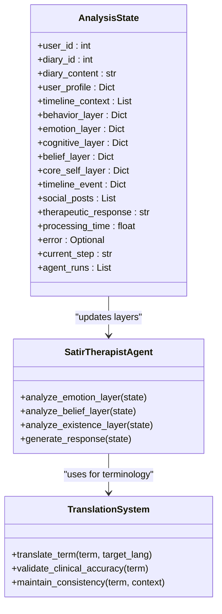

**Diagram sources**
- [state.py:10-45](file://backend/app/agents/state.py#L10-L45)
- [agent_impl.py:205-394](file://backend/app/agents/agent_impl.py#L205-L394)
- [SatirIceberg.tsx:14-50](file://frontend/src/pages/analysis/SatirIceberg.tsx#L14-L50)
- [en-US.json:720-737](file://frontend/src/i18n/locales/en-US.json#L720-L737)
- [zh-CN.json:720-737](file://frontend/src/i18n/locales/zh-CN.json#L720-L737)

**Section sources**
- [agent_impl.py:205-394](file://backend/app/agents/agent_impl.py#L205-L394)
- [prompts.py:62-163](file://backend/app/agents/prompts.py#L62-L163)
- [state.py:10-45](file://backend/app/agents/state.py#L10-L45)
- [SatirIceberg.tsx:14-50](file://frontend/src/pages/analysis/SatirIceberg.tsx#L14-L50)
- [en-US.json:720-737](file://frontend/src/i18n/locales/en-US.json#L720-L737)
- [zh-CN.json:720-737](file://frontend/src/i18n/locales/zh-CN.json#L720-L737)

### Agent Orchestration System
- Responsibilities:
  - ContextCollectorAgent: Builds contextual profile and timeline context.
  - TimelineManagerAgent: Extracts structured events with emotion, type, and importance.
  - SatirTherapistAgent: Runs three specialized steps (emotion, belief, existence) and generates a therapeutic response.
  - SocialContentCreatorAgent: Produces multiple social post variants aligned with user style.
- Formatting: Converts internal state into a standardized AnalysisResponse with metadata and agent run logs.
- **Enhanced**: Each agent's output is processed through the translation system to ensure psychological terminology accuracy.

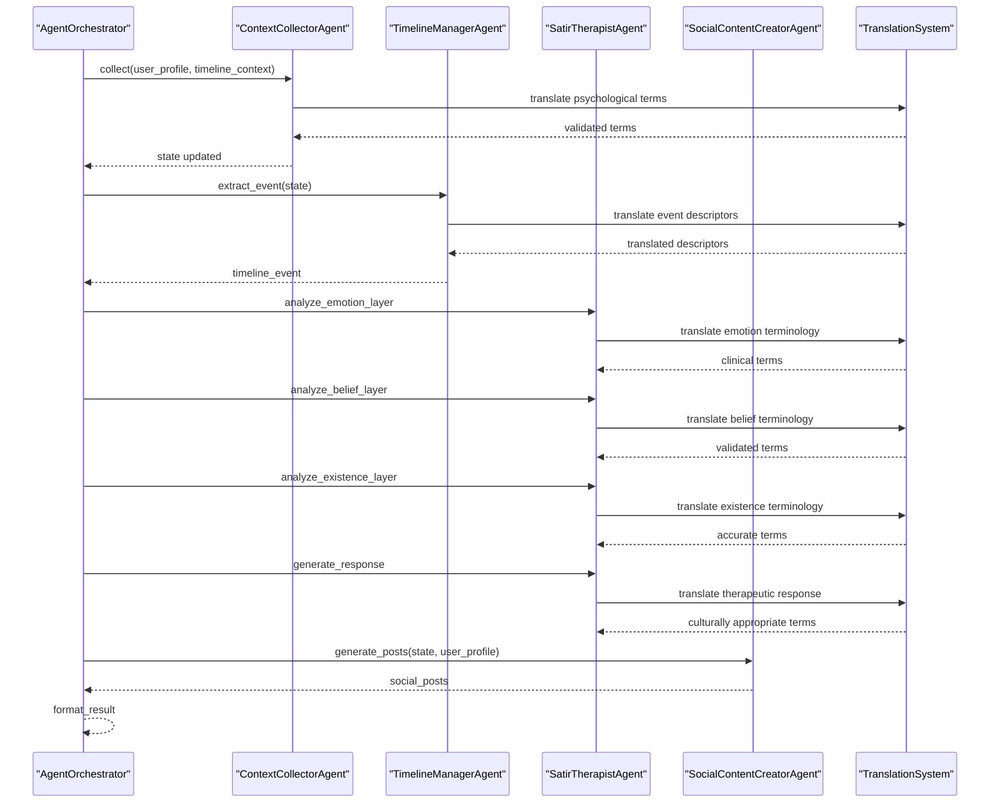

**Diagram sources**
- [orchestrator.py:27-131](file://backend/app/agents/orchestrator.py#L27-L131)
- [agent_impl.py:92-491](file://backend/app/agents/agent_impl.py#L92-L491)
- [SatirIceberg.tsx:12-13](file://frontend/src/pages/analysis/SatirIceberg.tsx#L12-L13)

**Section sources**
- [orchestrator.py:18-171](file://backend/app/agents/orchestrator.py#L18-L171)
- [agent_impl.py:92-491](file://backend/app/agents/agent_impl.py#L92-L491)

### Social Content Generation for Community Sharing
- Uses user's social style and stored samples to produce multiple post variants.
- Falls back gracefully if parsing fails.
- Integrates with community endpoints for sharing after analysis.
- **Enhanced**: Social posts are generated using translated psychological terminology that aligns with user's social style while maintaining clinical accuracy.

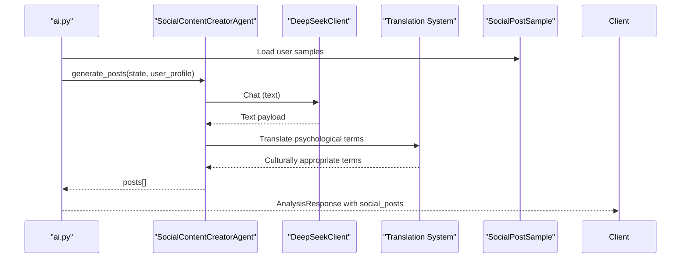

**Diagram sources**
- [ai.py:770-800](file://backend/app/api/v1/ai.py#L770-L800)
- [agent_impl.py:396-491](file://backend/app/agents/agent_impl.py#L396-L491)
- [diary.py:135-153](file://backend/app/models/diary.py#L135-L153)
- [SatirIceberg.tsx:12-13](file://frontend/src/pages/analysis/SatirIceberg.tsx#L12-L13)

**Section sources**
- [ai.py:770-800](file://backend/app/api/v1/ai.py#L770-L800)
- [agent_impl.py:396-491](file://backend/app/agents/agent_impl.py#L396-L491)
- [diary.py:135-153](file://backend/app/models/diary.py#L135-L153)

### Backend Service Architecture
- FastAPI endpoints under /ai, /diaries, and /community.
- SQLAlchemy models for diaries, timeline events, AI analyses, and social samples.
- Services for diary/timeline management and optional Qdrant vector memory.
- Schemas define request/response shapes for type safety.
- **Enhanced**: Integrated translation middleware ensures psychological terminology consistency across all API responses.

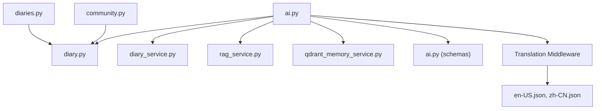

**Diagram sources**
- [ai.py:1-907](file://backend/app/api/v1/ai.py#L1-L907)
- [diaries.py:1-501](file://backend/app/api/v1/diaries.py#L1-L501)
- [community.py:1-324](file://backend/app/api/v1/community.py#L1-L324)
- [diary.py:1-186](file://backend/app/models/diary.py#L1-L186)
- [diary_service.py:1-637](file://backend/app/services/diary_service.py#L1-L637)
- [rag_service.py:1-360](file://backend/app/services/rag_service.py#L1-L360)
- [qdrant_memory_service.py:1-190](file://backend/app/services/qdrant_memory_service.py#L1-L190)
- [ai.py:1-108](file://backend/app/schemas/ai.py#L1-L108)
- [en-US.json:720-737](file://frontend/src/i18n/locales/en-US.json#L720-L737)
- [zh-CN.json:720-737](file://frontend/src/i18n/locales/zh-CN.json#L720-L737)

**Section sources**
- [ai.py:1-907](file://backend/app/api/v1/ai.py#L1-L907)
- [diaries.py:1-501](file://backend/app/api/v1/diaries.py#L1-L501)
- [community.py:1-324](file://backend/app/api/v1/community.py#L1-L324)
- [diary.py:1-186](file://backend/app/models/diary.py#L1-L186)
- [diary_service.py:1-637](file://backend/app/services/diary_service.py#L1-L637)
- [rag_service.py:1-360](file://backend/app/services/rag_service.py#L1-L360)
- [qdrant_memory_service.py:1-190](file://backend/app/services/qdrant_memory_service.py#L1-L190)
- [ai.py:1-108](file://backend/app/schemas/ai.py#L1-L108)

### Memory Management with Qdrant
- Optional vector memory service that synchronizes user diaries to a Qdrant collection and performs cosine-distance searches.
- Embedding via token hashing with configurable dimension.
- Retrieval context method ensures up-to-date vectors before search.

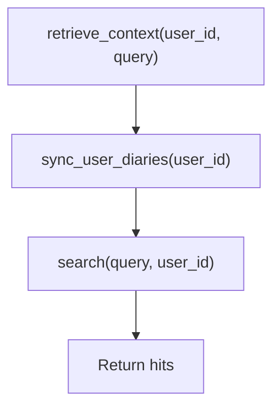

**Diagram sources**
- [qdrant_memory_service.py:175-186](file://backend/app/services/qdrant_memory_service.py#L175-L186)

**Section sources**
- [qdrant_memory_service.py:45-186](file://backend/app/services/qdrant_memory_service.py#L45-L186)

### Streaming Response Handling
- DeepSeek client supports streaming mode and yields tokens incrementally.
- Useful for progressive UI updates during long-running analysis.

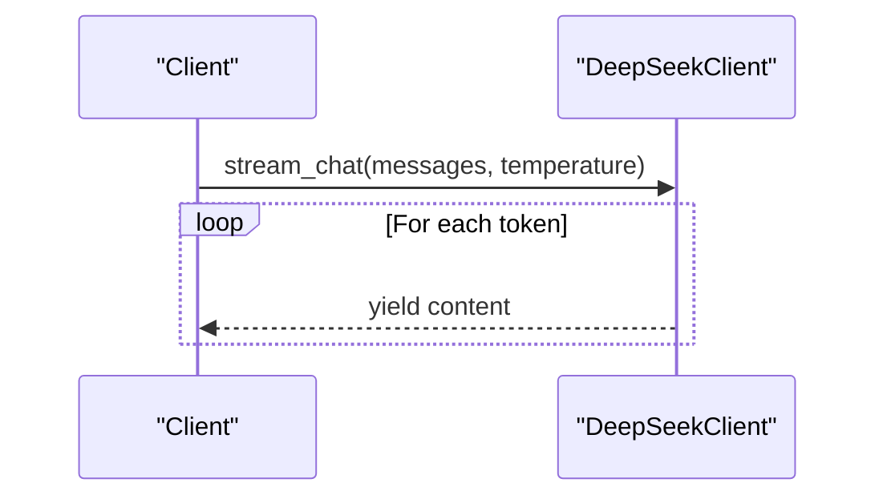

**Diagram sources**
- [llm.py:94-143](file://backend/app/agents/llm.py#L94-L143)

**Section sources**
- [llm.py:94-143](file://backend/app/agents/llm.py#L94-L143)

### Analysis Result Visualization and Recommendations
- Evidence list with scores and reasons enables trend identification and targeted insights.
- Metadata includes analysis scope, window, counts, and retrieval strategy.
- Visualization-ready fields: emotion trends, continuity signals, turning points, growth suggestions.
- **Enhanced**: Frontend components utilize comprehensive internationalization for psychological terminology, supporting both English and Chinese users with culturally appropriate translations.

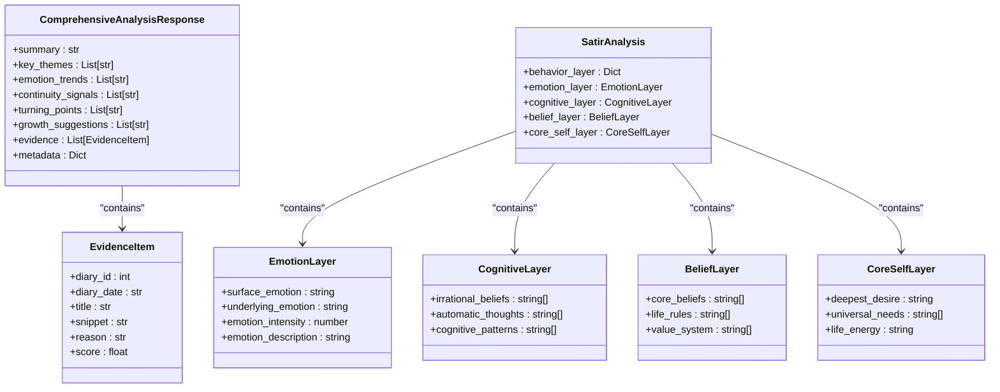

**Diagram sources**
- [ai.py:32-42](file://backend/app/api/v1/ai.py#L32-L42)
- [ai.py:23-41](file://backend/app/schemas/ai.py#L23-L41)
- [analysis.ts:186-192](file://frontend/src/types/analysis.ts#L186-L192)
- [analysis.ts:161-184](file://frontend/src/types/analysis.ts#L161-L184)

**Section sources**
- [ai.py:267-403](file://backend/app/api/v1/ai.py#L267-L403)
- [ai.py:23-41](file://backend/app/schemas/ai.py#L23-L41)
- [analysis.ts:186-192](file://frontend/src/types/analysis.ts#L186-L192)
- [analysis.ts:161-184](file://frontend/src/types/analysis.ts#L161-L184)

### Psychological Terminology Translation System
- **New**: Comprehensive translation infrastructure for specialized psychological terminology.
- **English Interface**: Terms like "Surface Emotion", "Underlying Emotion", "Irrational Beliefs", "Core Beliefs", and "Deepest Desire" are consistently translated.
- **Chinese Interface**: Corresponding Chinese terms ensure cultural appropriateness while maintaining clinical accuracy.
- **Consistency**: Translation system validates clinical accuracy and maintains terminology consistency across all user-facing interfaces.
- **Cultural Adaptation**: Psychological concepts are adapted to different cultural contexts while preserving their clinical meaning.

**Section sources**
- [SatirIceberg.tsx:14-50](file://frontend/src/pages/analysis/SatirIceberg.tsx#L14-L50)
- [en-US.json:720-737](file://frontend/src/i18n/locales/en-US.json#L720-L737)
- [zh-CN.json:720-737](file://frontend/src/i18n/locales/zh-CN.json#L720-L737)
- [analysis.ts:161-192](file://frontend/src/types/analysis.ts#L161-L192)

## Dependency Analysis
- API depends on agent orchestration, RAG service, and persistence models.
- Agents depend on prompt templates and the DeepSeek client.
- RAG service depends on diary models for chunking and scoring.
- Qdrant memory service optionally augments retrieval with vectors.
- Diaries and timelines are tightly coupled with analysis persistence.
- **Enhanced**: Translation system integrates with all components to ensure psychological terminology consistency.

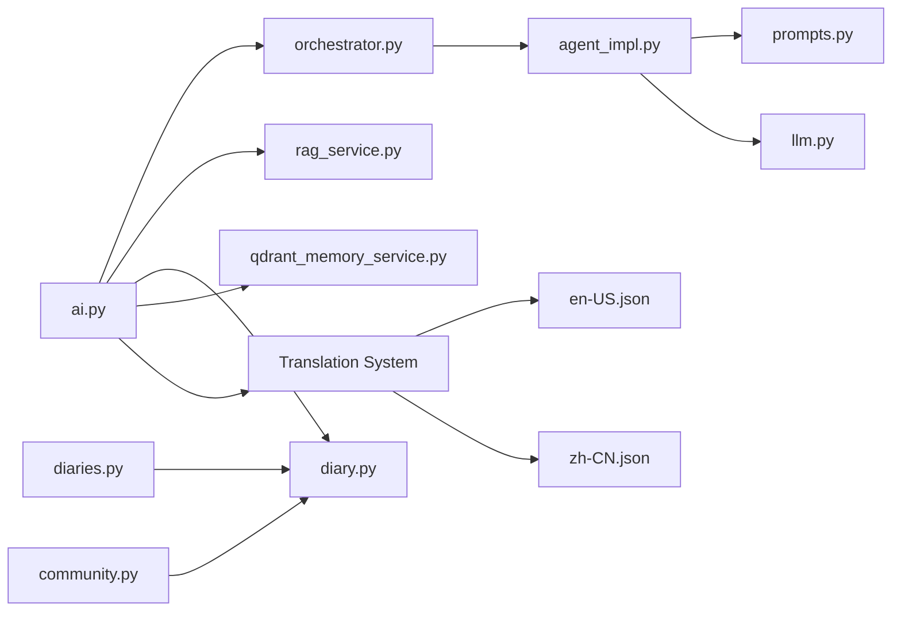

**Diagram sources**
- [ai.py:1-907](file://backend/app/api/v1/ai.py#L1-L907)
- [orchestrator.py:1-176](file://backend/app/agents/orchestrator.py#L1-L176)
- [agent_impl.py:1-491](file://backend/app/agents/agent_impl.py#L1-L491)
- [prompts.py:1-438](file://backend/app/agents/prompts.py#L1-L438)
- [llm.py:1-220](file://backend/app/agents/llm.py#L1-L220)
- [rag_service.py:1-360](file://backend/app/services/rag_service.py#L1-L360)
- [qdrant_memory_service.py:1-190](file://backend/app/services/qdrant_memory_service.py#L1-L190)
- [diary.py:1-186](file://backend/app/models/diary.py#L1-L186)
- [diaries.py:1-501](file://backend/app/api/v1/diaries.py#L1-L501)
- [community.py:1-324](file://backend/app/api/v1/community.py#L1-L324)
- [en-US.json:720-737](file://frontend/src/i18n/locales/en-US.json#L720-L737)
- [zh-CN.json:720-737](file://frontend/src/i18n/locales/zh-CN.json#L720-L737)

**Section sources**
- [ai.py:1-907](file://backend/app/api/v1/ai.py#L1-L907)
- [orchestrator.py:1-176](file://backend/app/agents/orchestrator.py#L1-L176)
- [agent_impl.py:1-491](file://backend/app/agents/agent_impl.py#L1-L491)
- [prompts.py:1-438](file://backend/app/agents/prompts.py#L1-L438)
- [llm.py:1-220](file://backend/app/agents/llm.py#L1-L220)
- [rag_service.py:1-360](file://backend/app/services/rag_service.py#L1-L360)
- [qdrant_memory_service.py:1-190](file://backend/app/services/qdrant_memory_service.py#L1-L190)
- [diary.py:1-186](file://backend/app/models/diary.py#L1-L186)
- [diaries.py:1-501](file://backend/app/api/v1/diaries.py#L1-L501)
- [community.py:1-324](file://backend/app/api/v1/community.py#L1-L324)

## Performance Considerations
- RAG scoring uses BM25 with idf/tf normalization and auxiliary signals; tune weights and thresholds for domain fit.
- Deduplication reduces redundancy; adjust similarity threshold and per-reason limits to balance recall vs. diversity.
- Vector memory (Qdrant) adds latency; enable only when beneficial and ensure collection initialization.
- Agent orchestration runs multiple LLM calls; consider temperature and response_format trade-offs for cost and quality.
- Streaming responses improve UX for long generations.
- **Enhanced**: Translation system performance considerations include caching frequently used psychological terms and optimizing translation validation processes.

## Troubleshooting Guide
- JSON parsing failures: The system includes robust parsers that handle raw JSON, fenced code blocks, and incremental decoding; errors are captured and surfaced.
- Persistence warnings: Analysis persists AIAnalysis and TimelineEvent; failures are logged and returned in metadata without blocking the response.
- Fallbacks: Daily guidance and social content generation include fallbacks when AI fails.
- Error propagation: Agent runs capture start/end timestamps and errors for diagnostics.
- **Enhanced**: Translation errors are handled gracefully with fallback to original terms and logging for translation quality improvement.

**Section sources**
- [agent_impl.py:25-68](file://backend/app/agents/agent_impl.py#L25-L68)
- [ai.py:534-591](file://backend/app/api/v1/ai.py#L534-L591)
- [ai.py:199-206](file://backend/app/api/v1/ai.py#L199-L206)
- [agent_impl.py:396-491](file://backend/app/agents/agent_impl.py#L396-L491)

## Conclusion
The AI Psychological Analysis feature combines multi-day diary aggregation, hybrid RAG evidence selection, structured Satir Iceberg analysis, and social content generation. Its modular agent orchestration, robust persistence, optional vector memory, and comprehensive translation system deliver a scalable foundation for psychological insights and community sharing. The enhanced translation infrastructure ensures specialized psychological terminology is accurately conveyed across different languages while maintaining clinical integrity.

## Appendices

### Example Workflows
- Multi-day integrated analysis:
  - Request: specify window_days and max_diaries.
  - Process: fetch diaries, build integrated content, run agents, persist results.
  - Output: structured analysis with evidence and metadata.
- Comprehensive user-level analysis:
  - Request: window_days and focus.
  - Process: build chunks, retrieve candidates via hybrid BM25, deduplicate, and synthesize JSON.
  - Output: themes, trends, signals, turning points, and growth suggestions.
- **Enhanced**: Psychological terminology translation workflow:
  - Process: identify psychological terms in analysis results.
  - Translation: validate clinical accuracy and apply cultural adaptation.
  - Output: user-friendly terms in preferred language while maintaining professional accuracy.

**Section sources**
- [ai.py:267-403](file://backend/app/api/v1/ai.py#L267-L403)
- [ai.py:406-638](file://backend/app/api/v1/ai.py#L406-L638)

### Prompt Engineering Strategies
- Use explicit roles and JSON response_format for deterministic outputs.
- Provide concise examples and constraints in prompts (e.g., character limits, categories).
- Separate system and user prompts to control tone and structure.
- **Enhanced**: Include psychological terminology validation requirements in prompt engineering to ensure clinical accuracy.

**Section sources**
- [prompts.py:9-28](file://backend/app/agents/prompts.py#L9-L28)
- [prompts.py:33-57](file://backend/app/agents/prompts.py#L33-L57)
- [prompts.py:62-163](file://backend/app/agents/prompts.py#L62-L163)
- [prompts.py:168-208](file://backend/app/agents/prompts.py#L168-L208)

### Result Interpretation Guidelines
- Evidence scoring: Higher scores indicate stronger matches; use reasons to understand retrieval intent.
- Metadata: Use analysis_scope, window, and retrieval strategy to contextualize findings.
- Trends and signals: Cross-reference emotion trends with continuity signals and turning points for narrative coherence.
- **Enhanced**: Psychological terminology interpretation guidelines:
  - Surface vs. underlying emotions: Understand the distinction between expressed and deeper feelings.
  - Irrational beliefs: Recognize cognitive distortions and their impact on behavior.
  - Core beliefs: Identify fundamental life principles and their origins.
  - Universal needs: Connect to Maslow's hierarchy and humanistic psychology concepts.

**Section sources**
- [ai.py:386-403](file://backend/app/api/v1/ai.py#L386-L403)
- [rag_service.py:319-356](file://backend/app/services/rag_service.py#L319-L356)
- [SatirIceberg.tsx:14-50](file://frontend/src/pages/analysis/SatirIceberg.tsx#L14-L50)
- [en-US.json:720-737](file://frontend/src/i18n/locales/en-US.json#L720-L737)
- [zh-CN.json:720-737](file://frontend/src/i18n/locales/zh-CN.json#L720-L737)

### Translation Quality Assurance
- **New**: Comprehensive quality assurance for psychological terminology translation.
- **Validation**: Clinical accuracy checks ensure professional terminology integrity.
- **Consistency**: Terminology consistency maintained across all user interfaces.
- **Cultural Adaptation**: Psychological concepts adapted to different cultural contexts.
- **Fallback Mechanisms**: Graceful degradation when translation fails, preserving original terms.

**Section sources**
- [SatirIceberg.tsx:12-13](file://frontend/src/pages/analysis/SatirIceberg.tsx#L12-L13)
- [en-US.json:720-737](file://frontend/src/i18n/locales/en-US.json#L720-L737)
- [zh-CN.json:720-737](file://frontend/src/i18n/locales/zh-CN.json#L720-L737)
- [analysis.ts:161-192](file://frontend/src/types/analysis.ts#L161-L192)