# Community Platform

<cite>
**Referenced Files in This Document**
- [community.py](file://backend/app/models/community.py)
- [community.py](file://backend/app/schemas/community.py)
- [community_service.py](file://backend/app/services/community_service.py)
- [community.py](file://backend/app/api/v1/community.py)
- [AnonymousAvatar.tsx](file://frontend/src/components/community/AnonymousAvatar.tsx)
- [CreatePostPage.tsx](file://frontend/src/pages/community/CreatePostPage.tsx)
- [CommunityPage.tsx](file://frontend/src/pages/community/CommunityPage.tsx)
- [CollectionsPage.tsx](file://frontend/src/pages/community/CollectionsPage.tsx)
- [PostDetailPage.tsx](file://frontend/src/pages/community/PostDetailPage.tsx)
- [HistoryPage.tsx](file://frontend/src/pages/community/HistoryPage.tsx)
- [LanguageSwitcher.tsx](file://frontend/src/components/common/LanguageSwitcher.tsx)
- [database.py](file://backend/app/models/database.py)
- [qdrant_memory_service.py](file://backend/app/services/qdrant_memory_service.py)
- [community.service.ts](file://frontend/src/services/community.service.ts)
- [security.py](file://backend/app/core/security.py)
- [index.ts](file://frontend/src/i18n/index.ts)
- [en-US.json](file://frontend/src/i18n/locales/en-US.json)
- [zh-CN.json](file://frontend/src/i18n/locales/zh-CN.json)
- [community.md](file://docs/功能文档/社区.md)
- [PRD-产品需求文档.md](file://PRD-产品需求文档.md)
- [i18n实施指南.md](file://docs/i18n实施指南.md)
</cite>

## Update Summary
**Changes Made**
- Updated Community Page and Create Post components to use comprehensive internationalization system
- Added detailed translation key documentation for community-related UI elements
- Enhanced internationalization system documentation with complete translation coverage
- Updated frontend component analysis to reflect full i18n integration
- Documented LanguageSwitcher component for dynamic language switching between Chinese and English

## Table of Contents
1. [Introduction](#introduction)
2. [Project Structure](#project-structure)
3. [Core Components](#core-components)
4. [Architecture Overview](#architecture-overview)
5. [Detailed Component Analysis](#detailed-component-analysis)
6. [Internationalization System](#internationalization-system)
7. [Dependency Analysis](#dependency-analysis)
8. [Performance Considerations](#performance-considerations)
9. [Troubleshooting Guide](#troubleshooting-guide)
10. [Conclusion](#conclusion)
11. [Appendices](#appendices)

## Introduction
This document describes the Community Platform feature of the application, focusing on the anonymous posting system, content moderation and user safety measures, content discovery via semantic search and popularity algorithms, user interactions (likes, comments, sharing), collections/bookmarks, post lifecycle, anonymous avatar and identity management, backend service architecture, database schema, and frontend component hierarchy. The platform now includes comprehensive internationalization support with English and Chinese language options. It also outlines community guidelines, content policy enforcement, and spam prevention mechanisms grounded in the repository's implementation.

## Project Structure
The Community Platform spans backend services and frontend pages with full internationalization support:
- Backend: FastAPI router, SQLAlchemy models, Pydantic schemas, and a dedicated service layer for community operations.
- Frontend: Pages for creating posts, browsing community feeds, viewing post details, managing collections, and rendering anonymous avatars, all with i18n support.
- Internationalization: Complete translation system supporting both Chinese and English languages.

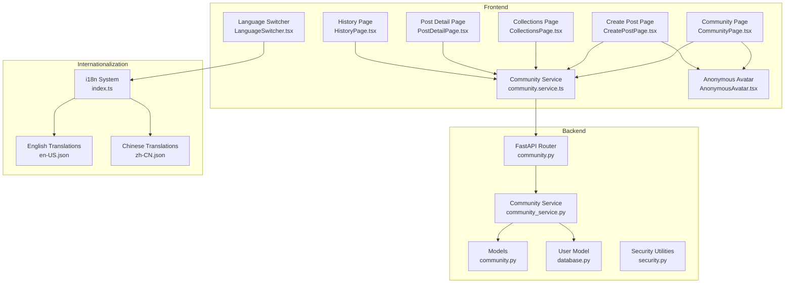

**Diagram sources**
- [community.py:1-324](file://backend/app/api/v1/community.py#L1-L324)
- [community_service.py:1-415](file://backend/app/services/community_service.py#L1-L415)
- [community.py:1-176](file://backend/app/models/community.py#L1-L176)
- [database.py:1-70](file://backend/app/models/database.py#L1-L70)
- [security.py:1-92](file://backend/app/core/security.py#L1-L92)
- [community.service.ts:1-180](file://frontend/src/services/community.service.ts#L1-L180)
- [CommunityPage.tsx:1-360](file://frontend/src/pages/community/CommunityPage.tsx#L1-L360)
- [CreatePostPage.tsx:1-212](file://frontend/src/pages/community/CreatePostPage.tsx#L1-L212)
- [CollectionsPage.tsx:1-137](file://frontend/src/pages/community/CollectionsPage.tsx#L1-L137)
- [PostDetailPage.tsx:1-306](file://frontend/src/pages/community/PostDetailPage.tsx#L1-L306)
- [HistoryPage.tsx:1-126](file://frontend/src/pages/community/HistoryPage.tsx#L1-L126)
- [AnonymousAvatar.tsx:1-46](file://frontend/src/components/community/AnonymousAvatar.tsx#L1-L46)
- [LanguageSwitcher.tsx:1-25](file://frontend/src/components/common/LanguageSwitcher.tsx#L1-L25)
- [index.ts:1-44](file://frontend/src/i18n/index.ts#L1-L44)
- [en-US.json:1-817](file://frontend/src/i18n/locales/en-US.json#L1-L817)
- [zh-CN.json:1-817](file://frontend/src/i18n/locales/zh-CN.json#L1-L817)

**Section sources**
- [community.py:1-324](file://backend/app/api/v1/community.py#L1-L324)
- [community_service.py:1-415](file://backend/app/services/community_service.py#L1-L415)
- [community.py:1-176](file://backend/app/models/community.py#L1-L176)
- [database.py:1-70](file://backend/app/models/database.py#L1-L70)
- [community.service.ts:1-180](file://frontend/src/services/community.service.ts#L1-L180)
- [CommunityPage.tsx:1-360](file://frontend/src/pages/community/CommunityPage.tsx#L1-L360)
- [CreatePostPage.tsx:1-212](file://frontend/src/pages/community/CreatePostPage.tsx#L1-L212)
- [CollectionsPage.tsx:1-137](file://frontend/src/pages/community/CollectionsPage.tsx#L1-L137)
- [PostDetailPage.tsx:1-306](file://frontend/src/pages/community/PostDetailPage.tsx#L1-L306)
- [HistoryPage.tsx:1-126](file://frontend/src/pages/community/HistoryPage.tsx#L1-L126)
- [AnonymousAvatar.tsx:1-46](file://frontend/src/components/community/AnonymousAvatar.tsx#L1-L46)
- [LanguageSwitcher.tsx:1-25](file://frontend/src/components/common/LanguageSwitcher.tsx#L1-L25)
- [index.ts:1-44](file://frontend/src/i18n/index.ts#L1-L44)
- [en-US.json:1-817](file://frontend/src/i18n/locales/en-US.json#L1-L817)
- [zh-CN.json:1-817](file://frontend/src/i18n/locales/zh-CN.json#L1-L817)

## Core Components
- Backend API router exposes endpoints for posts, comments, likes, collections, image uploads, and history.
- Community service encapsulates business logic: CRUD, counts, toggles, pagination, and response building.
- SQLAlchemy models define posts, comments, likes, collects, views, and user relations.
- Pydantic schemas validate and serialize request/response payloads.
- Frontend pages orchestrate user actions and render community experiences, including anonymous avatars and full internationalization support.
- Internationalization system provides seamless language switching between Chinese and English.

Key capabilities:
- Anonymous posting with immutable content for anonymous posts.
- Interaction counters and toggles for likes and collections.
- Comment threads with nested replies.
- Browse history tracking per user-post pair.
- Image upload endpoint with size/type constraints.
- Full i18n support with translation keys for all community UI elements.
- Dynamic language switching via LanguageSwitcher component.

**Section sources**
- [community.py:39-156](file://backend/app/api/v1/community.py#L39-L156)
- [community_service.py:36-144](file://backend/app/services/community_service.py#L36-L144)
- [community.py:23-176](file://backend/app/models/community.py#L23-L176)
- [community.py:12-124](file://backend/app/schemas/community.py#L12-L124)
- [CreatePostPage.tsx:53-78](file://frontend/src/pages/community/CreatePostPage.tsx#L53-L78)
- [CommunityPage.tsx:71-101](file://frontend/src/pages/community/CommunityPage.tsx#L71-L101)
- [LanguageSwitcher.tsx:1-25](file://frontend/src/components/common/LanguageSwitcher.tsx#L1-L25)

## Architecture Overview
The backend follows a layered architecture with full internationalization support:
- API layer validates requests and delegates to the service layer.
- Service layer performs database operations and builds enriched responses.
- Models define persistence and relationships.
- Security utilities manage authentication tokens.
- Internationalization system provides translation services across all frontend components.

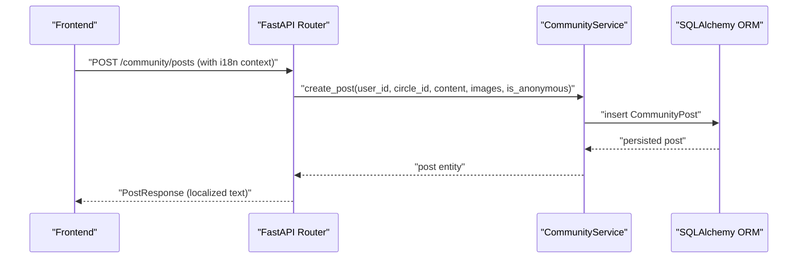

**Diagram sources**
- [community.py:39-56](file://backend/app/api/v1/community.py#L39-L56)
- [community_service.py:36-57](file://backend/app/services/community_service.py#L36-L57)
- [community.py:23-54](file://backend/app/models/community.py#L23-L54)

**Section sources**
- [community.py:1-324](file://backend/app/api/v1/community.py#L1-L324)
- [community_service.py:1-415](file://backend/app/services/community_service.py#L1-L415)
- [database.py:13-44](file://backend/app/models/database.py#L13-L44)

## Detailed Component Analysis

### Anonymous Posting System
- Users can opt into anonymous posting during creation.
- Anonymous posts cannot be edited afterward.
- Author metadata is omitted in responses for anonymous posts.
- Anonymous avatar UI component renders a stylized placeholder with an eye-closed icon fallback.
- All UI text for anonymous features is fully localized in both Chinese and English.

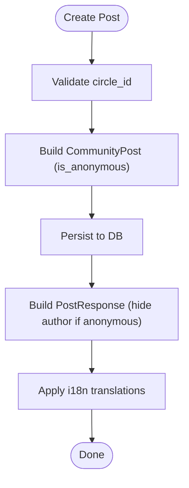

**Diagram sources**
- [community_service.py:36-57](file://backend/app/services/community_service.py#L36-L57)
- [community.py:23-54](file://backend/app/models/community.py#L23-L54)
- [community.py:33-47](file://backend/app/schemas/community.py#L33-L47)

**Section sources**
- [community.py:39-56](file://backend/app/api/v1/community.py#L39-L56)
- [community_service.py:119-135](file://backend/app/services/community_service.py#L119-L135)
- [CreatePostPage.tsx:199-205](file://frontend/src/pages/community/CreatePostPage.tsx#L199-L205)
- [AnonymousAvatar.tsx:1-46](file://frontend/src/components/community/AnonymousAvatar.tsx#L1-L46)

### Content Discovery Mechanism
- Listing posts supports pagination and optional circle filtering.
- Comments retrieval orders by creation time.
- Browse history aggregates last view per post per user.
- Semantic search capability exists for diary memory via Qdrant; while not directly used for community posts, the pattern demonstrates semantic embedding and retrieval.
- All discovery UI elements are fully localized with proper pluralization support.

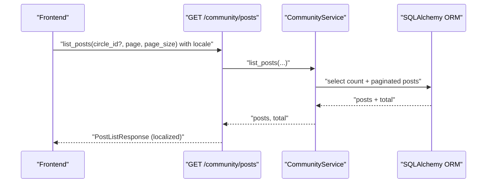

**Diagram sources**
- [community.py:59-79](file://backend/app/api/v1/community.py#L59-L79)
- [community_service.py:68-93](file://backend/app/services/community_service.py#L68-L93)

**Section sources**
- [community.py:59-79](file://backend/app/api/v1/community.py#L59-L79)
- [community_service.py:68-93](file://backend/app/services/community_service.py#L68-L93)
- [qdrant_memory_service.py:133-173](file://backend/app/services/qdrant_memory_service.py#L133-L173)

### User Interactions: Likes, Comments, Sharing
- Toggle like/unlike updates counters atomically.
- Toggle collect/uncollect updates counters atomically.
- Create and list comments; nested replies supported via parent_id.
- Sharing is not implemented in the current code; only likes, comments, and collections are present.
- All interaction UI elements are fully localized with proper pluralization and time formatting.

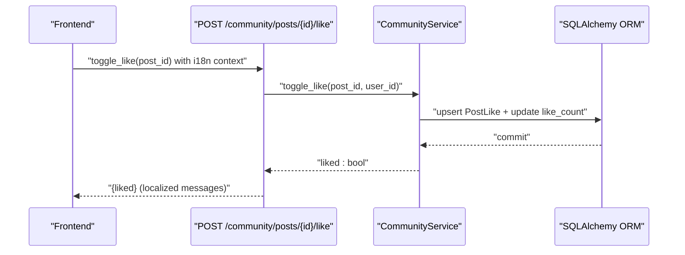

**Diagram sources**
- [community.py:245-256](file://backend/app/api/v1/community.py#L245-L256)
- [community_service.py:213-235](file://backend/app/services/community_service.py#L213-L235)

**Section sources**
- [community.py:245-272](file://backend/app/api/v1/community.py#L245-L272)
- [community_service.py:213-270](file://backend/app/services/community_service.py#L213-L270)
- [community.py:193-227](file://backend/app/api/v1/community.py#L193-L227)
- [community_service.py:148-209](file://backend/app/services/community_service.py#L148-L209)

### Collections and Bookmark System
- Users can toggle collection state for posts.
- Dedicated endpoint lists collected posts with pagination.
- Collections page renders curated list with interaction stats.
- All collection UI elements are fully localized with proper pluralization.

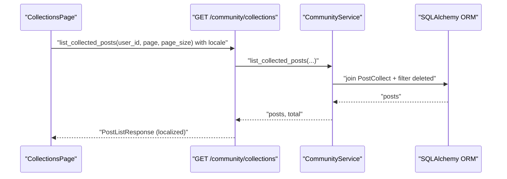

**Diagram sources**
- [community.py:275-294](file://backend/app/api/v1/community.py#L275-L294)
- [community_service.py:281-305](file://backend/app/services/community_service.py#L281-L305)
- [CollectionsPage.tsx:30-40](file://frontend/src/pages/community/CollectionsPage.tsx#L30-L40)

**Section sources**
- [community.py:275-294](file://backend/app/api/v1/community.py#L275-L294)
- [community_service.py:281-305](file://backend/app/services/community_service.py#L281-L305)
- [CollectionsPage.tsx:78-121](file://frontend/src/pages/community/CollectionsPage.tsx#L78-L121)

### Post Lifecycle: Creation to Moderation and Archiving
- Creation: Validate circle, persist post, return enriched response.
- Editing: Allowed only for non-anonymous posts.
- Deletion: Soft-delete flag applied.
- Listing: Filters out deleted posts; supports pagination and circle filtering.
- Moderation: No explicit admin endpoints observed; deletion acts as soft moderation.
- All lifecycle UI messages are fully localized.

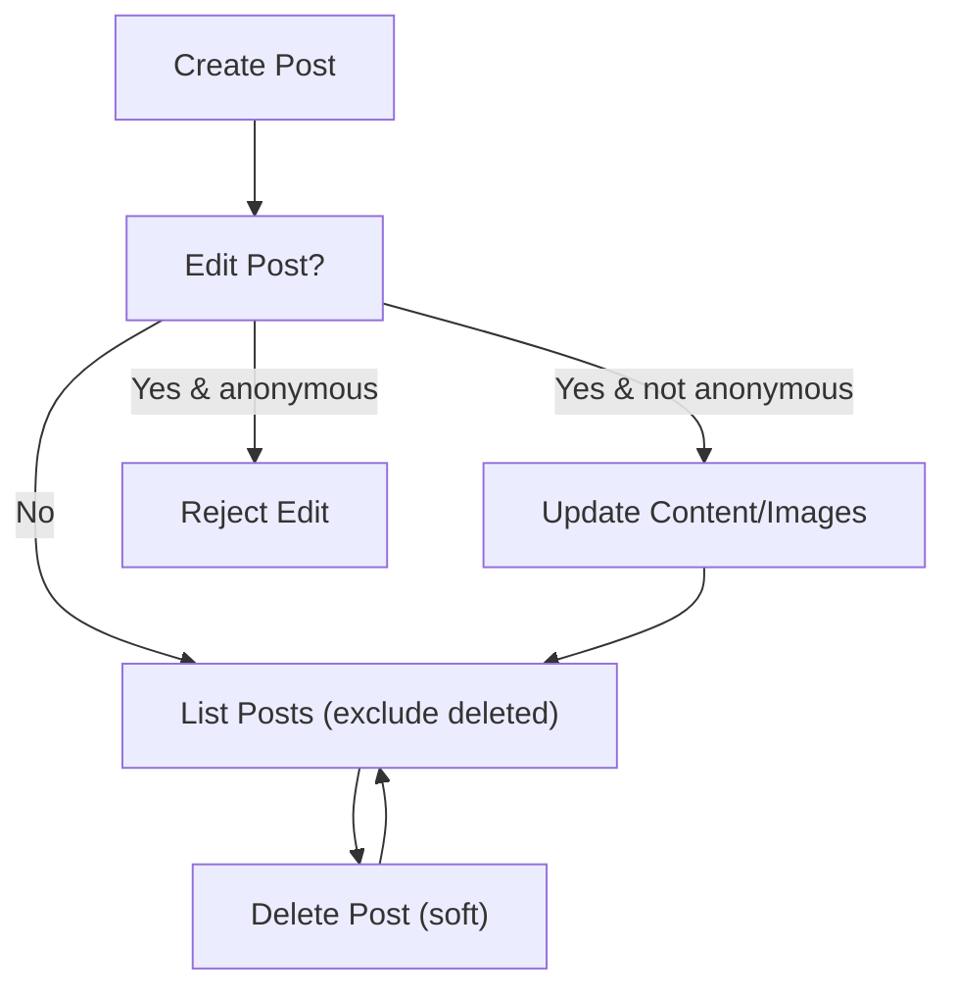

**Diagram sources**
- [community_service.py:36-57](file://backend/app/services/community_service.py#L36-L57)
- [community_service.py:119-135](file://backend/app/services/community_service.py#L119-L135)
- [community_service.py:137-144](file://backend/app/services/community_service.py#L137-L144)
- [community_service.py:68-93](file://backend/app/services/community_service.py#L68-L93)

**Section sources**
- [community_service.py:36-144](file://backend/app/services/community_service.py#L36-L144)
- [community.py:122-155](file://backend/app/api/v1/community.py#L122-L155)

### Anonymous Avatar and Identity Management
- Anonymous posts hide author identity in responses.
- Anonymous avatar component renders a gradient-filled circle with either a fallback icon or a default image.
- Non-anonymous authors display username initials or avatar when available.
- All anonymous identity UI elements are fully localized.

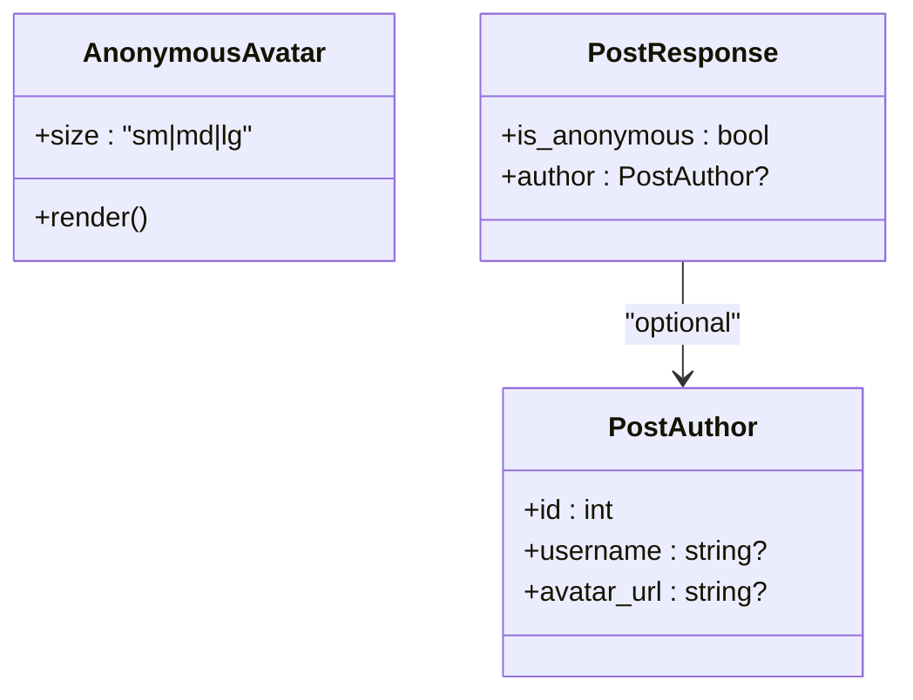

**Diagram sources**
- [AnonymousAvatar.tsx:1-46](file://frontend/src/components/community/AnonymousAvatar.tsx#L1-L46)
- [community.py:26-47](file://backend/app/schemas/community.py#L26-L47)

**Section sources**
- [AnonymousAvatar.tsx:1-46](file://frontend/src/components/community/AnonymousAvatar.tsx#L1-L46)
- [community.py:26-47](file://backend/app/schemas/community.py#L26-L47)
- [CommunityPage.tsx:249-274](file://frontend/src/pages/community/CommunityPage.tsx#L249-L274)

### Backend Service Architecture
- API router depends on current active user and database session.
- Service layer centralizes queries, mutations, and response enrichment.
- Security utilities provide JWT encoding/decoding and password hashing.
- Internationalization system provides translation services across all components.

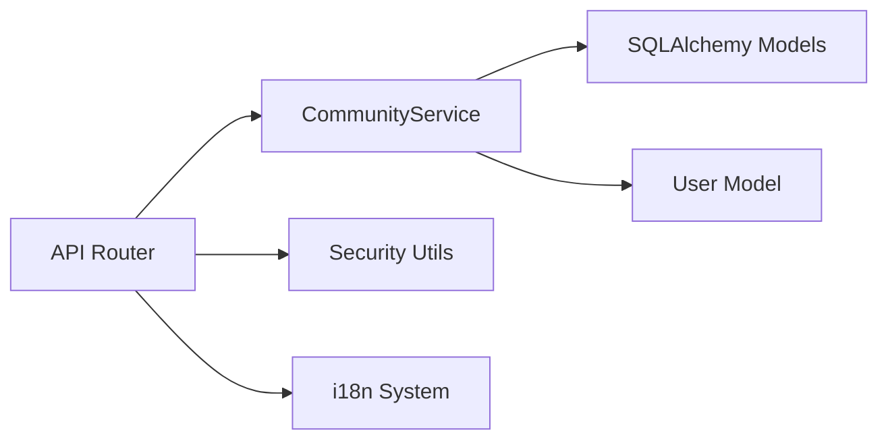

**Diagram sources**
- [community.py:1-324](file://backend/app/api/v1/community.py#L1-L324)
- [community_service.py:1-415](file://backend/app/services/community_service.py#L1-L415)
- [database.py:13-44](file://backend/app/models/database.py#L13-L44)
- [security.py:1-92](file://backend/app/core/security.py#L1-L92)

**Section sources**
- [community.py:1-324](file://backend/app/api/v1/community.py#L1-L324)
- [community_service.py:1-415](file://backend/app/services/community_service.py#L1-L415)
- [security.py:1-92](file://backend/app/core/security.py#L1-L92)

### Database Schema for Posts and Interactions
- CommunityPost: primary keys, foreign key to users, circle_id, content, images, anonymous flag, counters, soft-delete, timestamps.
- PostComment: nested reply support via parent_id, anonymous flag, soft-delete.
- PostLike: unique constraint on user-post pair.
- PostCollect: unique constraint on user-post pair.
- PostView: per-user-per-post view records.
- User: base user model with profile fields.

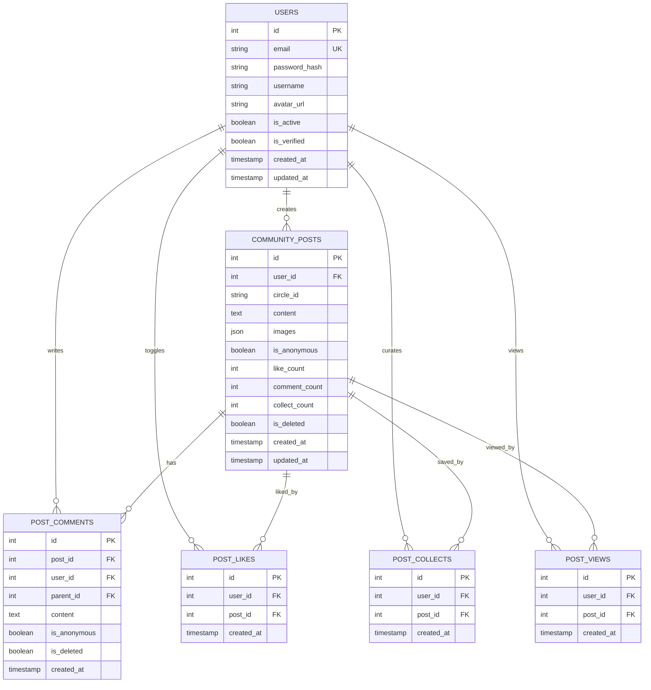

**Diagram sources**
- [community.py:23-176](file://backend/app/models/community.py#L23-L176)
- [database.py:13-44](file://backend/app/models/database.py#L13-L44)

**Section sources**
- [community.py:1-176](file://backend/app/models/community.py#L1-L176)
- [database.py:1-70](file://backend/app/models/database.py#L1-L70)

### Frontend Component Hierarchy
- CommunityPage: fetches circles and posts, handles likes/collects, renders anonymous/non-anonymous author blocks, and pagination with full i18n support.
- CreatePostPage: selects circle, manages images, toggles anonymity, and submits posts with localized UI.
- CollectionsPage: lists collected posts with uncollect action and localized text.
- PostDetailPage: displays post details, comments, and interactions with full localization.
- HistoryPage: shows browse history with localized timestamps and UI elements.
- AnonymousAvatar: reusable component for anonymous identities.
- LanguageSwitcher: component for dynamic language switching between Chinese and English.

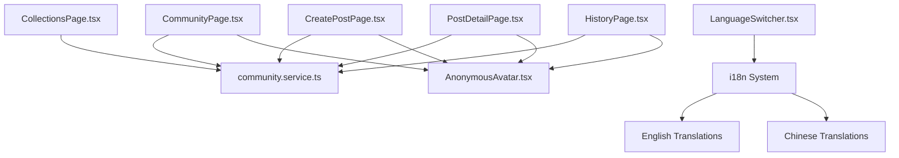

**Diagram sources**
- [CommunityPage.tsx:1-360](file://frontend/src/pages/community/CommunityPage.tsx#L1-L360)
- [CreatePostPage.tsx:1-212](file://frontend/src/pages/community/CreatePostPage.tsx#L1-L212)
- [CollectionsPage.tsx:1-137](file://frontend/src/pages/community/CollectionsPage.tsx#L1-L137)
- [PostDetailPage.tsx:1-306](file://frontend/src/pages/community/PostDetailPage.tsx#L1-L306)
- [HistoryPage.tsx:1-126](file://frontend/src/pages/community/HistoryPage.tsx#L1-L126)
- [AnonymousAvatar.tsx:1-46](file://frontend/src/components/community/AnonymousAvatar.tsx#L1-L46)
- [LanguageSwitcher.tsx:1-25](file://frontend/src/components/common/LanguageSwitcher.tsx#L1-L25)
- [community.service.ts:1-180](file://frontend/src/services/community.service.ts#L1-L180)
- [index.ts:1-44](file://frontend/src/i18n/index.ts#L1-L44)
- [en-US.json:1-817](file://frontend/src/i18n/locales/en-US.json#L1-L817)
- [zh-CN.json:1-817](file://frontend/src/i18n/locales/zh-CN.json#L1-L817)

**Section sources**
- [CommunityPage.tsx:1-360](file://frontend/src/pages/community/CommunityPage.tsx#L1-L360)
- [CreatePostPage.tsx:1-212](file://frontend/src/pages/community/CreatePostPage.tsx#L1-L212)
- [CollectionsPage.tsx:1-137](file://frontend/src/pages/community/CollectionsPage.tsx#L1-L137)
- [PostDetailPage.tsx:1-306](file://frontend/src/pages/community/PostDetailPage.tsx#L1-L306)
- [HistoryPage.tsx:1-126](file://frontend/src/pages/community/HistoryPage.tsx#L1-L126)
- [AnonymousAvatar.tsx:1-46](file://frontend/src/components/community/AnonymousAvatar.tsx#L1-L46)
- [LanguageSwitcher.tsx:1-25](file://frontend/src/components/common/LanguageSwitcher.tsx#L1-L25)
- [community.service.ts:1-180](file://frontend/src/services/community.service.ts#L1-L180)
- [index.ts:1-44](file://frontend/src/i18n/index.ts#L1-L44)
- [en-US.json:1-817](file://frontend/src/i18n/locales/en-US.json#L1-L817)
- [zh-CN.json:1-817](file://frontend/src/i18n/locales/zh-CN.json#L1-L817)

## Internationalization System

### Translation Key Structure
The community platform uses a hierarchical translation key structure:

- **`community`**: General community-related translations
- **`communityPage`**: Community page specific translations  
- **`createPost`**: Create post page translations
- **`common`**: Shared translations used across the application

### Language Detection and Switching
The i18n system supports automatic language detection and manual switching:

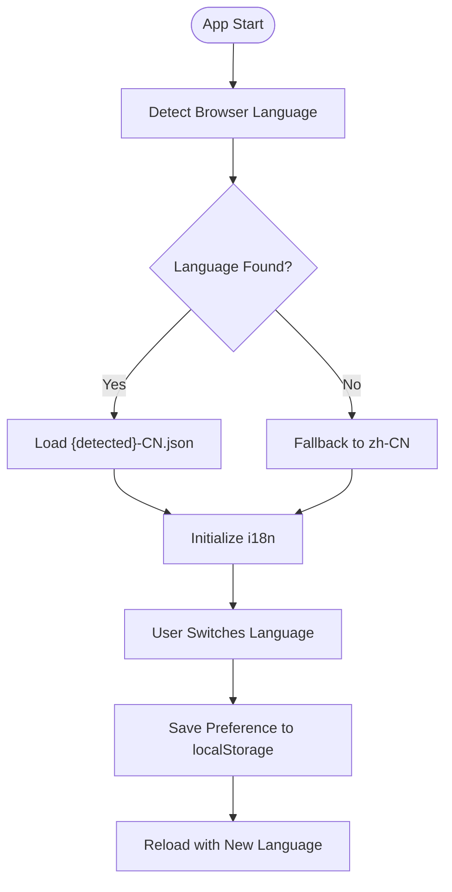

**Diagram sources**
- [index.ts:1-44](file://frontend/src/i18n/index.ts#L1-L44)
- [LanguageSwitcher.tsx:1-25](file://frontend/src/components/common/LanguageSwitcher.tsx#L1-L25)

### Translation Keys for Community Features

#### Community Page Translations (`communityPage`)
- `title`: "Emotion Resonance Circle" / "情绪共鸣圈"
- `loadFailed`: "Failed to load posts" / "加载帖子失败"
- `operationFailed`: "Operation failed" / "操作失败"
- `browseHistory`: "Browse History" / "浏览记录"
- `myCollections`: "My Collections" / "我的收藏"
- `newPost`: "New Post" / "发帖"
- `todayAtmosphere`: "Today's Community Vibe" / "今日社区氛围"
- `atmosphereTitle`: "Express slowly, still be truly heard" / "慢一点表达，也能被认真听见"
- `atmosphereDesc`: "Today's circle is perfect for sharing your real current feelings..." / "今天的共鸣圈更适合分享「真实近况」..."
- `todayPosts`: "Today's Posts" / "今日帖子"
- `currentGroup`: "Current Group" / "当前分组"
- `all`: "All" / "全部"
- `noPosts`: "No posts yet" / "还没有帖子"
- `beFirst`: "Be the first to share" / "成为第一个分享的人吧"
- `anonymous`: "Anonymous" / "匿名用户"
- `unnamed`: "Unnamed" / "未命名"
- `prevPage`: "Previous" / "上一页"
- `nextPage`: "Next" / "下一页"
- `justNow`: "Just now" / "刚刚"
- `minutesAgo`: "{{count}} min ago" / "{{count}} 分钟前"
- `hoursAgo`: "{{count}} hours ago" / "{{count}} 小时前"
- `daysAgo`: "{{count}} days ago" / "{{count}} 天前"

#### Create Post Translations (`createPost`)
- `pageTitle`: "Create Post" / "发布动态"
- `publish`: "Publish" / "发布"
- `publishing`: "Publishing..." / "发布中..."
- `publishSuccess`: "Published successfully" / "发布成功"
- `publishFailed`: "Publish failed" / "发布失败"
- `selectCircle`: "Select a circle" / "请选择一个圈子"
- `enterContent`: "Please enter content" / "请输入内容"
- `maxImages`: "Maximum 9 images" / "最多上传9张图片"
- `uploadFailed`: "Image upload failed" / "图片上传失败"
- `placeholder`: "Share how you feel right now..." / "分享你此刻的感受..."
- `uploading`: "Uploading" / "上传中"
- `add`: "Add" / "添加"
- `anonymousPublish`: "Anonymous Post" / "匿名发布"
- `anonymousHint`: "Others won't see your identity" / "其他人不会看到你的身份"
- `anonymousWarning`: "Anonymous posts cannot be edited after publishing..." / "匿名帖子发布后不可编辑，请确认内容后再发布。"

#### General Community Translations (`community`)
- `title`: "Community" / "社区"
- `newPost`: "New Post" / "发帖"
- `editPost`: "Edit Post" / "编辑帖子"
- `deletePost`: "Delete Post" / "删除帖子"
- `postList`: "Post List" / "帖子列表"
- `postDetail`: "Post Detail" / "帖子详情"
- `myPosts`: "My Posts" / "我的帖子"
- `collections`: "Collections" / "收藏"
- `likes`: "Likes" / "点赞"
- `comments`: "Comments" / "评论"
- `anonymous`: "Anonymous" / "匿名"
- `publish`: "Publish" / "发布"
- `publishSuccess`: "Published successfully" / "发布成功"
- `publishFailed`: "Publish failed" / "发布失败"
- `noPosts`: "No posts yet" / "暂无帖子"
- `writePost`: "Write something..." / "写点什么..."
- `commentPlaceholder`: "Share your thoughts..." / "写下你的想法..."

**Section sources**
- [index.ts:1-44](file://frontend/src/i18n/index.ts#L1-L44)
- [LanguageSwitcher.tsx:1-25](file://frontend/src/components/common/LanguageSwitcher.tsx#L1-L25)
- [en-US.json:586-627](file://frontend/src/i18n/locales/en-US.json#L586-L627)
- [zh-CN.json:586-627](file://frontend/src/i18n/locales/zh-CN.json#L586-L627)

## Dependency Analysis
- API depends on service layer and current user/session.
- Service depends on models and user model for author resolution.
- Frontend service depends on API endpoints.
- Security utilities underpin authentication.
- Internationalization system provides translation services across all components.
- LanguageSwitcher component manages user language preferences.

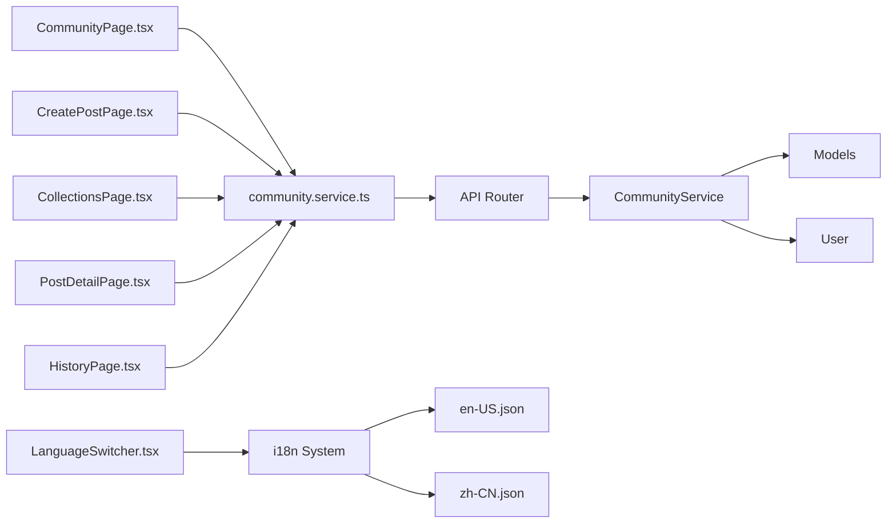

**Diagram sources**
- [community.py:1-324](file://backend/app/api/v1/community.py#L1-L324)
- [community_service.py:1-415](file://backend/app/services/community_service.py#L1-L415)
- [database.py:13-44](file://backend/app/models/database.py#L13-L44)
- [community.service.ts:1-180](file://frontend/src/services/community.service.ts#L1-L180)
- [CommunityPage.tsx:1-360](file://frontend/src/pages/community/CommunityPage.tsx#L1-L360)
- [CreatePostPage.tsx:1-212](file://frontend/src/pages/community/CreatePostPage.tsx#L1-L212)
- [CollectionsPage.tsx:1-137](file://frontend/src/pages/community/CollectionsPage.tsx#L1-L137)
- [PostDetailPage.tsx:1-306](file://frontend/src/pages/community/PostDetailPage.tsx#L1-L306)
- [HistoryPage.tsx:1-126](file://frontend/src/pages/community/HistoryPage.tsx#L1-L126)
- [LanguageSwitcher.tsx:1-25](file://frontend/src/components/common/LanguageSwitcher.tsx#L1-L25)
- [index.ts:1-44](file://frontend/src/i18n/index.ts#L1-L44)
- [en-US.json:1-817](file://frontend/src/i18n/locales/en-US.json#L1-L817)
- [zh-CN.json:1-817](file://frontend/src/i18n/locales/zh-CN.json#L1-L817)

**Section sources**
- [community.py:1-324](file://backend/app/api/v1/community.py#L1-L324)
- [community_service.py:1-415](file://backend/app/services/community_service.py#L1-L415)
- [database.py:1-70](file://backend/app/models/database.py#L1-L70)
- [community.service.ts:1-180](file://frontend/src/services/community.service.ts#L1-L180)
- [LanguageSwitcher.tsx:1-25](file://frontend/src/components/common/LanguageSwitcher.tsx#L1-L25)
- [index.ts:1-44](file://frontend/src/i18n/index.ts#L1-L44)

## Performance Considerations
- Pagination limits: endpoints cap page_size to prevent heavy loads.
- Indexes on foreign keys and filters (user_id, post_id, circle_id) improve query performance.
- Count queries precede paginated selects to compute total pages efficiently.
- Image upload constraints (type and size) reduce storage overhead and downstream processing costs.
- i18n system caches translations to minimize repeated lookups.
- Language preference stored in localStorage to avoid repeated detection.

Recommendations:
- Add database indexes on created_at for time-based sorting.
- Consider caching popular posts or frequently accessed counts.
- Batch operations for view history aggregation.
- Implement lazy loading for large translation files if needed.
- Cache frequently accessed translation keys in memory.

**Section sources**
- [community.py:60-63](file://backend/app/api/v1/community.py#L60-L63)
- [community_service.py:78-93](file://backend/app/services/community_service.py#L78-L93)
- [index.ts:25-30](file://frontend/src/i18n/index.ts#L25-L30)

## Troubleshooting Guide
Common issues and remedies:
- Invalid circle_id during post creation: ensure circle_id matches predefined values.
- Attempting to edit anonymous posts: blocked by service logic.
- Not found errors for posts/comments: verify ownership and soft-deleted state.
- Image upload failures: check allowed types and size limits.
- Translation not displaying: verify translation keys exist in both language files.
- Language switching not working: check localStorage key and browser language detection.
- Missing pluralization: ensure proper pluralization keys (e.g., minutesAgo, hoursAgo).

Operational tips:
- Inspect HTTP status codes returned by endpoints.
- Verify JWT-based authentication for protected routes.
- Confirm database constraints (unique likes/collects) to avoid duplicates.
- Check i18n initialization and language detection logs.
- Verify translation file syntax and key existence.

**Section sources**
- [community_service.py:43-45](file://backend/app/services/community_service.py#L43-L45)
- [community_service.py:127-128](file://backend/app/services/community_service.py#L127-L128)
- [community.py:166-178](file://backend/app/api/v1/community.py#L166-L178)
- [security.py:73-91](file://backend/app/core/security.py#L73-L91)
- [index.ts:25-30](file://frontend/src/i18n/index.ts#L25-L30)

## Conclusion
The Community Platform integrates anonymous posting, robust interactions, curated collections, and privacy-conscious identity management with comprehensive internationalization support. Its backend employs a clean service-layer architecture with strong typing via Pydantic and SQLAlchemy ORM. Frontend components deliver a cohesive user experience, including anonymous avatars, intuitive post interactions, and full i18n support with Chinese and English languages. The platform's internationalization system provides seamless language switching and proper localization for all community features. While explicit moderation endpoints are not present, soft deletion and strict anonymity safeguards align with community guidelines emphasizing safety and respect.

## Appendices

### Community Guidelines and Policy Enforcement
- Anonymous posts cannot be edited to protect identities and reduce malicious edits.
- Anonymous interactions remain anonymous.
- Community is organized into emotional circles to avoid open-feed chaos.
- Visual identity for anonymous users avoids cold defaults; circles use emotionally resonant colors.
- All community policies are presented in the user's selected language.

**Section sources**
- [community.md:10-39](file://docs/功能文档/社区.md#L10-L39)
- [community_service.py:127-128](file://backend/app/services/community_service.py#L127-L128)

### Spam Prevention Mechanisms
- Content length constraints and image upload limits reduce low-effort spam.
- Soft deletion allows removal without permanent loss.
- Anonymous-only immutable posts reduce edit-based abuse.
- i18n system helps prevent language-based spam by enforcing proper translations.

**Section sources**
- [community.py:14-17](file://backend/app/schemas/community.py#L14-L17)
- [community.py:173-178](file://backend/app/api/v1/community.py#L173-L178)
- [community_service.py:137-144](file://backend/app/services/community_service.py#L137-L144)

### Internationalization Best Practices
- Translation keys follow hierarchical naming conventions.
- Pluralization handled through ICU message format with parameter substitution.
- Language detection prioritizes browser preference with localStorage caching.
- All UI text is fully translatable including dynamic content like timestamps.
- Error messages and user feedback are properly localized.

**Section sources**
- [index.ts:25-30](file://frontend/src/i18n/index.ts#L25-L30)
- [en-US.json:605-627](file://frontend/src/i18n/locales/en-US.json#L605-L627)
- [zh-CN.json:605-627](file://frontend/src/i18n/locales/zh-CN.json#L605-L627)

### Implementation Progress
The community features have been successfully localized with comprehensive translation coverage:

- **Community Page**: Fully localized with 14 translation keys covering navigation, atmosphere, circle selection, post listing, and pagination.
- **Create Post Page**: Fully localized with 14 translation keys covering form labels, placeholders, warnings, and interactive elements.
- **Translation Files**: Complete coverage in both English and Chinese with proper pluralization support.
- **Language Switcher**: Integrated component enabling seamless language switching between Chinese and English.

**Section sources**
- [i18n实施指南.md:1-278](file://docs/i18n实施指南.md#L1-L278)
- [CommunityPage.tsx:18-30](file://frontend/src/pages/community/CommunityPage.tsx#L18-L30)
- [CreatePostPage.tsx:29-49](file://frontend/src/pages/community/CreatePostPage.tsx#L29-L49)
- [en-US.json:586-627](file://frontend/src/i18n/locales/en-US.json#L586-L627)
- [zh-CN.json:586-627](file://frontend/src/i18n/locales/zh-CN.json#L586-L627)