# Data Visualization

<cite>
**Referenced Files in This Document**
- [EmotionChart.tsx](file://frontend/src/components/common/EmotionChart.tsx)
- [EmotionMap.tsx](file://frontend/src/pages/emotion/EmotionMap.tsx)
- [Dashboard.tsx](file://frontend/src/pages/dashboard/Dashboard.tsx)
- [AnalysisOverview.tsx](file://frontend/src/pages/analysis/AnalysisOverview.tsx)
- [AnalysisResult.tsx](file://frontend/src/pages/analysis/AnalysisResult.tsx)
- [SatirIceberg.tsx](file://frontend/src/pages/analysis/SatirIceberg.tsx)
- [index.ts](file://frontend/src/i18n/index.ts)
- [zh-CN.json](file://frontend/src/i18n/locales/zh-CN.json)
- [en-US.json](file://frontend/src/i18n/locales/en-US.json)
- [emotion.service.ts](file://frontend/src/services/emotion.service.ts)
- [diary.service.ts](file://frontend/src/services/diary.service.ts)
- [ai.service.ts](file://frontend/src/services/ai.service.ts)
- [diaryStore.ts](file://frontend/src/store/diaryStore.ts)
- [analysis.ts](file://frontend/src/types/analysis.ts)
- [diary.ts](file://frontend/src/types/diary.ts)
- [package.json](file://frontend/package.json)
</cite>

## Update Summary
**Changes Made**
- Added comprehensive internationalization documentation for EmotionMap component
- Documented full emotionMap namespace translations and dynamic feature label implementation
- Updated visualization architecture to include i18n integration patterns
- Enhanced component analysis with localization considerations
- Added internationalization best practices for multilingual users
- Updated EmotionChart to reflect its non-internationalized status

## Table of Contents
1. [Introduction](#introduction)
2. [Project Structure](#project-structure)
3. [Core Components](#core-components)
4. [Architecture Overview](#architecture-overview)
5. [Detailed Component Analysis](#detailed-component-analysis)
6. [Internationalization Implementation](#internationalization-implementation)
7. [Dependency Analysis](#dependency-analysis)
8. [Performance Considerations](#performance-considerations)
9. [Troubleshooting Guide](#troubleshooting-guide)
10. [Conclusion](#conclusion)

## Introduction
This document explains the Data Visualization feature for mood tracking and behavioral insights, with comprehensive coverage of internationalization support. It covers:
- Emotion chart components using SVG-based bubble layouts for mood distribution
- Dashboard layout and KPI cards for personal insights with localized content
- Statistical reporting system for diary patterns and trends with multilingual support
- Interactive visualization components enabling time-range and filter exploration
- Integration between analysis results and visual presentation
- Responsive design considerations for charts across screen sizes
- Frontend component architecture, data formatting, and user interaction
- Data transformation pipeline from raw analysis results to visual representations
- Performance optimizations for large datasets and real-time updates
- Internationalization implementation for multilingual users

## Project Structure
The visualization feature spans several frontend modules with comprehensive internationalization support:
- Pages: dashboard overview, analysis overview, individual analysis results, and psychological model visualization
- Services: API clients for diary analytics and emotion analysis
- Store: centralized state for diary lists and emotion statistics
- Types: shared TypeScript interfaces for analysis and diary data
- Components: reusable emotion bubble chart and UI primitives
- i18n: internationalization framework with Chinese and English support

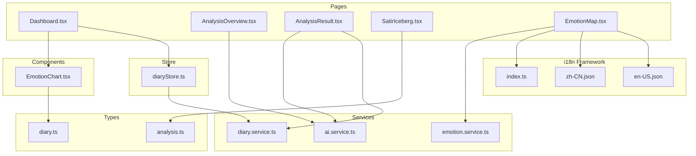

**Diagram sources**
- [Dashboard.tsx:1-335](file://frontend/src/pages/dashboard/Dashboard.tsx#L1-L335)
- [AnalysisOverview.tsx:1-119](file://frontend/src/pages/analysis/AnalysisOverview.tsx#L1-L119)
- [AnalysisResult.tsx:1-410](file://frontend/src/pages/analysis/AnalysisResult.tsx#L1-L410)
- [SatirIceberg.tsx:1-216](file://frontend/src/pages/analysis/SatirIceberg.tsx#L1-L216)
- [EmotionMap.tsx:1-334](file://frontend/src/pages/emotion/EmotionMap.tsx#L1-L334)
- [EmotionChart.tsx:1-269](file://frontend/src/components/common/EmotionChart.tsx#L1-L269)
- [index.ts:1-44](file://frontend/src/i18n/index.ts#L1-L44)
- [emotion.service.ts:1-63](file://frontend/src/services/emotion.service.ts#L1-L63)
- [zh-CN.json:1-817](file://frontend/src/i18n/locales/zh-CN.json#L1-L817)
- [en-US.json:1-817](file://frontend/src/i18n/locales/en-US.json#L1-L817)

**Section sources**
- [Dashboard.tsx:1-335](file://frontend/src/pages/dashboard/Dashboard.tsx#L1-L335)
- [EmotionChart.tsx:1-269](file://frontend/src/components/common/EmotionChart.tsx#L1-L269)
- [EmotionMap.tsx:1-334](file://frontend/src/pages/emotion/EmotionMap.tsx#L1-L334)
- [index.ts:1-44](file://frontend/src/i18n/index.ts#L1-L44)
- [emotion.service.ts:1-63](file://frontend/src/services/emotion.service.ts#L1-L63)
- [zh-CN.json:1-817](file://frontend/src/i18n/locales/zh-CN.json#L1-L817)
- [en-US.json:1-817](file://frontend/src/i18n/locales/en-US.json#L1-L817)

## Core Components
- EmotionChart: An SVG-based bubble chart that renders emotion distributions with color mapping, dynamic sizing, and hover interactions. It computes a force-directed layout and radial gradients per emotion.
- EmotionMap: A sophisticated emotion star map featuring 8-dimensional feature vector clustering, PCA visualization, and comprehensive internationalization support.
- Dashboard: Displays KPIs (total entries, monthly entries, top emotion) and a live emotion bubble chart derived from recent diary entries.
- AnalysisOverview: Initiates comprehensive analysis over configurable windows and presents themes, trends, signals, and suggestions.
- AnalysisResult: Presents single-diary analysis results including timeline events, Satir Iceberg layers, therapeutic responses, and social posts.
- SatirIceberg: A layered visualization of psychological layers with expandable cards and intensity indicators.
- Services and Store: Provide emotion statistics, timeline events, and analysis results; manage loading and error states.
- i18n Framework: Complete internationalization system supporting Chinese and English languages with automatic language detection.

**Section sources**
- [EmotionChart.tsx:1-269](file://frontend/src/components/common/EmotionChart.tsx#L1-L269)
- [EmotionMap.tsx:1-334](file://frontend/src/pages/emotion/EmotionMap.tsx#L1-L334)
- [Dashboard.tsx:1-335](file://frontend/src/pages/dashboard/Dashboard.tsx#L1-L335)
- [AnalysisOverview.tsx:1-119](file://frontend/src/pages/analysis/AnalysisOverview.tsx#L1-L119)
- [AnalysisResult.tsx:1-410](file://frontend/src/pages/analysis/AnalysisResult.tsx#L1-L410)
- [SatirIceberg.tsx:1-216](file://frontend/src/pages/analysis/SatirIceberg.tsx#L1-L216)
- [index.ts:1-44](file://frontend/src/i18n/index.ts#L1-L44)

## Architecture Overview
The visualization architecture integrates UI pages, state management, service APIs, and internationalization to deliver interactive insights in multiple languages.

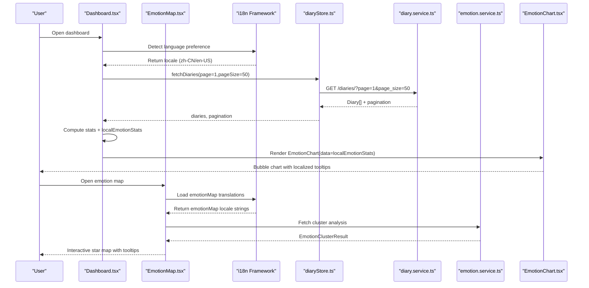

**Diagram sources**
- [Dashboard.tsx:35-70](file://frontend/src/pages/dashboard/Dashboard.tsx#L35-L70)
- [EmotionMap.tsx:28-61](file://frontend/src/pages/emotion/EmotionMap.tsx#L28-L61)
- [index.ts:25-30](file://frontend/src/i18n/index.ts#L25-L30)
- [diaryStore.ts:50-74](file://frontend/src/store/diaryStore.ts#L50-L74)
- [diary.service.ts:21-31](file://frontend/src/services/diary.service.ts#L21-L31)
- [emotion.service.ts:52-62](file://frontend/src/services/emotion.service.ts#L52-L62)
- [EmotionChart.tsx:158-268](file://frontend/src/components/common/EmotionChart.tsx#L158-L268)

**Section sources**
- [Dashboard.tsx:35-70](file://frontend/src/pages/dashboard/Dashboard.tsx#L35-L70)
- [EmotionMap.tsx:28-61](file://frontend/src/pages/emotion/EmotionMap.tsx#L28-L61)
- [index.ts:25-30](file://frontend/src/i18n/index.ts#L25-L30)
- [diaryStore.ts:50-74](file://frontend/src/store/diaryStore.ts#L50-L74)
- [diary.service.ts:21-31](file://frontend/src/services/diary.service.ts#L21-L31)
- [emotion.service.ts:52-62](file://frontend/src/services/emotion.service.ts#L52-L62)
- [EmotionChart.tsx:158-268](file://frontend/src/components/common/EmotionChart.tsx#L158-L268)

## Detailed Component Analysis

### EmotionChart Component
- Purpose: Visualize emotion frequency and percentages as scalable bubbles with color-coded semantics.
- Data model: Accepts EmotionStats array with tag, count, and percentage.
- Color mapping: Uses a curated palette keyed by emotion names; includes fallback and fuzzy matching.
- Layout algorithm: Centers the largest emotion, arranges others in a spiral pattern with collision avoidance; radius scales with count.
- Interactions: Hover highlights with glow and tooltip showing tag, count, and percentage.
- Rendering: SVG with radial gradients per emotion; responsive container with constrained width/height.
- **Updated**: No internationalization support - displays Chinese emotion names directly.

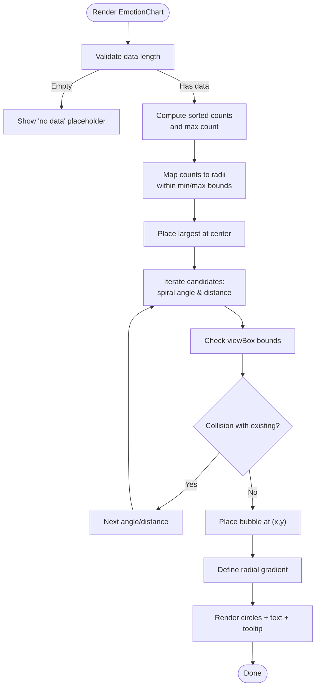

**Diagram sources**
- [EmotionChart.tsx:96-154](file://frontend/src/components/common/EmotionChart.tsx#L96-L154)
- [EmotionChart.tsx:158-268](file://frontend/src/components/common/EmotionChart.tsx#L158-L268)

**Section sources**
- [EmotionChart.tsx:1-269](file://frontend/src/components/common/EmotionChart.tsx#L1-L269)

### EmotionMap Component
- Purpose: Advanced emotion star map visualization with 8-dimensional feature vector clustering and PCA reduction.
- Data model: EmotionClusterResult with points, clusters, and statistics.
- Feature engineering: Extracts valence, arousal, dominance, self-reference, social density, cognitive complexity, temporal orientation, and expression richness.
- Clustering: K-Means clustering with automatic K selection using elbow method and silhouette score.
- Visualization: Interactive scatter plot with cluster highlighting, hover details, and statistical summaries.
- **Updated**: Full internationalization support with emotionMap namespace translations.

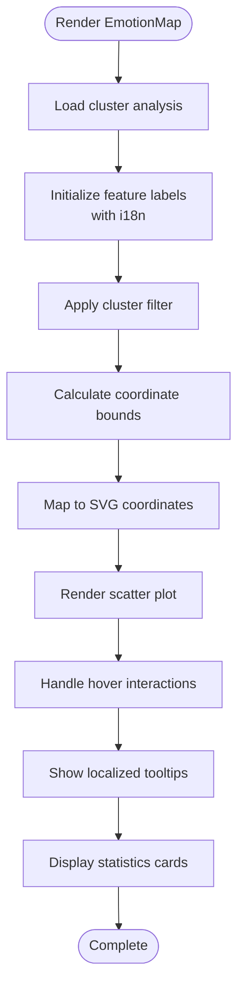

**Diagram sources**
- [EmotionMap.tsx:28-90](file://frontend/src/pages/emotion/EmotionMap.tsx#L28-L90)
- [EmotionMap.tsx:180-275](file://frontend/src/pages/emotion/EmotionMap.tsx#L180-L275)

**Section sources**
- [EmotionMap.tsx:1-334](file://frontend/src/pages/emotion/EmotionMap.tsx#L1-L334)

### Dashboard Layout and KPIs
- KPIs: Total entries, monthly entries, and top emotion computed from recent diary entries.
- Local emotion stats: Aggregated emotion tag counts and percentages for the last 30 days.
- Visualization: EmotionChart rendered below KPIs with a descriptive header.
- Navigation and actions: Quick-access buttons to write, browse, growth center, and comprehensive analysis.
- **Updated**: All dashboard content is fully localized through the i18n framework.

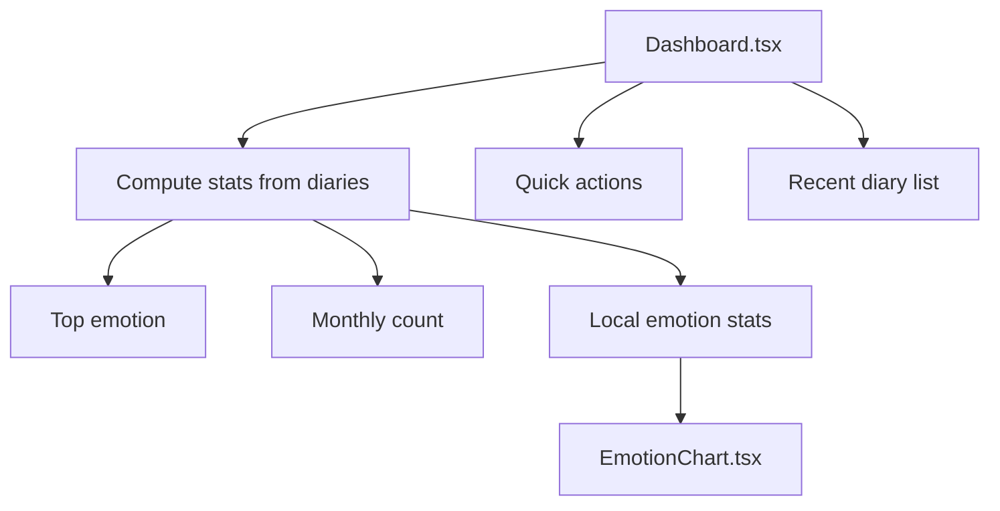

**Diagram sources**
- [Dashboard.tsx:37-70](file://frontend/src/pages/dashboard/Dashboard.tsx#L37-L70)
- [Dashboard.tsx:254-264](file://frontend/src/pages/dashboard/Dashboard.tsx#L254-L264)
- [EmotionChart.tsx:158-268](file://frontend/src/components/common/EmotionChart.tsx#L158-L268)

**Section sources**
- [Dashboard.tsx:1-335](file://frontend/src/pages/dashboard/Dashboard.tsx#L1-L335)

### Statistical Reporting System
- Data sources:
  - Emotion statistics: fetched via diary service with a days parameter.
  - Timeline events: recent or range-based queries for event density and trends.
  - Comprehensive analysis: multi-diary RAG-based insights with themes, trends, signals, and suggestions.
- Presentation:
  - AnalysisOverview: time-window selection, loading states, and structured sections for summary, themes, trends, signals, turning points, and suggestions.
  - AnalysisResult: single-diary breakdown including timeline event, Satir layers, therapeutic response, and social posts.
- **Updated**: All statistical reports support internationalization through the analysis namespace.

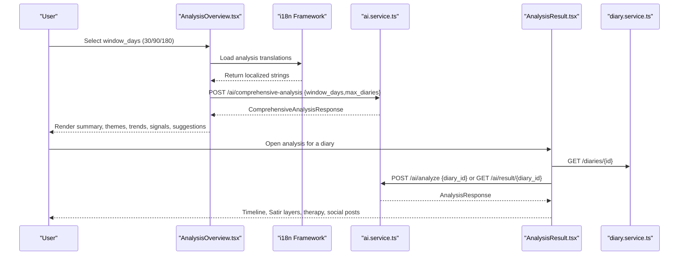

**Diagram sources**
- [AnalysisOverview.tsx:15-26](file://frontend/src/pages/analysis/AnalysisOverview.tsx#L15-L26)
- [index.ts:13-20](file://frontend/src/i18n/index.ts#L13-L20)
- [ai.service.ts:44-47](file://frontend/src/services/ai.service.ts#L44-L47)
- [AnalysisResult.tsx:33-78](file://frontend/src/pages/analysis/AnalysisResult.tsx#L33-L78)
- [diary.service.ts:33-48](file://frontend/src/services/diary.service.ts#L33-L48)

**Section sources**
- [AnalysisOverview.tsx:1-119](file://frontend/src/pages/analysis/AnalysisOverview.tsx#L1-L119)
- [AnalysisResult.tsx:1-410](file://frontend/src/pages/analysis/AnalysisResult.tsx#L1-L410)
- [ai.service.ts:1-112](file://frontend/src/services/ai.service.ts#L1-L112)
- [diary.service.ts:1-112](file://frontend/src/services/diary.service.ts#L1-L112)
- [index.ts:13-20](file://frontend/src/i18n/index.ts#L13-L20)

### Interactive Visualization Components
- Time-range exploration:
  - Dashboard: computes stats over a fixed window (last 30 days) for local emotion stats.
  - AnalysisOverview: allows selecting window_days for comprehensive analysis.
- Filters:
  - Diary listing supports emotion_tag filtering via service parameters.
  - Timeline queries support date range and daily filters.
- User interactions:
  - EmotionChart hover states and tooltips.
  - EmotionMap hover details with feature vectors and cluster information.
  - Expandable SatirIceberg layers with content toggles.
  - Copy-to-clipboard for social posts with feedback.
- **Updated**: All interactive components support internationalization through the i18n framework.

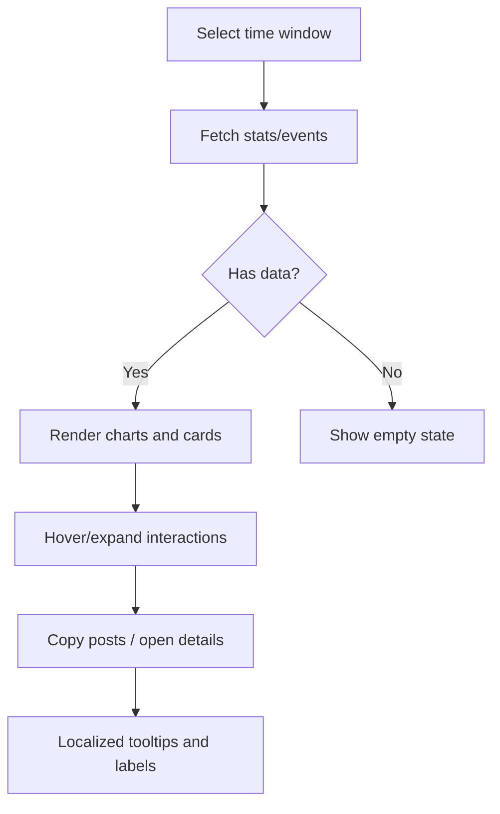

**Diagram sources**
- [Dashboard.tsx:37-70](file://frontend/src/pages/dashboard/Dashboard.tsx#L37-L70)
- [AnalysisOverview.tsx:15-26](file://frontend/src/pages/analysis/AnalysisOverview.tsx#L15-L26)
- [EmotionMap.tsx:258-275](file://frontend/src/pages/emotion/EmotionMap.tsx#L258-L275)
- [diary.service.ts:21-31](file://frontend/src/services/diary.service.ts#L21-L31)
- [diary.service.ts:64-76](file://frontend/src/services/diary.service.ts#L64-L76)

**Section sources**
- [Dashboard.tsx:37-70](file://frontend/src/pages/dashboard/Dashboard.tsx#L37-L70)
- [AnalysisOverview.tsx:15-26](file://frontend/src/pages/analysis/AnalysisOverview.tsx#L15-L26)
- [EmotionMap.tsx:258-275](file://frontend/src/pages/emotion/EmotionMap.tsx#L258-L275)
- [diary.service.ts:21-31](file://frontend/src/services/diary.service.ts#L21-L31)
- [diary.service.ts:64-76](file://frontend/src/services/diary.service.ts#L64-L76)

### Integration Between Analysis Results and Visual Presentation
- EmotionChart consumes EmotionStats arrays derived from:
  - Local computation in Dashboard (recent diaries)
  - Backend emotion statistics endpoint
- EmotionMap composes multiple visual blocks:
  - Cluster analysis with feature vector visualization
  - Statistical summaries with localized descriptions
  - Interactive scatter plot with hover details
- AnalysisResult composes multiple visual blocks:
  - Timeline event summary and tags
  - SatirIceberg layers with nested content
  - Therapeutic response and social posts with version/style metadata
- Data types define consistent structures for seamless rendering.
- **Updated**: All components integrate with the i18n framework for multilingual support.

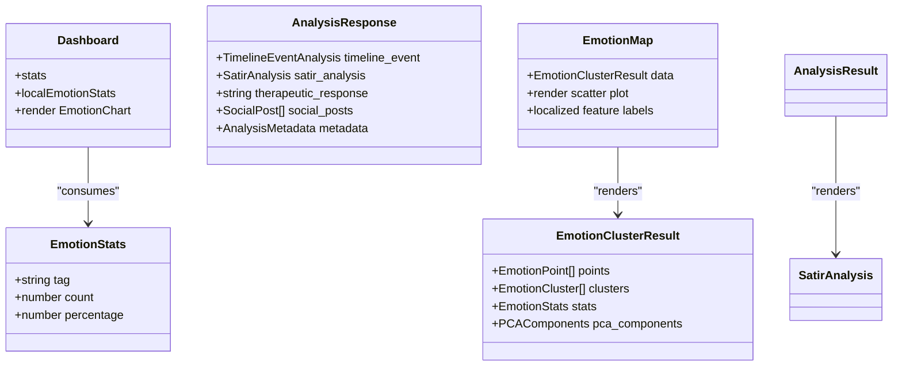

**Diagram sources**
- [diary.ts:59-63](file://frontend/src/types/diary.ts#L59-L63)
- [diary.ts:65-73](file://frontend/src/types/diary.ts#L65-L73)
- [Dashboard.tsx:37-70](file://frontend/src/pages/dashboard/Dashboard.tsx#L37-L70)
- [analysis.ts:133-141](file://frontend/src/types/analysis.ts#L133-L141)
- [analysis.ts:91-97](file://frontend/src/types/analysis.ts#L91-L97)
- [EmotionMap.tsx:37-47](file://frontend/src/pages/emotion/EmotionMap.tsx#L37-L47)

**Section sources**
- [diary.ts:59-63](file://frontend/src/types/diary.ts#L59-L63)
- [diary.ts:65-73](file://frontend/src/types/diary.ts#L65-L73)
- [Dashboard.tsx:37-70](file://frontend/src/pages/dashboard/Dashboard.tsx#L37-L70)
- [analysis.ts:133-141](file://frontend/src/types/analysis.ts#L133-L141)
- [analysis.ts:91-97](file://frontend/src/types/analysis.ts#L91-L97)
- [EmotionMap.tsx:37-47](file://frontend/src/pages/emotion/EmotionMap.tsx#L37-L47)

### Responsive Design Considerations
- EmotionChart:
  - Fixed intrinsic size with a responsive container; SVG viewBox ensures crisp rendering at various widths.
  - Dynamic font sizes and bubble radii adapt to available space.
  - **Updated**: Chinese emotion names are fully supported in responsive layouts.
- Dashboard:
  - Grid-based KPI cards and quick-action buttons adapt across breakpoints.
  - Lists and cards use padding and spacing tuned for mobile and desktop.
  - **Updated**: All dashboard content is localized for different languages.
- EmotionMap:
  - Interactive scatter plot with cluster highlighting and hover effects.
  - Statistical cards with localized descriptions and value formatting.
  - **Updated**: Full internationalization support for all UI elements.
- SatirIceberg:
  - Layer widths decrease progressively to form a visual pyramid; content remains readable with collapsible sections.

**Section sources**
- [EmotionChart.tsx:158-180](file://frontend/src/components/common/EmotionChart.tsx#L158-L180)
- [Dashboard.tsx:220-252](file://frontend/src/pages/dashboard/Dashboard.tsx#L220-L252)
- [EmotionMap.tsx:180-275](file://frontend/src/pages/emotion/EmotionMap.tsx#L180-L275)
- [SatirIceberg.tsx:89-120](file://frontend/src/pages/analysis/SatirIceberg.tsx#L89-L120)

### Frontend Component Architecture
- Pages orchestrate data fetching and render domain-specific views with internationalization.
- Services encapsulate API endpoints for diaries and emotion analysis.
- Store centralizes state for lists and stats with loading/error handling.
- Types define contracts for data exchange and rendering.
- **Updated**: Components integrate with the i18n framework for multilingual support.

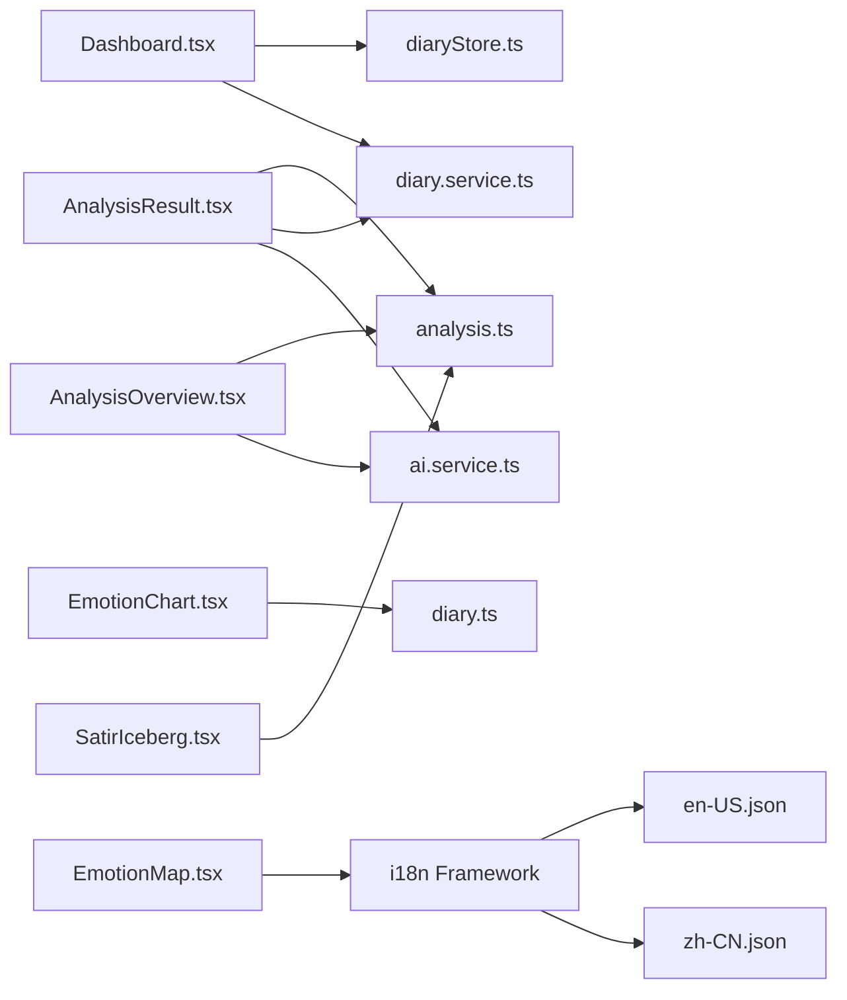

**Diagram sources**
- [AnalysisOverview.tsx:1-119](file://frontend/src/pages/analysis/AnalysisOverview.tsx#L1-L119)
- [AnalysisResult.tsx:1-410](file://frontend/src/pages/analysis/AnalysisResult.tsx#L1-L410)
- [Dashboard.tsx:1-335](file://frontend/src/pages/dashboard/Dashboard.tsx#L1-L335)
- [EmotionMap.tsx:1-334](file://frontend/src/pages/emotion/EmotionMap.tsx#L1-L334)
- [ai.service.ts:1-112](file://frontend/src/services/ai.service.ts#L1-L112)
- [diary.service.ts:1-112](file://frontend/src/services/diary.service.ts#L1-L112)
- [diaryStore.ts:1-164](file://frontend/src/store/diaryStore.ts#L1-L164)
- [EmotionChart.tsx:1-269](file://frontend/src/components/common/EmotionChart.tsx#L1-L269)
- [diary.ts:1-128](file://frontend/src/types/diary.ts#L1-L128)
- [analysis.ts:1-142](file://frontend/src/types/analysis.ts#L1-L142)
- [SatirIceberg.tsx:1-216](file://frontend/src/pages/analysis/SatirIceberg.tsx#L1-L216)
- [index.ts:1-44](file://frontend/src/i18n/index.ts#L1-L44)
- [zh-CN.json:1-817](file://frontend/src/i18n/locales/zh-CN.json#L1-L817)
- [en-US.json:1-817](file://frontend/src/i18n/locales/en-US.json#L1-L817)

**Section sources**
- [AnalysisOverview.tsx:1-119](file://frontend/src/pages/analysis/AnalysisOverview.tsx#L1-L119)
- [AnalysisResult.tsx:1-410](file://frontend/src/pages/analysis/AnalysisResult.tsx#L1-L410)
- [Dashboard.tsx:1-335](file://frontend/src/pages/dashboard/Dashboard.tsx#L1-L335)
- [EmotionMap.tsx:1-334](file://frontend/src/pages/emotion/EmotionMap.tsx#L1-L334)
- [ai.service.ts:1-112](file://frontend/src/services/ai.service.ts#L1-L112)
- [diary.service.ts:1-112](file://frontend/src/services/diary.service.ts#L1-L112)
- [diaryStore.ts:1-164](file://frontend/src/store/diaryStore.ts#L1-L164)
- [EmotionChart.tsx:1-269](file://frontend/src/components/common/EmotionChart.tsx#L1-L269)
- [diary.ts:1-128](file://frontend/src/types/diary.ts#L1-L128)
- [analysis.ts:1-142](file://frontend/src/types/analysis.ts#L1-L142)
- [SatirIceberg.tsx:1-216](file://frontend/src/pages/analysis/SatirIceberg.tsx#L1-L216)
- [index.ts:1-44](file://frontend/src/i18n/index.ts#L1-L44)
- [zh-CN.json:1-817](file://frontend/src/i18n/locales/zh-CN.json#L1-L817)
- [en-US.json:1-817](file://frontend/src/i18n/locales/en-US.json#L1-L817)

### Data Transformation Pipeline
- From raw analysis to visuals:
  - Fetch: Pages call services to retrieve emotion stats and analysis results.
  - Transform: Dashboard computes totals, monthly counts, and emotion percentages locally.
  - Localize: EmotionMap uses i18n to translate feature labels and UI elements.
  - Render: EmotionChart receives normalized EmotionStats; SatirIceberg consumes structured analysis objects.
- Consistency: Types enforce field contracts across the pipeline.
- **Updated**: Internationalization is integrated at the transformation stage for multilingual support.

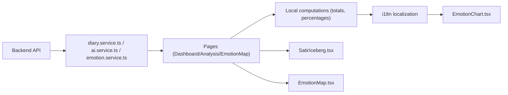

**Diagram sources**
- [diary.service.ts:78-84](file://frontend/src/services/diary.service.ts#L78-L84)
- [ai.service.ts:44-47](file://frontend/src/services/ai.service.ts#L44-L47)
- [emotion.service.ts:52-62](file://frontend/src/services/emotion.service.ts#L52-L62)
- [Dashboard.tsx:37-70](file://frontend/src/pages/dashboard/Dashboard.tsx#L37-L70)
- [EmotionMap.tsx:37-47](file://frontend/src/pages/emotion/EmotionMap.tsx#L37-L47)
- [EmotionChart.tsx:158-268](file://frontend/src/components/common/EmotionChart.tsx#L158-L268)
- [SatirIceberg.tsx:1-216](file://frontend/src/pages/analysis/SatirIceberg.tsx#L1-L216)

**Section sources**
- [diary.service.ts:78-84](file://frontend/src/services/diary.service.ts#L78-L84)
- [ai.service.ts:44-47](file://frontend/src/services/ai.service.ts#L44-L47)
- [emotion.service.ts:52-62](file://frontend/src/services/emotion.service.ts#L52-L62)
- [Dashboard.tsx:37-70](file://frontend/src/pages/dashboard/Dashboard.tsx#L37-L70)
- [EmotionMap.tsx:37-47](file://frontend/src/pages/emotion/EmotionMap.tsx#L37-L47)
- [EmotionChart.tsx:158-268](file://frontend/src/components/common/EmotionChart.tsx#L158-L268)
- [SatirIceberg.tsx:1-216](file://frontend/src/pages/analysis/SatirIceberg.tsx#L1-L216)

## Internationalization Implementation

### i18n Framework Architecture
The application uses react-i18next with automatic language detection and localStorage persistence:
- Language detection: Automatically detects browser language preference
- Storage: Persists user language choice in localStorage
- Fallback: Defaults to Chinese (zh-CN) if no preference detected
- Namespace support: Organizes translations by feature area (emotionMap, analysis, dashboard, etc.)

### Translation Structure
Translations are organized by namespace for different components:
- emotionMap: All emotion visualization and clustering interface text
- analysis: AI analysis and psychological model content
- dashboard: Main dashboard and KPI interface
- common: Shared UI elements and basic phrases
- navigation: Site navigation and menu items

### EmotionMap Internationalization Features
The EmotionMap component demonstrates comprehensive internationalization:
- Dynamic feature label translation using useMemo with t() hook
- Localized algorithm explanations and technical descriptions
- Context-aware translations with variable substitution
- Error messages and user guidance in multiple languages
- Statistical descriptions with localized terminology

### Implementation Patterns
Common internationalization patterns used across components:
- Feature label translation: `t('emotionMap.features.valence')`
- Contextual translations: `t('emotionMap.subtitle', { count: data.stats.total_diaries })`
- Error handling: `toast(t('emotionMap.loadFailed'), 'error')`
- Conditional translations: Dynamic content based on analysis results

### Language Support Matrix
- Chinese (Simplified): Primary language with comprehensive translation coverage
- English: Secondary language with complete feature parity
- Automatic switching: Based on user preference and browser settings
- Fallback mechanism: Ensures content availability even with incomplete translations

**Section sources**
- [index.ts:1-44](file://frontend/src/i18n/index.ts#L1-L44)
- [zh-CN.json:516-559](file://frontend/src/i18n/locales/zh-CN.json#L516-L559)
- [en-US.json:516-559](file://frontend/src/i18n/locales/en-US.json#L516-L559)
- [EmotionMap.tsx:37-61](file://frontend/src/pages/emotion/EmotionMap.tsx#L37-L61)

## Dependency Analysis
- External libraries:
  - Recharts: present in dependencies; however, the emotion bubble chart is implemented with pure SVG in EmotionChart.tsx.
  - react-i18next: comprehensive internationalization framework with automatic language detection
  - date-fns: used for formatting dates in analysis results.
  - Tailwind and Radix UI: used for styling and UI primitives.
- Internal dependencies:
  - Pages depend on services and store.
  - Components depend on types for shape safety.
  - **Updated**: EmotionMap depends on i18n framework for multilingual support.
  - No circular dependencies observed among the analyzed modules.

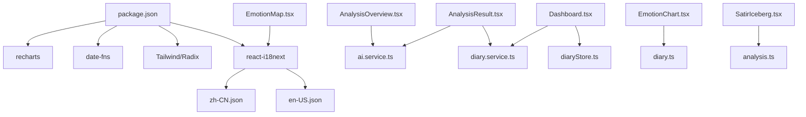

**Diagram sources**
- [package.json:14-36](file://frontend/package.json#L14-L36)
- [AnalysisOverview.tsx:1-119](file://frontend/src/pages/analysis/AnalysisOverview.tsx#L1-L119)
- [AnalysisResult.tsx:1-410](file://frontend/src/pages/analysis/AnalysisResult.tsx#L1-L410)
- [Dashboard.tsx:1-335](file://frontend/src/pages/dashboard/Dashboard.tsx#L1-L335)
- [EmotionMap.tsx:1-334](file://frontend/src/pages/emotion/EmotionMap.tsx#L1-L334)
- [index.ts:1-44](file://frontend/src/i18n/index.ts#L1-L44)
- [diary.service.ts:1-112](file://frontend/src/services/diary.service.ts#L1-L112)
- [ai.service.ts:1-112](file://frontend/src/services/ai.service.ts#L1-L112)
- [diaryStore.ts:1-164](file://frontend/src/store/diaryStore.ts#L1-L164)
- [EmotionChart.tsx:1-269](file://frontend/src/components/common/EmotionChart.tsx#L1-L269)
- [diary.ts:1-128](file://frontend/src/types/diary.ts#L1-L128)
- [analysis.ts:1-142](file://frontend/src/types/analysis.ts#L1-L142)
- [SatirIceberg.tsx:1-216](file://frontend/src/pages/analysis/SatirIceberg.tsx#L1-L216)

**Section sources**
- [package.json:14-36](file://frontend/package.json#L14-L36)
- [AnalysisOverview.tsx:1-119](file://frontend/src/pages/analysis/AnalysisOverview.tsx#L1-L119)
- [AnalysisResult.tsx:1-410](file://frontend/src/pages/analysis/AnalysisResult.tsx#L1-L410)
- [Dashboard.tsx:1-335](file://frontend/src/pages/dashboard/Dashboard.tsx#L1-L335)
- [EmotionMap.tsx:1-334](file://frontend/src/pages/emotion/EmotionMap.tsx#L1-L334)
- [index.ts:1-44](file://frontend/src/i18n/index.ts#L1-L44)
- [diary.service.ts:1-112](file://frontend/src/services/diary.service.ts#L1-L112)
- [ai.service.ts:1-112](file://frontend/src/services/ai.service.ts#L1-L112)
- [diaryStore.ts:1-164](file://frontend/src/store/diaryStore.ts#L1-L164)
- [EmotionChart.tsx:1-269](file://frontend/src/components/common/EmotionChart.tsx#L1-L269)
- [diary.ts:1-128](file://frontend/src/types/diary.ts#L1-L128)
- [analysis.ts:1-142](file://frontend/src/types/analysis.ts#L1-L142)
- [SatirIceberg.tsx:1-216](file://frontend/src/pages/analysis/SatirIceberg.tsx#L1-L216)

## Performance Considerations
- EmotionChart:
  - Computationally lightweight: sorting and layout occur on small datasets (emotion counts).
  - Memoization: layout recomputes only when data changes.
  - SVG rendering: efficient for static shapes; avoid frequent reflows by minimizing DOM updates.
  - **Updated**: No internationalization overhead as Chinese emotion names are embedded.
- EmotionMap:
  - Computationally intensive: clustering and PCA calculations on larger datasets.
  - Memoization: feature label translations computed once per language switch.
  - SVG rendering: efficient for interactive scatter plots with hover effects.
  - **Updated**: Internationalization adds minimal overhead through react-i18next hooks.
- Dashboard:
  - Limits fetched diaries to a reasonable page size to keep computations fast.
  - Local aggregation avoids repeated network requests for stats.
- Analysis pages:
  - Async analysis tasks can be polled or handled via server-side caching; UI should reflect progress and errors.
- Recommendations:
  - Debounce time-range selections to prevent rapid re-fetches.
  - Virtualize long lists (timeline events) if datasets grow large.
  - Lazy-load heavy analysis results to improve initial load performance.
  - **Updated**: Consider memoizing i18n translations for frequently accessed components.

## Troubleshooting Guide
- No emotion data:
  - EmotionChart displays a neutral placeholder when input data is empty.
  - **Updated**: EmotionMap shows localized "not enough diaries" message.
- Loading states:
  - Dashboard shows a spinner while fetching diaries; pages display loading spinners during analysis.
  - **Updated**: EmotionMap displays localized loading states and error messages.
- Errors:
  - Services and pages set error messages; UI surfaces actionable feedback and retry actions.
  - **Updated**: Error messages are fully localized through the i18n framework.
- Clipboard operations:
  - Fallback implementation ensures copying works even without secure contexts.
- **Updated**: Internationalization troubleshooting:
  - Language detection issues: Check localStorage key 'yinji-language'
  - Missing translations: Verify emotionMap namespace exists in locale files
  - Fallback language: Ensure zh-CN contains all required emotionMap keys

**Section sources**
- [EmotionChart.tsx:166-172](file://frontend/src/components/common/EmotionChart.tsx#L166-L172)
- [EmotionMap.tsx:99-110](file://frontend/src/pages/emotion/EmotionMap.tsx#L99-L110)
- [EmotionMap.tsx:54-56](file://frontend/src/pages/emotion/EmotionMap.tsx#L54-L56)
- [Dashboard.tsx:86-92](file://frontend/src/pages/dashboard/Dashboard.tsx#L86-L92)
- [AnalysisResult.tsx:21-26](file://frontend/src/pages/analysis/AnalysisResult.tsx#L21-L26)
- [AnalysisResult.tsx:96-117](file://frontend/src/pages/analysis/AnalysisResult.tsx#L96-L117)

## Conclusion
The Data Visualization feature combines a custom SVG-based emotion bubble chart with dashboard KPIs, comprehensive analysis pages, and advanced emotion star mapping. It leverages typed data contracts, efficient local computations, and clear separation of concerns across pages, services, and store. While Recharts is included as a dependency, the emotion visualization is implemented independently for precise control over layout and responsiveness.

**Updated**: The feature now includes comprehensive internationalization support through react-i18next, with full multilingual capabilities for emotion visualization components. The EmotionMap component serves as a prime example of how internationalization is integrated into complex visualizations, demonstrating proper use of translation namespaces, dynamic content generation, and responsive design considerations for global users.

The architecture supports interactive exploration via time windows and filters, integrates seamlessly with backend analysis results, maintains performance through targeted optimizations, and provides a robust foundation for multilingual data visualization experiences. The internationalization framework ensures consistent user experience across different languages while preserving the technical depth and visual sophistication of the emotion analysis features.