# Timeline Management

<cite>
**Referenced Files in This Document**
- [Timeline.tsx](file://frontend/src/pages/timeline/Timeline.tsx)
- [index.ts](file://frontend/src/i18n/index.ts)
- [zh-CN.json](file://frontend/src/i18n/locales/zh-CN.json)
- [en-US.json](file://frontend/src/i18n/locales/en-US.json)
- [diary_service.py](file://backend/app/services/diary_service.py)
- [terrain_service.py](file://backend/app/services/terrain_service.py)
- [diary.py](file://backend/app/models/diary.py)
- [diary.py (schemas)](file://backend/app/schemas/diary.py)
- [diaries.py](file://backend/app/api/v1/diaries.py)
- [rebuild_timeline_events.py](file://backend/scripts/rebuild_timeline_events.py)
- [agent_impl.py](file://backend/app/agents/agent_impl.py)
- [prompts.py](file://backend/app/agents/prompts.py)
- [diary.ts (types)](file://frontend/src/types/diary.ts)
</cite>

## Update Summary
**Changes Made**
- Added multilingual support documentation for Timeline components
- Updated frontend internationalization implementation details
- Enhanced data visualization localization coverage
- Expanded backend localization considerations for timeline features

## Table of Contents
1. [Introduction](#introduction)
2. [Project Structure](#project-structure)
3. [Core Components](#core-components)
4. [Architecture Overview](#architecture-overview)
5. [Detailed Component Analysis](#detailed-component-analysis)
6. [Multilingual Support Implementation](#multilingual-support-implementation)
7. [Dependency Analysis](#dependency-analysis)
8. [Performance Considerations](#performance-considerations)
9. [Troubleshooting Guide](#troubleshooting-guide)
10. [Conclusion](#conclusion)
11. [Appendices](#appendices)

## Introduction
Timeline Management transforms raw diary entries into a structured, visual timeline of meaningful life events. It provides:
- Automatic event extraction from diary content via AI agents
- Aggregated emotional terrain visualization (energy, valence, density)
- Interactive calendar and trend charts with event clustering and key moment markers
- Importance scoring to highlight significant moments
- Trend analysis to identify behavioral patterns and shifts
- Historical review and growth insights for personal reflection and growth tracking
- **Multilingual support for international users with localized data visualization elements**

## Project Structure
The feature spans frontend React components and backend Python services with comprehensive internationalization support:
- Frontend: Timeline page renders localized calendar, trend chart, keyword cards, and event details with dynamic language switching
- Backend: Services orchestrate event creation, aggregation, and terrain computation with locale-aware processing
- Agents: Extract structured events from diary content with multilingual considerations
- Models/Schemas: Define data structures for timeline events and growth insights with localization support
- Scripts: Legacy data migration and rebuilding with internationalization compatibility
- **Internationalization: Full i18n setup supporting Chinese and English with automatic language detection**

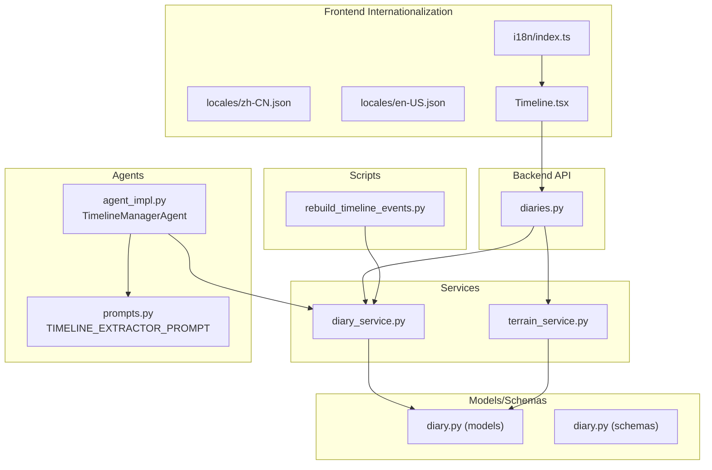

**Diagram sources**
- [Timeline.tsx:116-656](file://frontend/src/pages/timeline/Timeline.tsx#L116-L656)
- [index.ts:1-44](file://frontend/src/i18n/index.ts#L1-L44)
- [diaries.py:271-352](file://backend/app/api/v1/diaries.py#L271-L352)
- [diary_service.py:281-637](file://backend/app/services/diary_service.py#L281-L637)
- [terrain_service.py:166-360](file://backend/app/services/terrain_service.py#L166-L360)
- [agent_impl.py:144-203](file://backend/app/agents/agent_impl.py#L144-L203)
- [prompts.py:33-57](file://backend/app/agents/prompts.py#L33-L57)
- [diary.py:67-186](file://backend/app/models/diary.py#L67-L186)
- [diary.py (schemas):75-101](file://backend/app/schemas/diary.py#L75-L101)
- [rebuild_timeline_events.py:19-59](file://backend/scripts/rebuild_timeline_events.py#L19-L59)

**Section sources**
- [Timeline.tsx:116-656](file://frontend/src/pages/timeline/Timeline.tsx#L116-L656)
- [index.ts:1-44](file://frontend/src/i18n/index.ts#L1-L44)
- [diaries.py:271-352](file://backend/app/api/v1/diaries.py#L271-L352)
- [diary_service.py:281-637](file://backend/app/services/diary_service.py#L281-L637)
- [terrain_service.py:166-360](file://backend/app/services/terrain_service.py#L166-L360)
- [agent_impl.py:144-203](file://backend/app/agents/agent_impl.py#L144-L203)
- [prompts.py:33-57](file://backend/app/agents/prompts.py#L33-L57)
- [diary.py:67-186](file://backend/app/models/diary.py#L67-L186)
- [diary.py (schemas):75-101](file://backend/app/schemas/diary.py#L75-L101)
- [rebuild_timeline_events.py:19-59](file://backend/scripts/rebuild_timeline_events.py#L19-L59)

## Core Components
- Frontend Timeline Page with Multilingual Support
  - Renders localized calendar grid with mood rings, trend chart with key-event markers, keyword cards, and selected-day details
  - Implements interactive navigation (month picker, day click, chart click) with language-aware formatting
  - Computes derived metrics (energy, valence, density) and highlights significant jumps with localized labels
  - **Full internationalization support for all UI elements, tooltips, and data displays**
- Backend Timeline Service
  - Creates and updates timeline events from diary entries with locale considerations
  - Supports AI refinement of extracted events with multilingual prompt handling
  - Provides rebuilding for legacy data migration with internationalization compatibility
- Backend Terrain Service
  - Aggregates events and diaries by day into energy/valence/density points with locale-aware processing
  - Detects peaks, valleys, and trends with localized summary generation
- AI Event Extraction Agent
  - Uses a structured prompt to extract event_summary, emotion_tag, importance_score, event_type, and related entities
  - **Handles multilingual content processing for international users**
- Data Models and Schemas
  - TimelineEvent, Diary, GrowthDailyInsight define the persistence model with localization support
  - Pydantic schemas validate and serialize requests/responses with internationalization considerations
- **Internationalization Framework**
  - **Full i18n setup supporting Chinese and English languages**
  - **Automatic language detection and localStorage caching**
  - **Comprehensive translation keys for all timeline-related UI elements**

**Section sources**
- [Timeline.tsx:116-656](file://frontend/src/pages/timeline/Timeline.tsx#L116-L656)
- [index.ts:1-44](file://frontend/src/i18n/index.ts#L1-L44)
- [diary_service.py:281-637](file://backend/app/services/diary_service.py#L281-L637)
- [terrain_service.py:166-360](file://backend/app/services/terrain_service.py#L166-L360)
- [agent_impl.py:144-203](file://backend/app/agents/agent_impl.py#L144-L203)
- [diary.py:67-186](file://backend/app/models/diary.py#L67-L186)
- [diary.py (schemas):75-101](file://backend/app/schemas/diary.py#L75-L101)

## Architecture Overview
The system follows a layered architecture with comprehensive internationalization support:
- API layer exposes endpoints for timeline retrieval and terrain generation with locale-aware responses
- Service layer encapsulates business logic for event creation, aggregation, and rebuilding with multilingual considerations
- Agent layer performs AI-driven extraction from diary content with language support
- Model layer persists timeline events and related entities with localization compatibility
- Frontend consumes API endpoints with dynamic language switching and renders interactive visualizations
- **Internationalization layer handles automatic language detection and translation management**

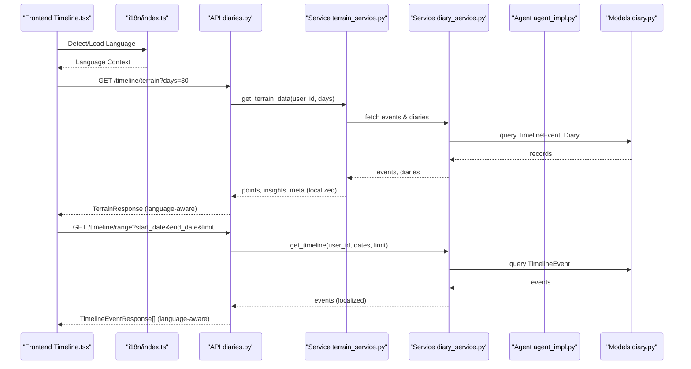

**Diagram sources**
- [diaries.py:271-352](file://backend/app/api/v1/diaries.py#L271-L352)
- [terrain_service.py:169-227](file://backend/app/services/terrain_service.py#L169-L227)
- [diary_service.py:524-569](file://backend/app/services/diary_service.py#L524-L569)
- [diary.py:67-186](file://backend/app/models/diary.py#L67-L186)
- [Timeline.tsx:128-145](file://frontend/src/pages/timeline/Timeline.tsx#L128-L145)
- [index.ts:25-30](file://frontend/src/i18n/index.ts#L25-L30)

## Detailed Component Analysis

### Frontend Timeline Component with Internationalization
Responsibilities:
- Fetch terrain data and render localized:
  - Mood calendar grid with ring visuals (outer color: emotion, inner brightness: energy, ring width: density)
  - Energy trend chart with clickable dots and key-event markers in user's language
  - Keyword cards per SATIR layer with localized titles and empty states
  - Selected day details panel with language-aware formatting
- Interactive controls:
  - Month navigation with localized month names
  - Window selection (7/30/90 days) with translated labels
  - Hover tooltips with daily insights in user's language
  - Click-to-view-diary actions with localized buttons

Key computations:
- Energy: max importance_score per day
- Valence: average of mapped emotion valence per day
- Density: number of events or diaries per day
- Jump detection: highlight key events when energy jumps by ≥2 between consecutive days
- **All UI labels, tooltips, and messages are dynamically translated based on detected language**

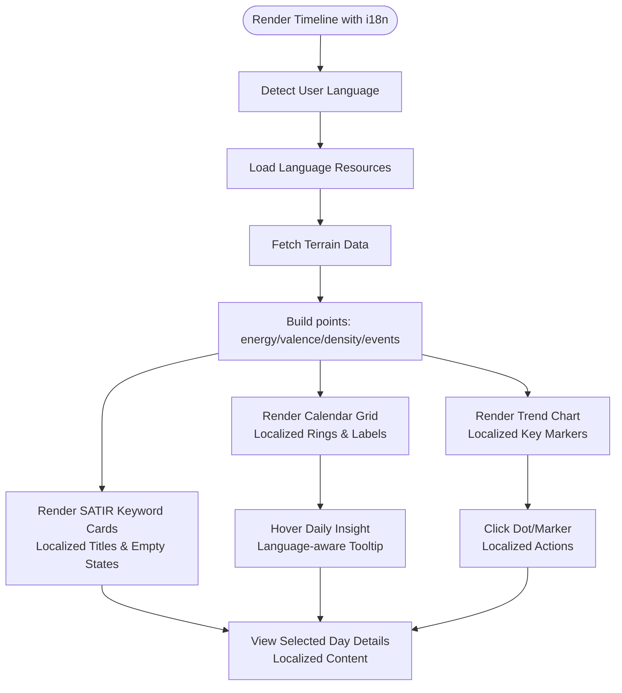

**Diagram sources**
- [Timeline.tsx:116-656](file://frontend/src/pages/timeline/Timeline.tsx#L116-L656)
- [index.ts:13-20](file://frontend/src/i18n/index.ts#L13-L20)
- [diary.ts (types):75-127](file://frontend/src/types/diary.ts#L75-L127)

**Section sources**
- [Timeline.tsx:116-656](file://frontend/src/pages/timeline/Timeline.tsx#L116-L656)
- [index.ts:1-44](file://frontend/src/i18n/index.ts#L1-L44)
- [diary.ts (types):75-127](file://frontend/src/types/diary.ts#L75-L127)

### Backend Event Extraction Service
Responsibilities:
- Create/update timeline events from diary entries (rule-based)
- AI refinement of events with structured JSON extraction
- Rebuilding events for a user within a date range (idempotent)
- Enforce cross-user isolation and prevent unauthorized writes
- **Handle multilingual content processing for international users**

Rule-based extraction:
- Builds event payload from diary title/content/emotion_tags/importance_score
- Infers event_type from keywords with locale considerations
- Stores source metadata for traceability

AI refinement:
- Calls LLM with a structured prompt to improve summary, emotion_tag, importance_score, and event_type
- Preserves AI results unless forced overwrite
- **Processes multilingual content for diverse user bases**

Rebuilding:
- Scans diaries within a date window and upserts events
- Returns statistics for audit
- **Maintains translation compatibility during legacy data migration**

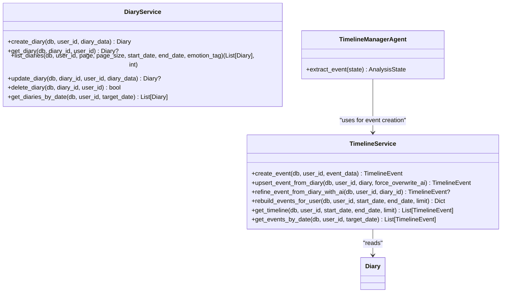

**Diagram sources**
- [diary_service.py:281-637](file://backend/app/services/diary_service.py#L281-L637)
- [agent_impl.py:144-203](file://backend/app/agents/agent_impl.py#L144-L203)

**Section sources**
- [diary_service.py:281-637](file://backend/app/services/diary_service.py#L281-L637)
- [agent_impl.py:144-203](file://backend/app/agents/agent_impl.py#L144-L203)
- [prompts.py:33-57](file://backend/app/agents/prompts.py#L33-L57)

### Backend Terrain Aggregation Service
Responsibilities:
- Aggregate timeline events and diaries by day
- Compute energy (max importance_score), valence (avg mapped emotion), density (count)
- Fallback to diary-derived metrics when no timeline events exist
- Detect peaks and valleys and compute trend
- **Generate localized summary insights for different languages**

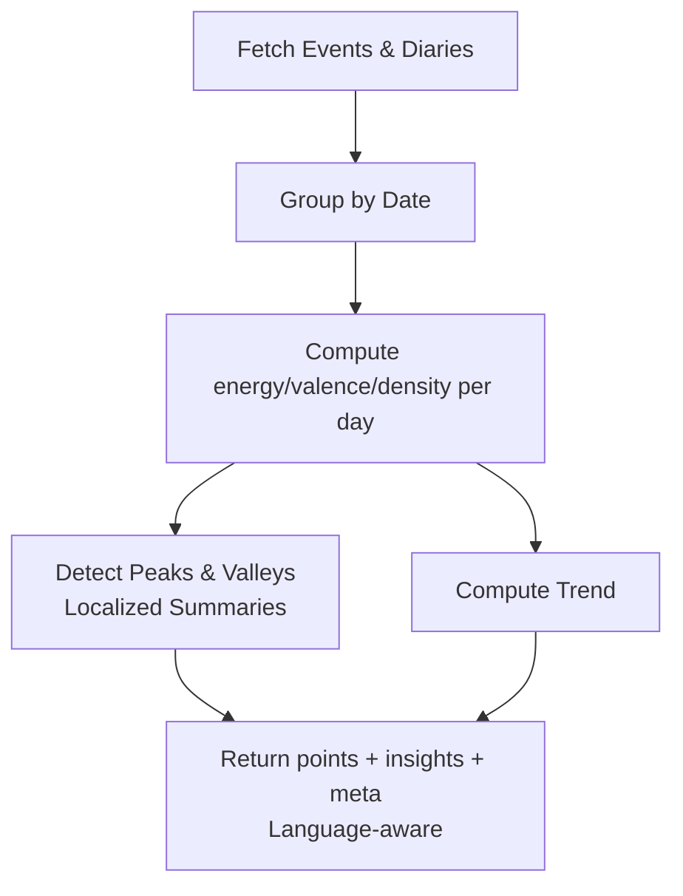

**Diagram sources**
- [terrain_service.py:169-227](file://backend/app/services/terrain_service.py#L169-L227)
- [terrain_service.py:266-355](file://backend/app/services/terrain_service.py#L266-L355)

**Section sources**
- [terrain_service.py:169-227](file://backend/app/services/terrain_service.py#L169-L227)
- [terrain_service.py:266-355](file://backend/app/services/terrain_service.py#L266-L355)

### Data Modeling for Timeline Events
Entities and relationships:
- TimelineEvent: stores event metadata, importance_score, emotion_tag, event_type, and related_entities
- Diary: user-owned journal entries with optional emotion_tags and importance_score
- GrowthDailyInsight: cached daily insights keyed by user and date

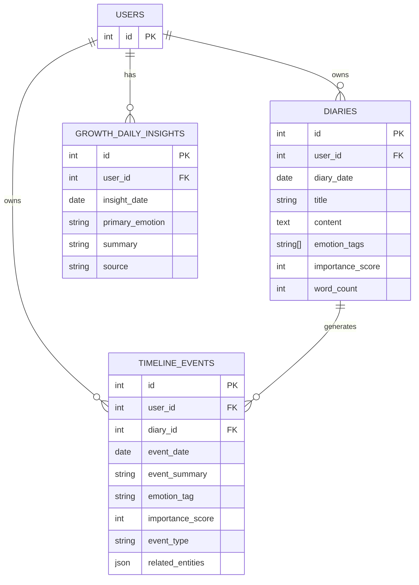

**Diagram sources**
- [diary.py:29-186](file://backend/app/models/diary.py#L29-L186)

**Section sources**
- [diary.py:29-186](file://backend/app/models/diary.py#L29-L186)

### API Endpoints for Timeline and Terrain
Endpoints:
- GET /timeline/range: Retrieve timeline events within a date range
- GET /timeline/date/{target_date}: Retrieve timeline events for a specific date
- POST /timeline/rebuild: Rebuild timeline events for a user within N days
- GET /timeline/terrain: Get terrain data (points, insights, meta)

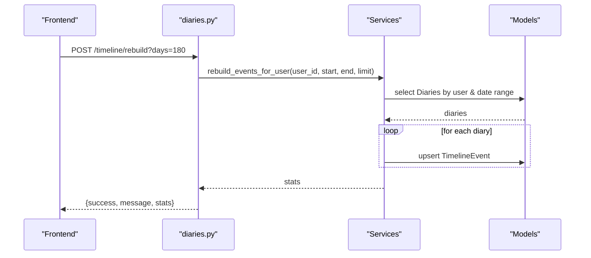

**Diagram sources**
- [diaries.py:311-333](file://backend/app/api/v1/diaries.py#L311-L333)
- [diary_service.py:490-522](file://backend/app/services/diary_service.py#L490-L522)

**Section sources**
- [diaries.py:271-352](file://backend/app/api/v1/diaries.py#L271-L352)
- [diaries.py:311-333](file://backend/app/api/v1/diaries.py#L311-L333)
- [diary_service.py:490-522](file://backend/app/services/diary_service.py#L490-L522)

### Rebuilding Script for Legacy Data Migration
Purpose:
- Rebuild timeline_events for a specific user or all active users
- Limit scan window and return processed counts

Usage:
- python3 scripts/rebuild_timeline_events.py --user-id 1 --days 365
- python3 scripts/rebuild_timeline_events.py --all --days 180

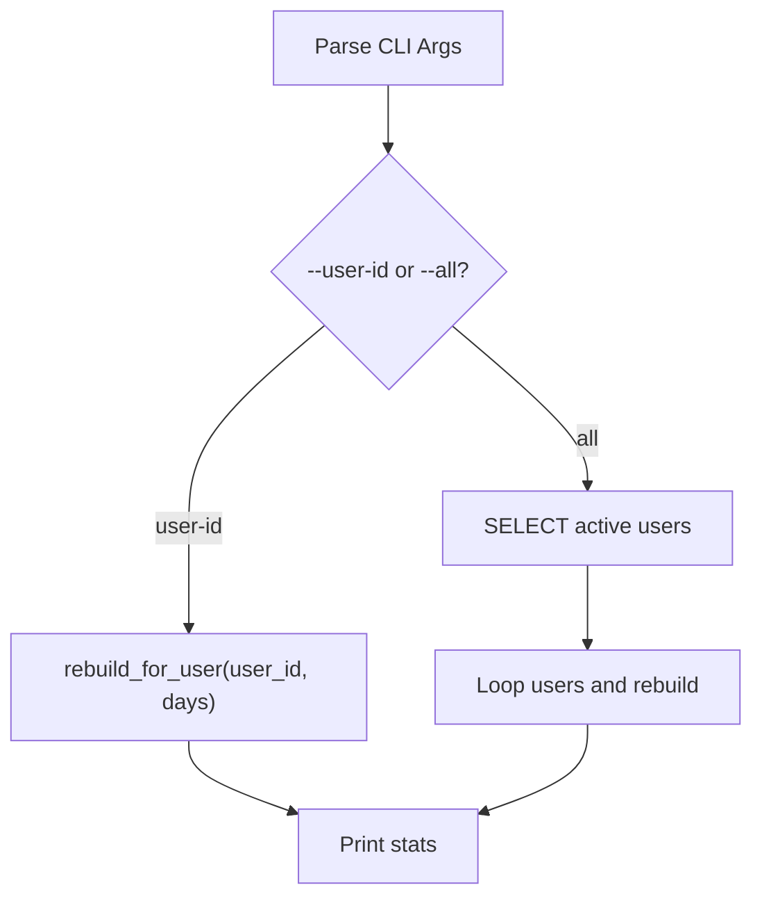

**Diagram sources**
- [rebuild_timeline_events.py:33-59](file://backend/scripts/rebuild_timeline_events.py#L33-L59)

**Section sources**
- [rebuild_timeline_events.py:19-59](file://backend/scripts/rebuild_timeline_events.py#L19-L59)

## Multilingual Support Implementation

### Frontend Internationalization Framework
The Timeline feature implements comprehensive multilingual support through a robust i18n framework:

**Language Detection and Configuration:**
- Automatic language detection using browser preferences and localStorage
- Fallback to Chinese (zh-CN) as default language
- Support for both Simplified Chinese and English interfaces
- Dynamic language switching without page reload

**Translation Key Structure:**
- Comprehensive translation keys for all UI elements in the Timeline component
- Dedicated keys for growth center features, calendar elements, and chart components
- SATIR model translations for behavioral, emotional, cognitive, belief, and desire layers
- Weekday abbreviations and localized tooltips

**Implementation Details:**
- Uses react-i18next for seamless React integration
- date-fns locale integration for localized date formatting
- Dynamic translation loading based on detected language
- Fallback mechanism for missing translations

**Section sources**
- [index.ts:1-44](file://frontend/src/i18n/index.ts#L1-L44)
- [zh-CN.json:372-423](file://frontend/src/i18n/locales/zh-CN.json#L372-L423)
- [en-US.json:372-423](file://frontend/src/i18n/locales/en-US.json#L372-L423)
- [Timeline.tsx:118](file://frontend/src/pages/timeline/Timeline.tsx#L118)

### Backend Localization Considerations
While the backend primarily processes Chinese text for event extraction, it maintains compatibility for international users:

**Event Type Classification:**
- EVENT_TYPE_KEYWORDS dictionary supports Chinese keywords for work, relationship, health, and achievement categories
- Future expansion planned for multilingual keyword support
- Flexible keyword matching allows for international content processing

**Terrain Service Localizations:**
- Emotion valence mapping uses Chinese emotion terms
- Peak and valley detection generates localized summary insights
- Trend analysis provides language-aware interpretations

**Section sources**
- [diary_service.py:16-28](file://backend/app/services/diary_service.py#L16-L28)
- [terrain_service.py:16-40](file://backend/app/services/terrain_service.py#L16-L40)

### Data Visualization Localization
The Timeline visualization adapts to user language preferences:

**Calendar Localization:**
- Weekday abbreviations adapt to user language (日/一/Sun variants)
- Date formatting respects locale-specific conventions
- Event markers maintain visual consistency across languages

**Chart Localization:**
- Axis labels and tooltips translate to user's preferred language
- Tooltips display localized emotion descriptions and importance scores
- Interactive elements provide language-aware feedback

**Keyword Card Localization:**
- SATIR layer titles and empty state messages adapt to language
- Color schemes and styling remain consistent while text translates
- Weighted keyword display respects language-specific text length

**Section sources**
- [Timeline.tsx:22-31](file://frontend/src/pages/timeline/Timeline.tsx#L22-L31)
- [Timeline.tsx:41-47](file://frontend/src/pages/timeline/Timeline.tsx#L41-L47)
- [Timeline.tsx:408-411](file://frontend/src/pages/timeline/Timeline.tsx#L408-L411)

## Dependency Analysis
- Frontend depends on:
  - API endpoints for terrain and timeline data
  - Types for TerrainResponse, TerrainPoint, GrowthDailyInsight
  - **i18n framework for language detection and translation management**
- Backend services depend on:
  - SQLAlchemy models for queries and persistence
  - Agent prompts for structured extraction
  - External LLM client for AI refinement
  - **Locale-aware processing for multilingual content**
- No circular dependencies observed between modules.

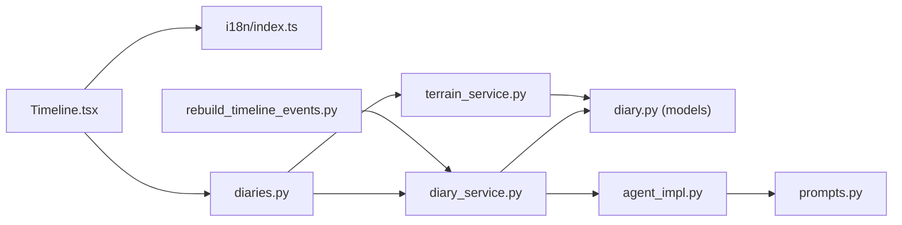

**Diagram sources**
- [Timeline.tsx:116-656](file://frontend/src/pages/timeline/Timeline.tsx#L116-L656)
- [index.ts:1-44](file://frontend/src/i18n/index.ts#L1-L44)
- [diaries.py:271-352](file://backend/app/api/v1/diaries.py#L271-L352)
- [diary_service.py:281-637](file://backend/app/services/diary_service.py#L281-L637)
- [terrain_service.py:166-360](file://backend/app/services/terrain_service.py#L166-L360)
- [agent_impl.py:144-203](file://backend/app/agents/agent_impl.py#L144-L203)
- [prompts.py:33-57](file://backend/app/agents/prompts.py#L33-L57)
- [diary.py:67-186](file://backend/app/models/diary.py#L67-L186)
- [rebuild_timeline_events.py:19-59](file://backend/scripts/rebuild_timeline_events.py#L19-L59)

**Section sources**
- [Timeline.tsx:116-656](file://frontend/src/pages/timeline/Timeline.tsx#L116-L656)
- [index.ts:1-44](file://frontend/src/i18n/index.ts#L1-L44)
- [diaries.py:271-352](file://backend/app/api/v1/diaries.py#L271-L352)
- [diary_service.py:281-637](file://backend/app/services/diary_service.py#L281-L637)
- [terrain_service.py:166-360](file://backend/app/services/terrain_service.py#L166-L360)
- [agent_impl.py:144-203](file://backend/app/agents/agent_impl.py#L144-L203)
- [prompts.py:33-57](file://backend/app/agents/prompts.py#L33-L57)
- [diary.py:67-186](file://backend/app/models/diary.py#L67-L186)
- [rebuild_timeline_events.py:19-59](file://backend/scripts/rebuild_timeline_events.py#L19-L59)

## Performance Considerations
- Frontend
  - Memoization of computed values (chart data, keyword lists) reduces re-renders
  - Lazy loading of daily insights prevents unnecessary API calls
  - Efficient calendar cell generation avoids DOM thrash
  - **Optimized translation loading and caching for improved performance**
- Backend
  - Queries are scoped by user and date ranges to minimize scans
  - Rebuilding limits the number of processed diaries
  - Aggregation loops per day avoid heavy joins
  - **Locale-aware processing maintains efficient multilingual content handling**
- Recommendations
  - Add pagination for timeline/range endpoint when volume grows
  - Cache terrain aggregations for recent windows
  - Batch rebuild operations for many users
  - **Implement translation key optimization for frequently accessed UI elements**

## Troubleshooting Guide
Common issues and resolutions:
- No events shown in calendar
  - Ensure diaries exist for the selected period and that events were rebuilt
  - Trigger rebuild endpoint or run the rebuild script
- AI refinement errors
  - LLM parsing failures fall back to existing event; check logs for parsing exceptions
- Cross-user data leakage
  - TimelineService enforces user isolation; verify user_id is correct and diary_id belongs to the user
- Missing daily insights
  - Frontend sets a fallback message when insight fetch fails; retry or check backend processing
- **Language switching issues**
  - Clear localStorage language preference if interface appears garbled
  - Verify translation keys exist in both zh-CN and en-US resource files
  - Check browser language detection settings

**Section sources**
- [diary_service.py:380-387](file://backend/app/services/diary_service.py#L380-L387)
- [diary_service.py:460-461](file://backend/app/services/diary_service.py#L460-L461)
- [diaries.py:311-333](file://backend/app/api/v1/diaries.py#L311-L333)
- [rebuild_timeline_events.py:43-54](file://backend/scripts/rebuild_timeline_events.py#L43-L54)
- [Timeline.tsx:204-218](file://frontend/src/pages/timeline/Timeline.tsx#L204-L218)
- [index.ts:25-30](file://frontend/src/i18n/index.ts#L25-L30)

## Conclusion
Timeline Management delivers a robust pipeline from raw diary entries to interactive, insightful visualizations with comprehensive multilingual support. The frontend presents a user-friendly calendar and trend chart in the user's preferred language, while the backend ensures reliable event extraction, aggregation, and trend analysis with locale-aware processing. The importance scoring and keyword analysis support reflective insights, and the rebuilding mechanisms enable smooth legacy migrations. The internationalization framework provides seamless language switching and localized content presentation for global users.

## Appendices

### Automatic Event Extraction Workflow
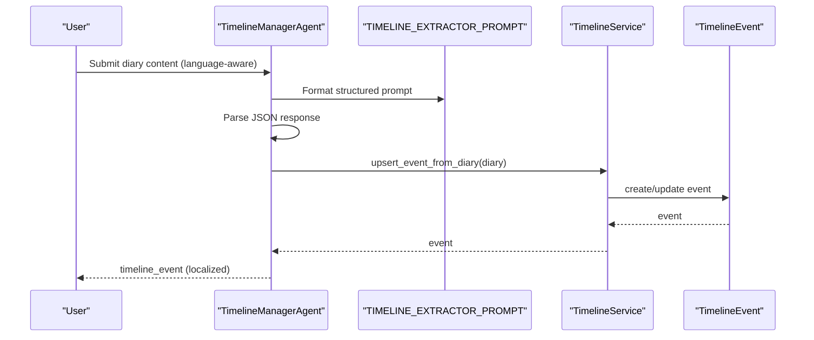

**Diagram sources**
- [agent_impl.py:144-203](file://backend/app/agents/agent_impl.py#L144-L203)
- [prompts.py:33-57](file://backend/app/agents/prompts.py#L33-L57)
- [diary_service.py:358-409](file://backend/app/services/diary_service.py#L358-L409)

**Section sources**
- [agent_impl.py:144-203](file://backend/app/agents/agent_impl.py#L144-L203)
- [prompts.py:33-57](file://backend/app/agents/prompts.py#L33-L57)
- [diary_service.py:358-409](file://backend/app/services/diary_service.py#L358-L409)

### Data Processing Pipeline: From Diary to Timeline
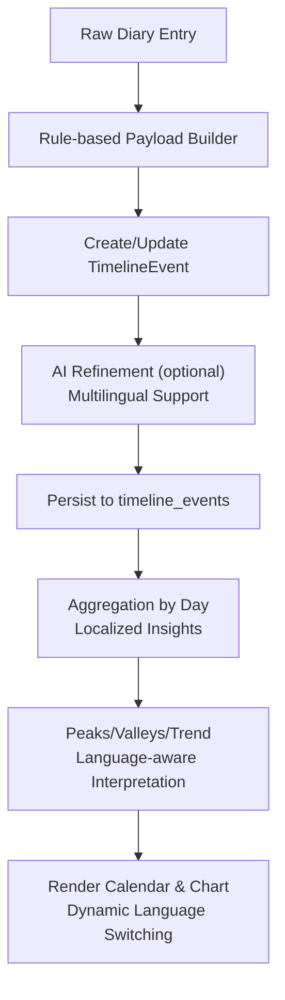

**Diagram sources**
- [diary_service.py:332-409](file://backend/app/services/diary_service.py#L332-L409)
- [diary_service.py:410-488](file://backend/app/services/diary_service.py#L410-L488)
- [terrain_service.py:266-355](file://backend/app/services/terrain_service.py#L266-L355)
- [Timeline.tsx:175-191](file://frontend/src/pages/timeline/Timeline.tsx#L175-L191)

**Section sources**
- [diary_service.py:332-409](file://backend/app/services/diary_service.py#L332-L409)
- [diary_service.py:410-488](file://backend/app/services/diary_service.py#L410-L488)
- [terrain_service.py:266-355](file://backend/app/services/terrain_service.py#L266-L355)
- [Timeline.tsx:175-191](file://frontend/src/pages/timeline/Timeline.tsx#L175-L191)

### Internationalization Implementation Details
**Frontend i18n Configuration:**
- Language detection order: localStorage → navigator → fallback
- Resource loading for zh-CN and en-US
- Automatic date formatting with locale-specific conventions
- Dynamic translation key resolution for all UI elements

**Backend Localization Features:**
- Flexible keyword matching for event classification
- Emotion valence mapping with Chinese terms
- Locale-aware summary generation for insights
- Translation compatibility for legacy data migration

**Section sources**
- [index.ts:25-30](file://frontend/src/i18n/index.ts#L25-L30)
- [zh-CN.json:372-423](file://frontend/src/i18n/locales/zh-CN.json#L372-L423)
- [en-US.json:372-423](file://frontend/src/i18n/locales/en-US.json#L372-L423)
- [diary_service.py:16-28](file://backend/app/services/diary_service.py#L16-L28)
- [terrain_service.py:16-40](file://backend/app/services/terrain_service.py#L16-L40)