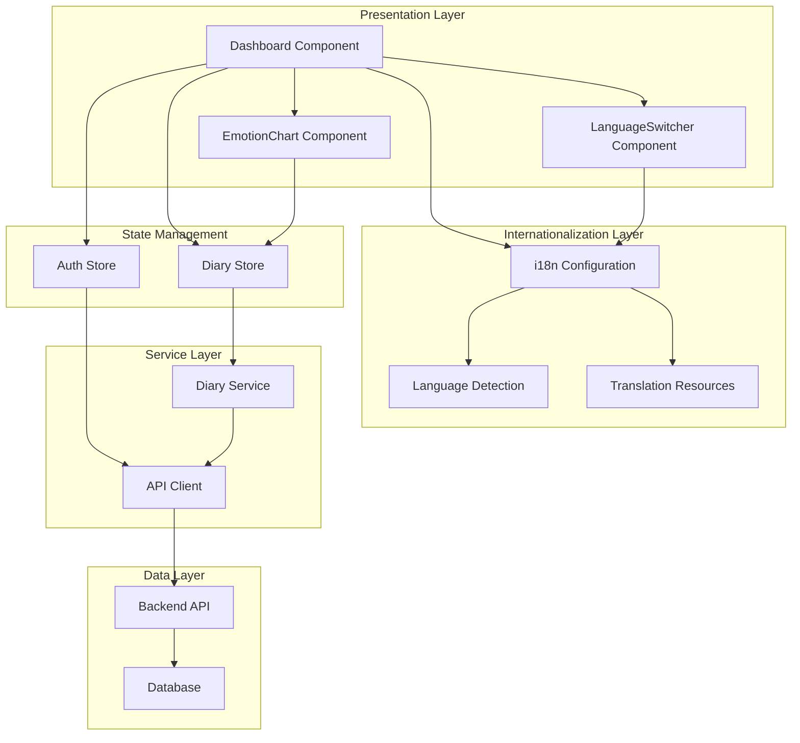
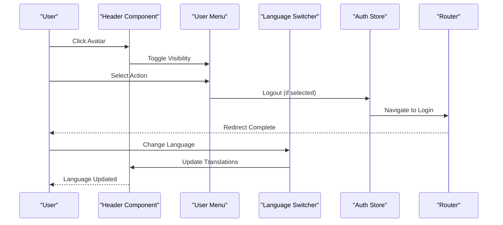
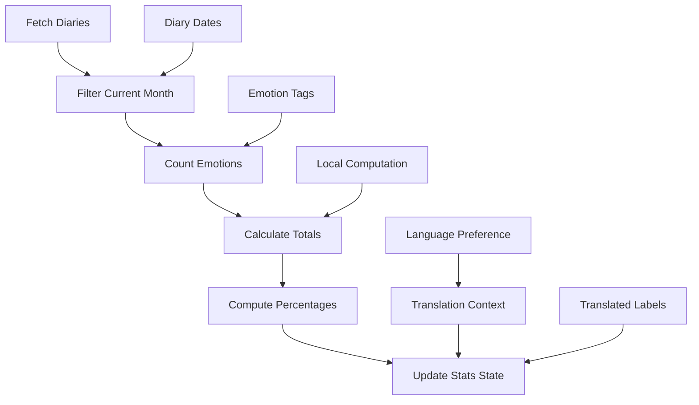
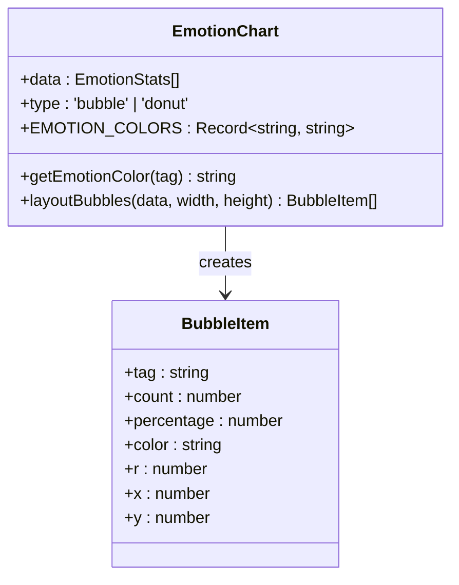
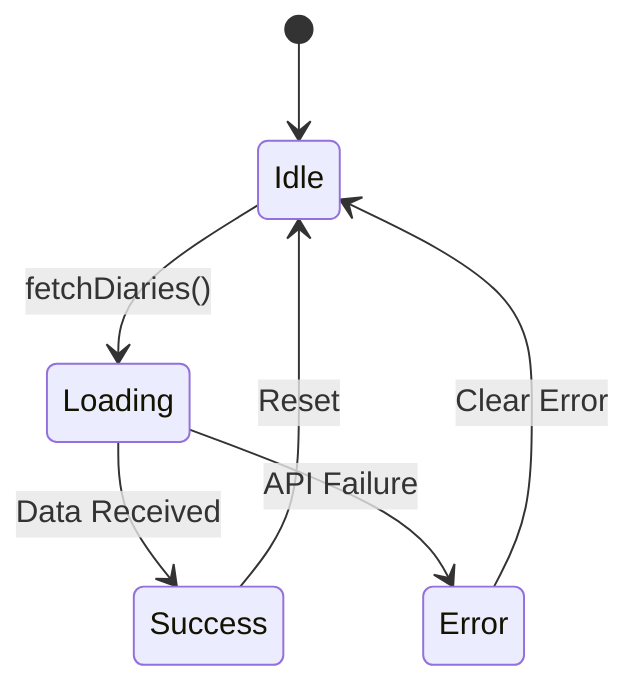
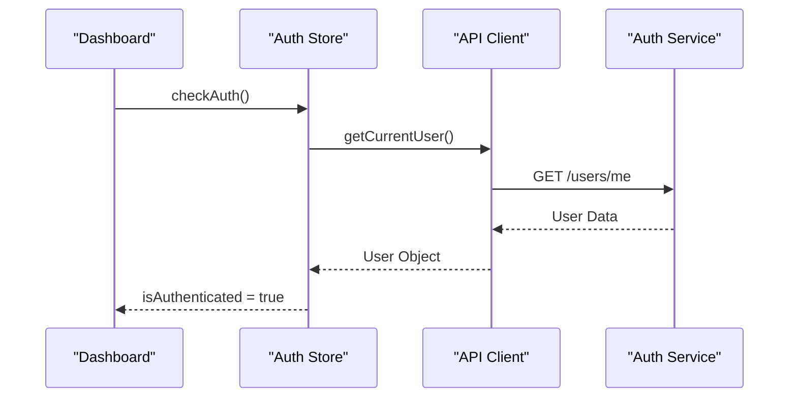
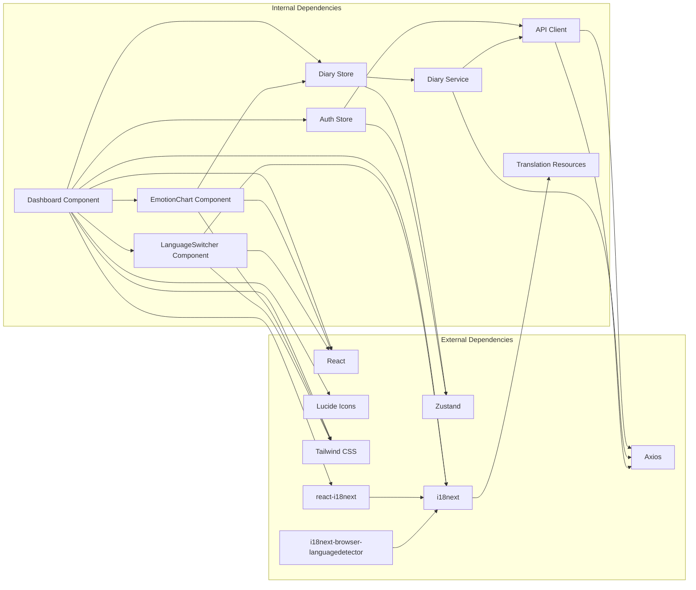

# Dashboard Component

<cite>
**Referenced Files in This Document**
- [Dashboard.tsx](file://frontend/src/pages/dashboard/Dashboard.tsx)
- [EmotionChart.tsx](file://frontend/src/components/common/EmotionChart.tsx)
- [LanguageSwitcher.tsx](file://frontend/src/components/common/LanguageSwitcher.tsx)
- [diary.service.ts](file://frontend/src/services/diary.service.ts)
- [diaryStore.ts](file://frontend/src/store/diaryStore.ts)
- [authStore.ts](file://frontend/src/store/authStore.ts)
- [diary.ts](file://frontend/src/types/diary.ts)
- [routes.ts](file://frontend/src/constants/routes.ts)
- [index.css](file://frontend/src/index.css)
- [api.ts](file://frontend/src/services/api.ts)
- [index.ts](file://frontend/src/i18n/index.ts)
- [zh-CN.json](file://frontend/src/i18n/locales/zh-CN.json)
- [en-US.json](file://frontend/src/i18n/locales/en-US.json)
- [首页仪表盘.md](file://docs/功能文档/首页仪表盘.md)
</cite>

## Update Summary
**Changes Made**
- Added comprehensive internationalization support with Chinese and English translations
- Integrated react-i18next for dynamic language switching
- Updated all navigation menus, statistics, and quick actions to use translated strings
- Implemented language detection and persistence mechanisms
- Added LanguageSwitcher component for manual language selection

## Table of Contents
1. [Introduction](#introduction)
2. [Project Structure](#project-structure)
3. [Core Components](#core-components)
4. [Architecture Overview](#architecture-overview)
5. [Detailed Component Analysis](#detailed-component-analysis)
6. [Internationalization Implementation](#internationalization-implementation)
7. [Dependency Analysis](#dependency-analysis)
8. [Performance Considerations](#performance-considerations)
9. [Troubleshooting Guide](#troubleshooting-guide)
10. [Conclusion](#conclusion)

## Introduction

The Dashboard Component serves as the primary landing page for authenticated users in the Yinji application. It provides a comprehensive overview of user activity through statistics cards, emotional visualization, quick navigation, and recent diary entries. The component follows a warm, soothing aesthetic designed for psychological journaling applications, featuring gentle gradients, soft shadows, and a harmonious color palette.

**Updated**: The dashboard now supports full internationalization with Chinese (zh-CN) and English (en-US) translations for all user-facing content including navigation menus, statistics displays, and quick action buttons. The component automatically detects user language preferences and provides seamless switching between supported languages.

The dashboard aggregates data from multiple sources including user authentication state, diary collections, and emotional analytics to present a personalized experience that encourages continued journaling engagement while providing meaningful insights into the user's emotional journey.

## Project Structure

The dashboard component is organized within the frontend application structure following React best practices with integrated internationalization:

```mermaid
graph TB
subgraph "Dashboard Structure"
A[Dashboard Page] --> B[Header Navigation]
A --> C[Statistics Cards]
A --> D[Quick Actions]
A --> E[Emotion Chart]
A --> F[Recent Diaries]
B --> G[User Menu]
B --> H[Navigation Links]
B --> I[Language Switcher]
C --> I[Translated Statistics]
C --> J[Monthly Count]
C --> K[Top Emotion]
E --> L[Emotion Visualization]
F --> M[Recent Entries]
I --> N[Dynamic Language Detection]
I --> O[Manual Language Switching]
</subgraph>
```

**Diagram sources**
- [Dashboard.tsx:1-335](file://frontend/src/pages/dashboard/Dashboard.tsx#L1-L335)
- [LanguageSwitcher.tsx:1-25](file://frontend/src/components/common/LanguageSwitcher.tsx#L1-L25)

The component leverages a modular architecture with clear separation of concerns and comprehensive internationalization:

- **Presentation Layer**: Dashboard.tsx handles UI rendering and user interactions with translated content
- **Internationalization Layer**: react-i18next integration with automatic language detection
- **Data Layer**: Uses Zustand stores for state management and service layer for API communication
- **Visualization Layer**: EmotionChart.tsx provides specialized data visualization
- **Styling Layer**: Tailwind CSS with custom animations and gradients

**Section sources**
- [Dashboard.tsx:1-335](file://frontend/src/pages/dashboard/Dashboard.tsx#L1-L335)
- [index.css:1-153](file://frontend/src/index.css#L1-L153)
- [index.ts:1-44](file://frontend/src/i18n/index.ts#L1-L44)

## Core Components

### Dashboard Main Component

The Dashboard component serves as the central hub for user interaction, implementing several key features with full internationalization support:

**User Authentication Integration**
- Integrates with authStore for user session management
- Provides secure navigation with automatic logout functionality
- Implements responsive user menu with avatar display

**Internationalized Content Management**
- Comprehensive translation support for all user-facing strings
- Dynamic language switching through LanguageSwitcher component
- Automatic language detection based on browser and localStorage preferences
- Fallback to Chinese (zh-CN) when translations are unavailable

**Data Aggregation and Statistics**
- Calculates daily statistics from local diary data
- Computes monthly counts and top emotions
- Displays real-time updates as new diary entries are added
- All statistics labels and messages are fully translatable

**Navigation and Quick Actions**
- Four primary navigation shortcuts with localized labels
- Implements intuitive routing to key application areas
- Includes contextual actions for immediate user engagement
- All navigation items are dynamically translated based on language preference

**Visual Design Elements**
- Implements gradient backgrounds with warm color schemes
- Utilizes custom animations for enhanced user experience
- Features responsive layout adapting to different screen sizes

**Section sources**
- [Dashboard.tsx:9-335](file://frontend/src/pages/dashboard/Dashboard.tsx#L9-L335)
- [authStore.ts:1-129](file://frontend/src/store/authStore.ts#L1-L129)

### Emotion Visualization Component

The EmotionChart component provides sophisticated data visualization for emotional patterns with internationalization support:

**Color Palette Management**
- Comprehensive emotion-to-color mapping system
- Support for fuzzy matching of emotion terms
- Consistent color scheme across the application

**Interactive Bubble Layout Algorithm**
- Force-directed circular arrangement
- Collision detection and avoidance
- Responsive sizing based on frequency data

**Visual Feedback System**
- Hover effects with scaling animations
- Gradient fills with radial transparency
- Tooltips displaying detailed statistics

**Section sources**
- [EmotionChart.tsx:1-269](file://frontend/src/components/common/EmotionChart.tsx#L1-L269)

### State Management Integration

The dashboard integrates with multiple state management systems:

**Diary Store Operations**
- Fetches recent diary entries for statistics calculation
- Manages loading states and error handling
- Provides pagination support for large datasets

**Authentication State**
- Monitors user session validity
- Handles logout operations
- Manages user profile display

**Section sources**
- [diaryStore.ts:1-164](file://frontend/src/store/diaryStore.ts#L1-L164)
- [authStore.ts:1-129](file://frontend/src/store/authStore.ts#L1-L129)

## Architecture Overview

The dashboard component follows a layered architecture pattern with integrated internationalization that ensures maintainability, scalability, and multilingual support:



**Diagram sources**
- [Dashboard.tsx:1-335](file://frontend/src/pages/dashboard/Dashboard.tsx#L1-L335)
- [LanguageSwitcher.tsx:1-25](file://frontend/src/components/common/LanguageSwitcher.tsx#L1-L25)
- [diaryStore.ts:1-164](file://frontend/src/store/diaryStore.ts#L1-L164)
- [authStore.ts:1-129](file://frontend/src/store/authStore.ts#L1-L129)
- [diary.service.ts:1-112](file://frontend/src/services/diary.service.ts#L1-L112)
- [api.ts:1-82](file://frontend/src/services/api.ts#L1-L82)
- [index.ts:1-44](file://frontend/src/i18n/index.ts#L1-L44)

The architecture emphasizes separation of concerns with clear boundaries between presentation, internationalization, state management, and data access layers. This design enables independent testing, maintenance, enhancement, and localization of individual components.

**Section sources**
- [Dashboard.tsx:1-335](file://frontend/src/pages/dashboard/Dashboard.tsx#L1-L335)
- [diaryStore.ts:1-164](file://frontend/src/store/diaryStore.ts#L1-L164)
- [diary.service.ts:1-112](file://frontend/src/services/diary.service.ts#L1-L112)

## Detailed Component Analysis

### Dashboard Component Implementation

The Dashboard component implements a sophisticated user interface with multiple interactive elements and comprehensive internationalization:

#### Header Navigation System

The header provides essential navigation and user management functionality with full translation support:



**Diagram sources**
- [Dashboard.tsx:68-72](file://frontend/src/pages/dashboard/Dashboard.tsx#L68-L72)
- [LanguageSwitcher.tsx:7-9](file://frontend/src/components/common/LanguageSwitcher.tsx#L7-L9)
- [authStore.ts:87-98](file://frontend/src/store/authStore.ts#L87-L98)

#### Internationalized Statistics Calculation Logic

The component performs real-time calculations on diary data with localized output:



**Diagram sources**
- [Dashboard.tsx:33-66](file://frontend/src/pages/dashboard/Dashboard.tsx#L33-L66)

#### Quick Action System with Translations

Four primary navigation actions provide immediate access to key features with localized labels:

| Action | Route | Icon | Chinese Label | English Label |
|--------|-------|------|---------------|---------------|
| Write Diary | `/diaries/new` | PenLine | 写日记 | Write Diary |
| My Diaries | `/diaries` | BookOpen | 我的日记 | My Diaries |
| Growth Center | `/growth` | Sprout | 成长中心 | Growth Center |
| Analysis | `/analysis` | Sparkles | AI 分析 | AI Analysis |

**Section sources**
- [Dashboard.tsx:235-252](file://frontend/src/pages/dashboard/Dashboard.tsx#L235-L252)
- [routes.ts:1-32](file://frontend/src/constants/routes.ts#L1-L32)

### EmotionChart Component Deep Dive

The EmotionChart component implements advanced visualization algorithms with internationalization considerations:

#### Color Mapping System

The component maintains a comprehensive emotion-to-color mapping:



**Diagram sources**
- [EmotionChart.tsx:5-82](file://frontend/src/components/common/EmotionChart.tsx#L5-L82)
- [EmotionChart.tsx:84-154](file://frontend/src/components/common/EmotionChart.tsx#L84-L154)

#### Layout Algorithm Analysis

The bubble layout algorithm employs sophisticated collision detection:

**Time Complexity**: O(n²) for collision checking in worst case
**Space Complexity**: O(n) for storing bubble positions

The algorithm prioritizes visual appeal through:
- Central placement of highest frequency emotion
- Spiral arrangement for remaining bubbles
- Boundary and collision constraints
- Smooth scaling animations on hover

**Section sources**
- [EmotionChart.tsx:84-154](file://frontend/src/components/common/EmotionChart.tsx#L84-L154)
- [EmotionChart.tsx:156-269](file://frontend/src/components/common/EmotionChart.tsx#L156-L269)

### State Management Integration

The dashboard integrates with multiple state management systems:

#### Diary Store Operations

The diary store manages all diary-related state and operations:



**Diagram sources**
- [diaryStore.ts:50-74](file://frontend/src/store/diaryStore.ts#L50-L74)

#### Authentication Flow

The authentication system provides seamless user session management:



**Diagram sources**
- [authStore.ts:100-116](file://frontend/src/store/authStore.ts#L100-L116)

**Section sources**
- [diaryStore.ts:1-164](file://frontend/src/store/diaryStore.ts#L1-L164)
- [authStore.ts:1-129](file://frontend/src/store/authStore.ts#L1-L129)

## Internationalization Implementation

The dashboard component now features comprehensive internationalization support through react-i18next integration:

### Translation Configuration

The i18n system is configured with automatic language detection and persistence:

```mermaid
flowchart TD
A[i18n Initialization] --> B[Load Resources]
B --> C[Detect Browser Language]
C --> D[Check localStorage]
D --> E{Language Found?}
E --> |Yes| F[Set Detected Language]
E --> |No| G[Use Fallback (zh-CN)]
F --> H[Initialize React-i18next]
G --> H
H --> I[Provide Translation Functions]
```

**Diagram sources**
- [index.ts:9-41](file://frontend/src/i18n/index.ts#L9-L41)

### Translation Resources Structure

The translation system organizes content into logical categories:

**Navigation Translations**
- Dashboard navigation items (仪表盘/Dashboard)
- Main navigation links (日记/Diaries, 时间轴/Timeline, 社区/Community)
- User menu actions (写日记/Write Diary, 我的日记/My Diaries, 设置/Settings)

**Dashboard Content Translations**
- Welcome messages (今天想记录些什么呢？/What would you like to record today?)
- Statistics labels (累计日记/Total Diaries, 本月记录/This Month, 主要情绪/Top Emotion)
- Quick action descriptions (记录今天/Record Today, 浏览记录/Browse Records)
- Empty state messages (还没有任何日记/No diaries yet)

**Auth Translations**
- Logout button text (退出登录/Logout)
- User menu items with icons and localized labels

### Language Detection and Persistence

The system implements intelligent language detection:

**Detection Order**: localStorage → navigator → fallback
**Persistence**: Language preference stored in localStorage with key 'yinji-language'
**Fallback**: Defaults to Chinese (zh-CN) when translations are unavailable

### Dynamic Translation Usage

The dashboard utilizes translations throughout the component:

```typescript
const { t } = useTranslation();
// Navigation links
['/', t('navigation.dashboard')], ['/diaries', t('navigation.diaries')]
// Statistics cards
t('dashboard.totalDiaries'), t('dashboard.thisMonth'), t('dashboard.topEmotion')
// Quick actions
t('navigation.writeDiary'), t('dashboard.recordToday')
// Auth actions
t('auth.logout')
```

**Section sources**
- [Dashboard.tsx:10-11](file://frontend/src/pages/dashboard/Dashboard.tsx#L10-L11)
- [Dashboard.tsx:110-115](file://frontend/src/pages/dashboard/Dashboard.tsx#L110-L115)
- [Dashboard.tsx:224-226](file://frontend/src/pages/dashboard/Dashboard.tsx#L224-L226)
- [Dashboard.tsx:239-243](file://frontend/src/pages/dashboard/Dashboard.tsx#L239-L243)
- [Dashboard.tsx:190](file://frontend/src/pages/dashboard/Dashboard.tsx#L190)
- [index.ts:26-30](file://frontend/src/i18n/index.ts#L26-L30)

## Dependency Analysis

The dashboard component exhibits well-managed dependencies with comprehensive internationalization support:



**Diagram sources**
- [Dashboard.tsx:1-335](file://frontend/src/pages/dashboard/Dashboard.tsx#L1-L335)
- [EmotionChart.tsx:1-269](file://frontend/src/components/common/EmotionChart.tsx#L1-L269)
- [LanguageSwitcher.tsx:1-25](file://frontend/src/components/common/LanguageSwitcher.tsx#L1-L25)
- [diaryStore.ts:1-164](file://frontend/src/store/diaryStore.ts#L1-L164)
- [authStore.ts:1-129](file://frontend/src/store/authStore.ts#L1-L129)
- [diary.service.ts:1-112](file://frontend/src/services/diary.service.ts#L1-L112)
- [api.ts:1-82](file://frontend/src/services/api.ts#L1-L82)
- [index.ts:1-44](file://frontend/src/i18n/index.ts#L1-L44)

### Component Coupling Analysis

The dashboard demonstrates appropriate coupling levels:
- **Low coupling** with external libraries (React, Zustand, Axios, i18next)
- **Moderate coupling** within internal components
- **High cohesion** within functional modules
- **Internationalization coupling** through react-i18next integration

### Data Flow Patterns

The component follows predictable data flow patterns with translation support:
1. **Unidirectional data flow** from services to stores to components
2. **Event-driven updates** through state changes
3. **Asynchronous operations** with proper error handling
4. **Computed properties** derived from raw data
5. **Translation resolution** through i18n resources
6. **Language switching** with dynamic content updates

**Section sources**
- [Dashboard.tsx:1-335](file://frontend/src/pages/dashboard/Dashboard.tsx#L1-L335)
- [diaryStore.ts:1-164](file://frontend/src/store/diaryStore.ts#L1-L164)
- [diary.service.ts:1-112](file://frontend/src/services/diary.service.ts#L1-L112)

## Performance Considerations

The dashboard component implements several performance optimization strategies with internationalization considerations:

### Memory Management
- **Efficient state updates** using selective state updates
- **Computed property caching** to avoid redundant calculations
- **Component memoization** through React.memo patterns
- **Cleanup functions** to prevent memory leaks
- **Translation resource caching** to minimize repeated lookups

### Rendering Optimization
- **Conditional rendering** to minimize DOM nodes
- **Virtual scrolling** for large diary lists
- **Lazy loading** for images and heavy components
- **CSS animations** instead of JavaScript animations
- **Translation function memoization** to optimize render cycles

### Network Efficiency
- **Batched requests** to reduce API calls
- **Caching strategies** for frequently accessed data
- **Debounced search** for filtering operations
- **Connection pooling** for concurrent requests

### Visual Performance
- **Hardware acceleration** through transform properties
- **Optimized SVG rendering** for chart components
- **Efficient color calculations** for large datasets
- **Responsive design** to minimize reflows

### Internationalization Performance
- **Translation resources loaded once** during initialization
- **Language detection cached** in localStorage
- **Dynamic imports** for language-specific content
- **Translation key caching** to avoid repeated lookups

## Troubleshooting Guide

Common issues and their solutions:

### Authentication Problems
**Issue**: Users unable to access dashboard after login
**Solution**: Verify auth store state and check API authentication headers

**Issue**: Session expiration during dashboard usage
**Solution**: Implement automatic token refresh and user notification

### Data Loading Issues
**Issue**: Empty dashboard despite existing diary entries
**Solution**: Check diary store pagination parameters and API response format

**Issue**: Slow loading times for statistics
**Solution**: Optimize data fetching and implement caching strategies

### Visual Rendering Problems
**Issue**: Emotion chart not displaying properly
**Solution**: Verify emotion tag data format and color mapping

**Issue**: Mobile responsiveness issues
**Solution**: Test responsive breakpoints and adjust CSS media queries

### Internationalization Issues
**Issue**: Content not translating or showing keys instead of text
**Solution**: Verify translation keys exist in zh-CN.json and en-US.json files

**Issue**: Language switching not working
**Solution**: Check LanguageSwitcher component and i18n configuration

**Issue**: Missing translations causing layout issues
**Solution**: Implement fallback translations and graceful degradation

### Performance Issues
**Issue**: Dashboard becomes sluggish with large datasets
**Solution**: Implement virtualization and lazy loading for diary lists

**Section sources**
- [Dashboard.tsx:23-31](file://frontend/src/pages/dashboard/Dashboard.tsx#L23-L31)
- [diaryStore.ts:68-73](file://frontend/src/store/diaryStore.ts#L68-L73)
- [api.ts:42-79](file://frontend/src/services/api.ts#L42-L79)
- [LanguageSwitcher.tsx:7-9](file://frontend/src/components/common/LanguageSwitcher.tsx#L7-L9)

## Conclusion

The Dashboard Component represents a well-architected solution that effectively balances functionality, aesthetics, and comprehensive internationalization. The component successfully integrates multiple data sources while maintaining clean separation of concerns through its layered architecture and robust i18n implementation.

**Key Strengths Include**:
- **User-centric design** with intuitive navigation and visual feedback
- **Robust state management** through Zustand stores
- **Sophisticated data visualization** with custom algorithms
- **Comprehensive internationalization** with automatic language detection and manual switching
- **Performance optimization** through efficient rendering, caching, and translation management
- **Maintainable code structure** with clear component boundaries and translation organization

The dashboard serves as an excellent foundation for the Yinji application, providing users with immediate value in their preferred language while establishing patterns for future feature development. The implementation demonstrates best practices in modern React development with internationalization, particularly suited for psychological wellness applications requiring both functionality and aesthetic consideration.

**Future Enhancements Could Include**:
- Enhanced analytics capabilities with multilingual support
- Personalized content recommendations with language adaptation
- Integration with wearable devices and multilingual APIs
- Advanced filtering and search functionality with internationalized interfaces
- Offline capability for improved accessibility with language persistence
- Additional language support beyond Chinese and English

The comprehensive internationalization implementation ensures the dashboard can serve a global user base while maintaining the warm, supportive aesthetic that makes the Yinji application special for psychological journaling and self-reflection.