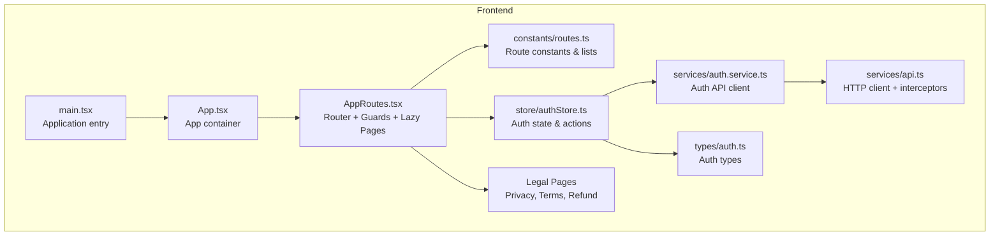
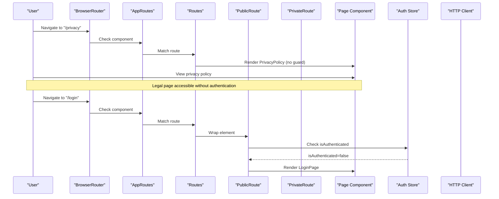
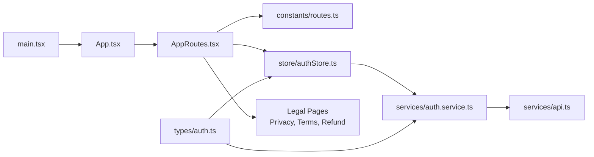

# Routing and Navigation

<cite>
**Referenced Files in This Document**
- [routes.ts](file://frontend/src/constants/routes.ts)
- [App.tsx](file://frontend/src/App.tsx)
- [authStore.ts](file://frontend/src/store/authStore.ts)
- [auth.service.ts](file://frontend/src/services/auth.service.ts)
- [api.ts](file://frontend/src/services/api.ts)
- [main.tsx](file://frontend/src/main.tsx)
- [auth.ts](file://frontend/src/types/auth.ts)
- [PrivacyPolicy.tsx](file://frontend/src/pages/legal/PrivacyPolicy.tsx)
- [TermsOfService.tsx](file://frontend/src/pages/legal/TermsOfService.tsx)
- [RefundPolicy.tsx](file://frontend/src/pages/legal/RefundPolicy.tsx)
</cite>

## Update Summary
**Changes Made**
- Updated routing structure documentation to reflect the split between App and AppRoutes components
- Enhanced authentication redirect handling documentation to include legal pages support
- Added documentation for legal page routing and navigation
- Updated guard component behavior to account for enhanced redirect logic
- Revised architecture diagrams to reflect the new component separation

## Table of Contents
1. [Introduction](#introduction)
2. [Project Structure](#project-structure)
3. [Core Components](#core-components)
4. [Architecture Overview](#architecture-overview)
5. [Detailed Component Analysis](#detailed-component-analysis)
6. [Dependency Analysis](#dependency-analysis)
7. [Performance Considerations](#performance-considerations)
8. [Troubleshooting Guide](#troubleshooting-guide)
9. [Conclusion](#conclusion)

## Introduction
This document explains the routing and navigation system of the Yìjì (映记) React application. It covers route configuration, private/public guards, lazy loading, route protection, dynamic and nested routes, redirects, and integration with authentication. It also documents parameter handling, query string management, performance optimization strategies, and error boundary integration.

**Updated** The routing system has been enhanced with improved authentication redirect handling and better separation of concerns through the AppRoutes component structure.

## Project Structure
The routing system is centered around:
- Route constants and lists for public/private routes
- Application-wide router configuration with guards
- Authentication store and service for protected access
- Lazy-loaded page components for performance
- Global HTTP client with interceptors for auth and error handling
- Legal page routing for privacy, terms, and refund policies

**Diagram sources**
- [main.tsx:1-13](file://frontend/src/main.tsx#L1-L13)
- [App.tsx:260-271](file://frontend/src/App.tsx#L260-L271)
- [App.tsx:62-258](file://frontend/src/App.tsx#L62-L258)
- [routes.ts:1-32](file://frontend/src/constants/routes.ts#L1-L32)
- [authStore.ts:1-129](file://frontend/src/store/authStore.ts#L1-L129)
- [auth.service.ts:1-118](file://frontend/src/services/auth.service.ts#L1-L118)
- [api.ts:1-107](file://frontend/src/services/api.ts#L1-L107)
- [auth.ts:1-45](file://frontend/src/types/auth.ts#L1-L45)
- [PrivacyPolicy.tsx:1-150](file://frontend/src/pages/legal/PrivacyPolicy.tsx#L1-L150)

**Section sources**
- [main.tsx:1-13](file://frontend/src/main.tsx#L1-L13)
- [App.tsx:260-271](file://frontend/src/App.tsx#L260-L271)
- [App.tsx:62-258](file://frontend/src/App.tsx#L62-L258)
- [routes.ts:1-32](file://frontend/src/constants/routes.ts#L1-L32)
- [authStore.ts:1-129](file://frontend/src/store/authStore.ts#L1-L129)
- [auth.service.ts:1-118](file://frontend/src/services/auth.service.ts#L1-L118)
- [api.ts:1-107](file://frontend/src/services/api.ts#L1-L107)
- [auth.ts:1-45](file://frontend/src/types/auth.ts#L1-L45)

## Core Components
- Route constants and lists define canonical paths and categorize routes as public or private.
- AppRoutes component handles router configuration, guard application, and route rendering.
- App component serves as the main container for the application.
- Guard components enforce authentication state and redirect accordingly.
- Auth store manages user session, token persistence, and initial auth check.
- Auth service encapsulates API calls for login, registration, logout, and profile retrieval.
- HTTP client centralizes base URL, timeouts, and request/response interceptors for auth and error handling.
- Legal pages provide public access to privacy policy, terms of service, and refund policy.

Key responsibilities:
- Route constants: maintain a single source of truth for route definitions and categories.
- AppRoutes: assemble routes, apply guards, handle redirects, and render lazy components.
- App: serve as the main application container with toast provider and browser router.
- Guards: protect private routes and prevent authenticated users from accessing public routes.
- Auth store: initialize auth state, persist tokens, and expose auth-aware UI logic.
- Auth service: integrate with backend APIs for authentication flows.
- HTTP client: attach tokens, handle 401 errors globally, and standardize requests.
- Legal pages: provide transparent business information without authentication barriers.

**Section sources**
- [routes.ts:1-32](file://frontend/src/constants/routes.ts#L1-L32)
- [App.tsx:62-258](file://frontend/src/App.tsx#L62-L258)
- [authStore.ts:23-129](file://frontend/src/store/authStore.ts#L23-L129)
- [auth.service.ts:11-118](file://frontend/src/services/auth.service.ts#L11-L118)
- [api.ts:7-107](file://frontend/src/services/api.ts#L7-L107)

## Architecture Overview
The routing architecture combines React Router with custom guard components and a centralized auth store. The system supports:
- Public routes (unauthenticated users only)
- Private routes (authenticated users only)
- Dynamic routes with parameters
- Redirects for legacy or invalid paths
- Lazy loading for page components
- Centralized auth via HTTP interceptors
- Legal page accessibility without authentication

**Updated** The architecture now includes enhanced authentication redirect handling that specifically excludes legal pages from redirect logic.

**Diagram sources**
- [App.tsx:124-127](file://frontend/src/App.tsx#L124-L127)
- [App.tsx:90-122](file://frontend/src/App.tsx#L90-L122)
- [App.tsx:32-59](file://frontend/src/App.tsx#L32-L59)
- [authStore.ts:100-116](file://frontend/src/store/authStore.ts#L100-L116)
- [auth.service.ts:25-28](file://frontend/src/services/auth.service.ts#L25-L28)
- [api.ts:52-104](file://frontend/src/services/api.ts#L52-L104)

## Detailed Component Analysis

### Route Configuration and Constants
- Route constants define canonical paths and parameterized helpers for dynamic segments.
- Lists separate public and private routes for quick reference and potential future use (e.g., prefetching or analytics).
- The route list includes home, diaries, analysis, growth/timeline, dashboard, and settings.

Best practices observed:
- Parameterized helpers ensure consistent dynamic route construction across the app.
- Dedicated lists enable centralized maintenance of route categories.

**Section sources**
- [routes.ts:1-32](file://frontend/src/constants/routes.ts#L1-L32)

### App Container and Routing Structure
**Updated** The application now uses a two-component structure with App serving as the main container and AppRoutes handling the routing logic.

- App component:
  - Provides the main application container with ToastProvider and BrowserRouter.
  - Serves as the root component for the entire application.
- AppRoutes component:
  - Contains all routing logic, guard application, and route definitions.
  - Manages authentication state initialization and sprite visibility.
  - Handles lazy loading and suspense fallbacks.
  - Implements enhanced redirect logic for authentication handling.

**Section sources**
- [App.tsx:260-271](file://frontend/src/App.tsx#L260-L271)
- [App.tsx:62-258](file://frontend/src/App.tsx#L62-L258)

### Router Setup and Route Protection
- The router wraps page components with guard wrappers:
  - PublicRoute prevents authenticated users from accessing login/register/forgot-password.
  - PrivateRoute enforces authentication and redirects unauthenticated users to the welcome landing.
- Legal policy pages are declared without guards and are publicly accessible.
- Redirects:
  - "/timeline" redirects to "/growth".
  - "/analysis/:id" redirects to "/analysis".
  - Wildcard "*" redirects to "/welcome".

**Updated** Enhanced authentication redirect handling now includes legal pages in the public paths set, preventing unnecessary redirects for privacy, terms, and refund policies.

Lazy loading:
- Page components are imported lazily to reduce initial bundle size and improve perceived performance.

Suspense fallback:
- A global Suspense wrapper provides a loading spinner while lazy chunks are being fetched.

**Section sources**
- [App.tsx:124-127](file://frontend/src/App.tsx#L124-L127)
- [App.tsx:178](file://frontend/src/App.tsx#L178)
- [App.tsx:189](file://frontend/src/App.tsx#L189)
- [App.tsx:253](file://frontend/src/App.tsx#L253)
- [App.tsx:32-59](file://frontend/src/App.tsx#L32-L59)

### Guard Components
- PublicRoute:
  - Checks authentication state.
  - If authenticated, redirects to "/".
  - Otherwise renders the child component.
- PrivateRoute:
  - Handles loading state during initial auth check.
  - If not authenticated, redirects to "/welcome".
  - Otherwise renders the child component.

Guard behavior ensures:
- Unauthenticated users cannot access private areas.
- Authenticated users cannot access login/register pages.
- Initial loading state is handled gracefully.

**Section sources**
- [App.tsx:32-59](file://frontend/src/App.tsx#L32-L59)

### Authentication Integration
- Auth store:
  - Provides actions for login, register, logout, and checking auth status.
  - Persists user, token, and authentication state.
  - Performs initial auth check on app load.
- Auth service:
  - Encapsulates backend API calls for authentication and profile management.
- HTTP client:
  - Adds Authorization header when a token exists.
  - Handles 401 responses by clearing local storage and redirecting to "/welcome".

**Updated** Enhanced authentication redirect handling:
- The `handleAuthExpired()` function now includes legal pages (/privacy, /terms, /refund) in the public paths set.
- This prevents redirects for legal pages even when authentication expires.
- Improves user experience by allowing access to legal information during authentication issues.

This integration ensures:
- Seamless authentication flows.
- Automatic token injection for protected endpoints.
- Centralized error handling for auth failures with enhanced redirect logic.

**Section sources**
- [authStore.ts:23-129](file://frontend/src/store/authStore.ts#L23-L129)
- [auth.service.ts:11-118](file://frontend/src/services/auth.service.ts#L11-L118)
- [api.ts:26-50](file://frontend/src/services/api.ts#L26-L50)

### Legal Page Routing and Navigation
**New** The routing system now includes dedicated legal pages with public access:

- Privacy Policy (/privacy): Comprehensive privacy policy with gradient styling and navigation links.
- Terms of Service (/terms): Complete terms and conditions with service descriptions and user obligations.
- Refund Policy (/refund): Detailed refund policy with subscription and cancellation procedures.

Legal pages characteristics:
- Accessible without authentication barriers.
- Integrated navigation links between all legal documents.
- Responsive design with gradient backgrounds and proper spacing.
- Return-to-home navigation for seamless user experience.

Navigation integration:
- Legal pages link to each other for easy cross-referencing.
- Each page includes navigation back to the main application.
- Consistent styling and responsive design patterns.

**Section sources**
- [App.tsx:124-127](file://frontend/src/App.tsx#L124-L127)
- [PrivacyPolicy.tsx:1-150](file://frontend/src/pages/legal/PrivacyPolicy.tsx#L1-L150)
- [TermsOfService.tsx:1-130](file://frontend/src/pages/legal/TermsOfService.tsx#L1-L130)
- [RefundPolicy.tsx:1-122](file://frontend/src/pages/legal/RefundPolicy.tsx#L1-L122)

### Dynamic Routes and Parameter Handling
- Dynamic segments:
  - Diaries: "/diaries/:id", "/diaries/:id/edit"
  - Community posts: "/community/post/:id"
- Parameter handling:
  - Route constants provide typed helpers for building URLs.
  - Page components consume parameters via React Router hooks (not shown here but typical usage).

Recommendations:
- Use route constants for URL construction to avoid typos.
- Validate parameters in page components and handle missing/invalid IDs gracefully.

**Section sources**
- [App.tsx:146-169](file://frontend/src/App.tsx#L146-L169)
- [App.tsx:228](file://frontend/src/App.tsx#L228)
- [routes.ts:10-14](file://frontend/src/constants/routes.ts#L10-L14)

### Redirect Patterns
- "/timeline" → "/growth"
- "/analysis/:id" → "/analysis"
- "*" → "/welcome"

These redirects:
- Normalize URLs and prevent broken links.
- Improve SEO and UX by consolidating similar routes.

**Section sources**
- [App.tsx:178](file://frontend/src/App.tsx#L178)
- [App.tsx:189](file://frontend/src/App.tsx#L189)
- [App.tsx:253](file://frontend/src/App.tsx#L253)

### Navigation Components and Breadcrumb Implementation
- No dedicated navigation components or breadcrumb implementation were found in the analyzed files.
- Active link highlighting is not implemented in the router configuration.
- Navigation utilities are not present in the analyzed files.

Recommendations:
- Create reusable navigation components (e.g., NavItem, Breadcrumb) to support active state and breadcrumbs.
- Integrate with React Router's useLocation/useNavigate for programmatic navigation and active link detection.

### Query String Management
- No explicit query string parsing or management was identified in the analyzed files.
- Typical approaches include using URLSearchParams or a library like react-query for URL state synchronization.

Recommendations:
- Centralize query string handling in a hook or utility to keep pages clean.
- Persist query state in URL for shareable links and deep linking.

### Route Preloading Strategies
- No explicit preloading or prefetching logic was found in the analyzed files.
- Current lazy loading occurs on first render of lazy components.

Recommendations:
- Implement preloading for frequently visited private routes after successful login.
- Use React Router's future flags and preload hints if upgrading to newer versions.

### Error Boundary Integration
- No error boundaries were found in the analyzed files.
- Global error handling is performed by the HTTP interceptor for 401 responses.

Recommendations:
- Add error boundaries around lazy-loaded components to gracefully handle loading errors.
- Surface user-friendly messages and provide retry actions.

## Dependency Analysis
The routing system exhibits clear separation of concerns:
- App component depends on AppRoutes for routing logic.
- AppRoutes depends on route constants, auth store, and lazy-loaded page components.
- Auth store depends on auth service and persists state.
- Auth service depends on the HTTP client.
- HTTP client depends on environment configuration and handles interceptors.
- Legal pages are independent components with navigation integration.

**Updated** The dependency structure now reflects the separation between App and AppRoutes components.

**Diagram sources**
- [main.tsx:1-13](file://frontend/src/main.tsx#L1-L13)
- [App.tsx:260-271](file://frontend/src/App.tsx#L260-L271)
- [App.tsx:62-258](file://frontend/src/App.tsx#L62-L258)
- [routes.ts:1-32](file://frontend/src/constants/routes.ts#L1-L32)
- [authStore.ts:1-129](file://frontend/src/store/authStore.ts#L1-L129)
- [auth.service.ts:1-118](file://frontend/src/services/auth.service.ts#L1-L118)
- [api.ts:1-107](file://frontend/src/services/api.ts#L1-L107)
- [auth.ts:1-45](file://frontend/src/types/auth.ts#L1-L45)

**Section sources**
- [App.tsx:260-271](file://frontend/src/App.tsx#L260-L271)
- [App.tsx:62-258](file://frontend/src/App.tsx#L62-L258)
- [authStore.ts:1-129](file://frontend/src/store/authStore.ts#L1-L129)
- [auth.service.ts:1-118](file://frontend/src/services/auth.service.ts#L1-L118)
- [api.ts:1-107](file://frontend/src/services/api.ts#L1-L107)
- [auth.ts:1-45](file://frontend/src/types/auth.ts#L1-L45)

## Performance Considerations
- Lazy loading is implemented for page components, reducing initial bundle size.
- Suspense fallback provides a smooth loading experience during chunk fetches.
- Enhanced authentication redirect handling reduces unnecessary redirects for legal pages.
- Component separation improves code organization and maintainability.
- Consider:
  - Preloading critical private routes after authentication.
  - Code-splitting shared components to further optimize bundles.
  - Using React Router's future flags for improved performance if upgrading.

**Updated** Performance improvements include reduced redirect overhead for legal pages and better component organization.

## Troubleshooting Guide
Common issues and resolutions:
- Unauthorized access attempts:
  - Symptom: Redirect to "/welcome" after 401.
  - Cause: HTTP interceptor clears tokens and redirects on 401.
  - Resolution: Ensure token is present in localStorage; re-authenticate if needed.
- Stuck loading on private routes:
  - Symptom: Spinner remains indefinitely.
  - Cause: Auth check still in progress.
  - Resolution: Wait for initial auth check to complete; verify network connectivity.
- Incorrect redirects:
  - Symptom: Visiting "/timeline" or "/analysis/:id" navigates unexpectedly.
  - Cause: Defined redirects normalize URLs.
  - Resolution: Use canonical paths "/growth" and "/analysis".
- Legal page access issues:
  - Symptom: Legal pages redirect unexpectedly.
  - Cause: Enhanced redirect logic excludes legal pages from authentication redirects.
  - Resolution: Legal pages are designed to be accessible without authentication.

**Updated** Added troubleshooting guidance for legal page access scenarios.

**Section sources**
- [api.ts:70-104](file://frontend/src/services/api.ts#L70-L104)
- [App.tsx:35-49](file://frontend/src/App.tsx#L35-L49)
- [App.tsx:178](file://frontend/src/App.tsx#L178)
- [App.tsx:189](file://frontend/src/App.tsx#L189)
- [api.ts:26-50](file://frontend/src/services/api.ts#L26-L50)

## Conclusion
The Yìjì routing system leverages React Router with custom guard components, lazy-loaded page components, and a centralized auth store. The system provides clear separation between public and private routes, handles dynamic parameters, and normalizes URLs via redirects. Recent enhancements include improved authentication redirect handling with legal page support, better component separation through the AppRoutes structure, and enhanced user experience for accessing legal documentation. Further improvements such as navigation components, breadcrumbs, query string utilities, preloading strategies, and error boundaries would further enhance UX and maintainability.